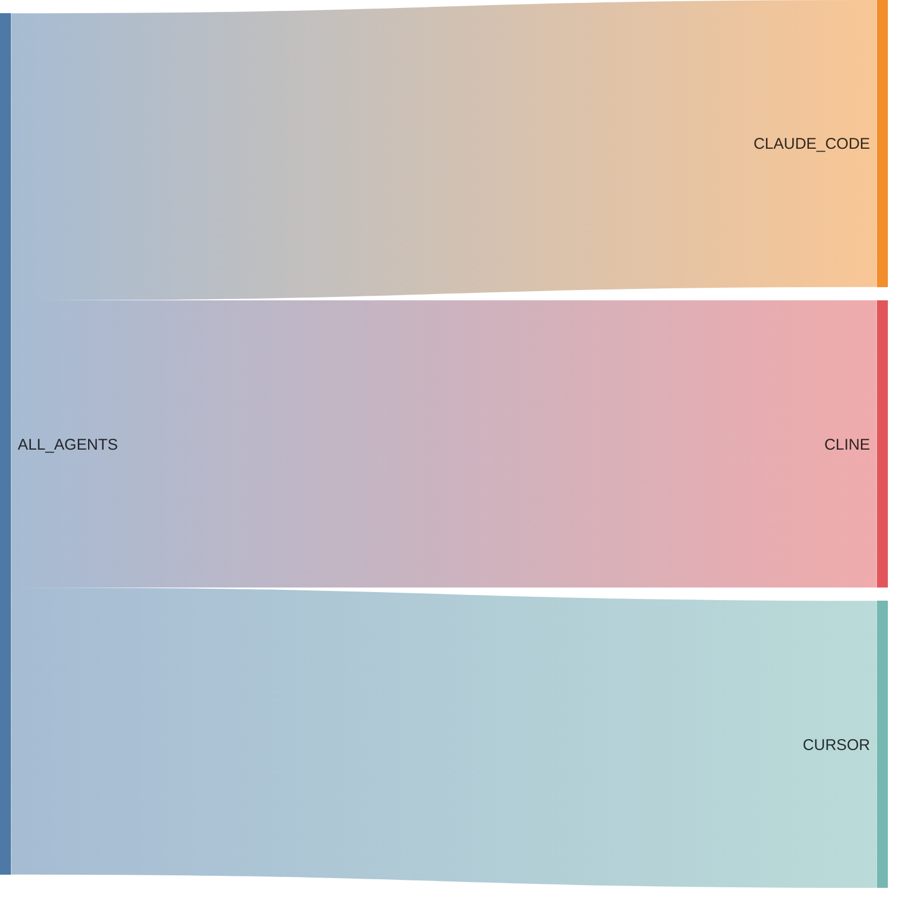
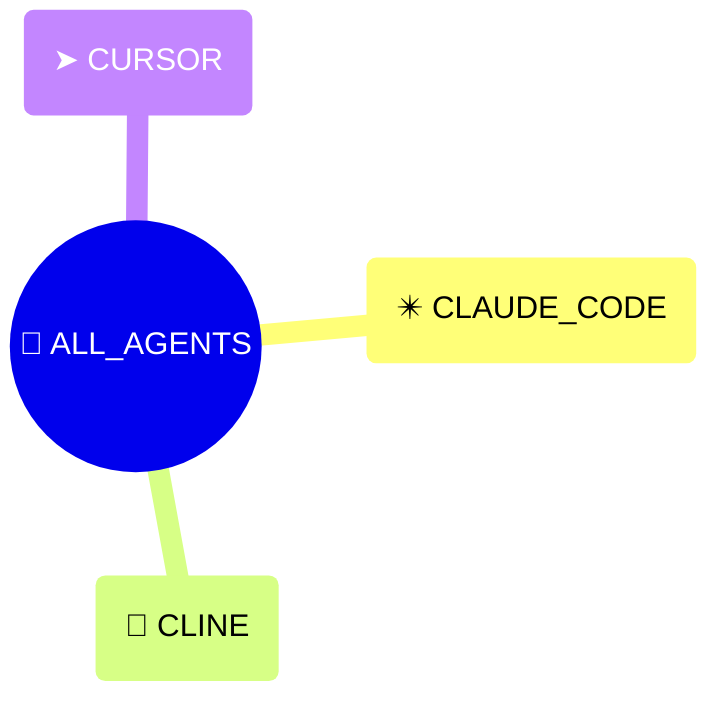

# {octicon}`dependabot` Agents

```{py:currentmodule} extra_platforms
```

Each agent represents an AI coding agent environment, and is associated with:

- a unique agent ID
- a human-readable name
- an icon (emoji / unicode character)
- a [detection function](detection.md)
- various metadata in its `info()` method

## Agent usage

Each agent is materialized by a {class}`~Agent` object, from which you can access various metadata:

```pycon
>>> from extra_platforms import CLAUDE_CODE
>>> CLAUDE_CODE
Agent(id='claude_code', name='Claude Code')
>>> CLAUDE_CODE.id
'claude_code'
>>> CLAUDE_CODE.current
False
>>> CLAUDE_CODE.info()
{'id': 'claude_code', 'name': 'Claude Code', 'icon': '✴️', 'url': 'https://claude.ai/code', 'current': False}
```

To check if the current environment is running in a specific agent, use the corresponding [detection function](detection.md):

```pycon
>>> from extra_platforms import is_claude_code
>>> is_claude_code()
False
```

The current agent can be obtained via the `current_agent()` function:

```pycon
>>> from extra_platforms import current_agent
>>> current_agent()
Agent(id='unknown_agent', name='Unknown agent')
```

## Absence is the normal case

Each AI coding agent advertises itself through a dedicated environment variable: `CLAUDECODE` for Claude Code, `CLINE_ACTIVE` for Cline, `CURSOR_AGENT` for Cursor. {func}`~current_agent` expects a single agent to announce itself and raises `RuntimeError` if several match at once.

Outside an agent session, every detection function returns `False` and {func}`~current_agent` returns {data}`~UNKNOWN_AGENT`. This makes {func}`~is_unknown_agent` the idiomatic "not driven by an agent" check.

The `LLM` variable is used as an expectation signal: when it is set but no agent is recognized, the miss is logged as a `WARNING` (a detection heuristic is probably missing and worth [reporting](https://github.com/kdeldycke/extra-platforms/issues)); otherwise it is only logged as `INFO`.

## Recognized agents

```{python:render}
:mirror:

from extra_platforms import ALL_AGENTS
from extra_platforms._docs import generate_trait_table

print(generate_trait_table(ALL_AGENTS))
```

<!-- mirror -->

| Icon | Symbol               | Name        | Detection function      |
| :--: | :------------------- | :---------- | :---------------------- |
|  ✴️  | {data}`~CLAUDE_CODE` | Claude Code | {func}`~is_claude_code` |
|  👾  | {data}`~CLINE`       | Cline       | {func}`~is_cline`       |
|  ➤   | {data}`~CURSOR`      | Cursor      | {func}`~is_cursor`      |

```{hint}
The {data}`~UNKNOWN_AGENT` trait represents an unrecognized
agent. It is not included in the {data}`~ALL_AGENTS` group,
and will be returned by {func}`~current_agent` if the current
agent is not recognized.
```

<!-- mirror-end -->

## Groups of agents

There is only one group defined for agents: `ALL_AGENTS`, which includes all recognized agents.

```{python:render}
:mirror:

from extra_platforms import ALL_AGENT_GROUPS
from extra_platforms._docs import generate_group_table

print(generate_group_table(ALL_AGENT_GROUPS))
```

<!-- mirror -->

| Icon | Symbol              | Description          | [Detection](detection.md) | {attr}`Canonical <Group.canonical>` |
| :--: | :------------------ | :------------------- | :------------------------ | :---------------------------------: |
|  🧠  | {data}`~ALL_AGENTS` | All AI coding agents | {func}`~is_any_agent`     |                  ⬥                  |

<!-- mirror-end -->

```{python:render}
:mirror:

from extra_platforms import ALL_AGENT_GROUPS
from extra_platforms._docs import generate_sankey

print(generate_sankey(ALL_AGENT_GROUPS))
```

<!-- mirror -->



<!-- mirror-end -->

```{python:render}
:mirror:

from extra_platforms import ALL_AGENTS, ALL_AGENT_GROUPS, CANONICAL_GROUPS
from extra_platforms._docs import generate_traits_mindmap

print(generate_traits_mindmap(list(CANONICAL_GROUPS & ALL_AGENT_GROUPS) + [ALL_AGENTS]))
```

<!-- mirror -->



<!-- mirror-end -->

## Predefined agents

```{eval-rst}
.. autoclasstree:: extra_platforms.agent_data
   :strict:
```

```{eval-rst}
.. automodule:: extra_platforms.agent_data
   :no-index:
```

```{python:render}
from extra_platforms import ALL_AGENTS, UNKNOWN_AGENT
from extra_platforms._docs import generate_sphinx_directives

print(
    generate_sphinx_directives(
        list(ALL_AGENTS) + [UNKNOWN_AGENT], "autodata", "symbol_id"
    )
)
```
