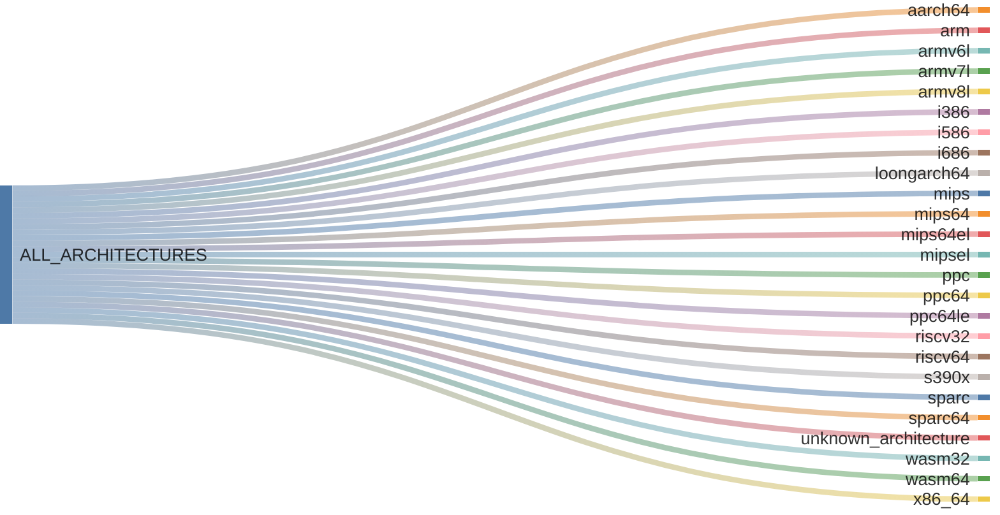

# {octicon}`cpu` Architectures

Each architecture represents a CPU instruction set, and is associated with:
- a unique architecture ID
- a human-readable name
- an icon (emoji / unicode character)
- a [detection function](detection.md)
- various metadata in its `info()` method

Each architecture is materialized by an [`Architecture` object](#extra_platforms.architecture.Architecture), from which you can access various metadata:

```pycon
>>> from extra_platforms import X86_64
>>> X86_64
Architecture(id='x86_64', name='x86-64 (AMD64)')
>>> X86_64.id
'x86_64'
>>> X86_64.current
True
>>> X86_64.info()
{'id': 'x86_64', 'name': 'x86-64 (AMD64)', 'icon': '💻', 'url': 'https://en.wikipedia.org/wiki/X86-64', 'current': True, 'machine': None, 'processor': None}
```

To check if the current architecture matches a specific architecture, use the corresponding [detection function](detection.md):

```pycon
>>> from extra_platforms import is_x86_64
>>> is_x86_64()
True
```

The current architecture can be obtained via the `current_architecture()` function:

```pycon
>>> from extra_platforms import current_architecture
>>> current_architecture()
Architecture(id='x86_64', name='x86-64 (AMD64)')
```

## Recognized architectures

<!-- architecture-table-start -->

| Icon | Name | Architecture ID | Detection function |
|:----:|:------|:-------------|:-------------------|
| 🔋 | [ARM64 (AArch64)](https://en.wikipedia.org/wiki/AArch64) | `aarch64` | [`is_aarch64()`](detection.md#extra_platforms.detection.is_aarch64) |
| 📱 | [ARM (32-bit)](https://en.wikipedia.org/wiki/ARM_architecture_family) | `arm` | [`is_arm()`](detection.md#extra_platforms.detection.is_arm) |
| 📱 | [ARMv6 (little-endian)](https://en.wikipedia.org/wiki/ARM11) | `armv6l` | [`is_armv6l()`](detection.md#extra_platforms.detection.is_armv6l) |
| 📱 | [ARMv7 (little-endian)](https://en.wikipedia.org/wiki/ARM_Cortex-A) | `armv7l` | [`is_armv7l()`](detection.md#extra_platforms.detection.is_armv7l) |
| 📱 | [ARMv8 (32-bit, little-endian)](https://en.wikipedia.org/wiki/ARM_Cortex-A) | `armv8l` | [`is_armv8l()`](detection.md#extra_platforms.detection.is_armv8l) |
| 🔲 | [Intel 80386 (i386)](https://en.wikipedia.org/wiki/Intel_80386) | `i386` | [`is_i386()`](detection.md#extra_platforms.detection.is_i386) |
| 🔲 | [Intel Pentium (i586)](https://en.wikipedia.org/wiki/P5_(microarchitecture)) | `i586` | [`is_i586()`](detection.md#extra_platforms.detection.is_i586) |
| 🔲 | [Intel Pentium Pro (i686)](https://en.wikipedia.org/wiki/P6_(microarchitecture)) | `i686` | [`is_i686()`](detection.md#extra_platforms.detection.is_i686) |
| 🐉 | [LoongArch (64-bit)](https://en.wikipedia.org/wiki/Loongson#LoongArch) | `loongarch64` | [`is_loongarch64()`](detection.md#extra_platforms.detection.is_loongarch64) |
| 🔧 | [MIPS (32-bit, big-endian)](https://en.wikipedia.org/wiki/MIPS_architecture) | `mips` | [`is_mips()`](detection.md#extra_platforms.detection.is_mips) |
| 🔧 | [MIPS64 (big-endian)](https://en.wikipedia.org/wiki/MIPS_architecture) | `mips64` | [`is_mips64()`](detection.md#extra_platforms.detection.is_mips64) |
| 🔧 | [MIPS64 (little-endian)](https://en.wikipedia.org/wiki/MIPS_architecture) | `mips64el` | [`is_mips64el()`](detection.md#extra_platforms.detection.is_mips64el) |
| 🔧 | [MIPS (32-bit, little-endian)](https://en.wikipedia.org/wiki/MIPS_architecture) | `mipsel` | [`is_mipsel()`](detection.md#extra_platforms.detection.is_mipsel) |
| ⚡ | [PowerPC (32-bit)](https://en.wikipedia.org/wiki/PowerPC) | `ppc` | [`is_ppc()`](detection.md#extra_platforms.detection.is_ppc) |
| ⚡ | [PowerPC 64-bit (big-endian)](https://en.wikipedia.org/wiki/Ppc64) | `ppc64` | [`is_ppc64()`](detection.md#extra_platforms.detection.is_ppc64) |
| ⚡ | [PowerPC 64-bit (little-endian)](https://en.wikipedia.org/wiki/Ppc64) | `ppc64le` | [`is_ppc64le()`](detection.md#extra_platforms.detection.is_ppc64le) |
| 🌱 | [RISC-V (32-bit)](https://en.wikipedia.org/wiki/RISC-V) | `riscv32` | [`is_riscv32()`](detection.md#extra_platforms.detection.is_riscv32) |
| 🌱 | [RISC-V (64-bit)](https://en.wikipedia.org/wiki/RISC-V) | `riscv64` | [`is_riscv64()`](detection.md#extra_platforms.detection.is_riscv64) |
| 🏢 | [IBM z/Architecture (s390x)](https://en.wikipedia.org/wiki/Z/Architecture) | `s390x` | [`is_s390x()`](detection.md#extra_platforms.detection.is_s390x) |
| ☀️ | [SPARC (32-bit)](https://en.wikipedia.org/wiki/SPARC) | `sparc` | [`is_sparc()`](detection.md#extra_platforms.detection.is_sparc) |
| ☀️ | [SPARC (64-bit)](https://en.wikipedia.org/wiki/SPARC) | `sparc64` | [`is_sparc64()`](detection.md#extra_platforms.detection.is_sparc64) |
| ❓ | [Unknown architecture](https://en.wikipedia.org/wiki/Instruction_set_architecture) | `unknown_architecture` | [`is_unknown_architecture()`](detection.md#extra_platforms.detection.is_unknown_architecture) |
| 🌐 | [WebAssembly (32-bit)](https://en.wikipedia.org/wiki/WebAssembly) | `wasm32` | [`is_wasm32()`](detection.md#extra_platforms.detection.is_wasm32) |
| 🌐 | [WebAssembly (64-bit)](https://en.wikipedia.org/wiki/WebAssembly) | `wasm64` | [`is_wasm64()`](detection.md#extra_platforms.detection.is_wasm64) |
| 💻 | [x86-64 (AMD64)](https://en.wikipedia.org/wiki/X86-64) | `x86_64` | [`is_x86_64()`](detection.md#extra_platforms.detection.is_x86_64) |

<!-- architecture-table-end -->

## Groups of architectures

All recognized architectures are grouped in non-overlapping families.

Here is their relationship visualized as a Sankey diagram:

<!-- architecture-sankey-start -->



<!-- architecture-sankey-end -->

## `extra_platforms.architecture` API

```{eval-rst}
.. autoclasstree:: extra_platforms.architecture
   :strict:
```

```{eval-rst}
.. automodule:: extra_platforms.architecture
   :members:
   :undoc-members:
   :show-inheritance:
```

## `extra_platforms.architecture_data` API

```{eval-rst}
.. autoclasstree:: extra_platforms.architecture_data
   :strict:
```

```{eval-rst}
.. automodule:: extra_platforms.architecture_data
   :members:
   :undoc-members:
   :show-inheritance:
```
