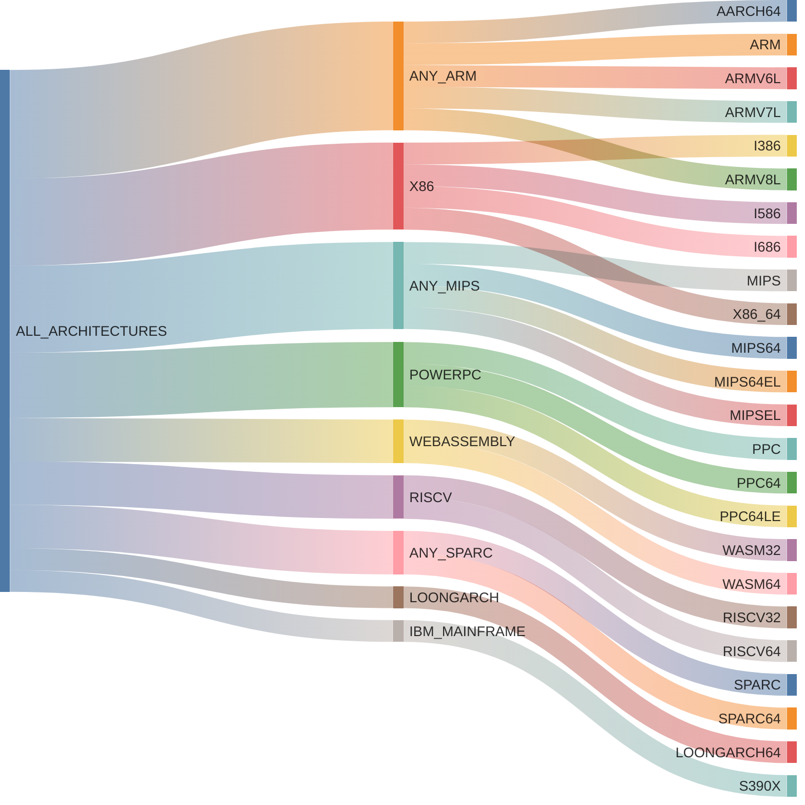
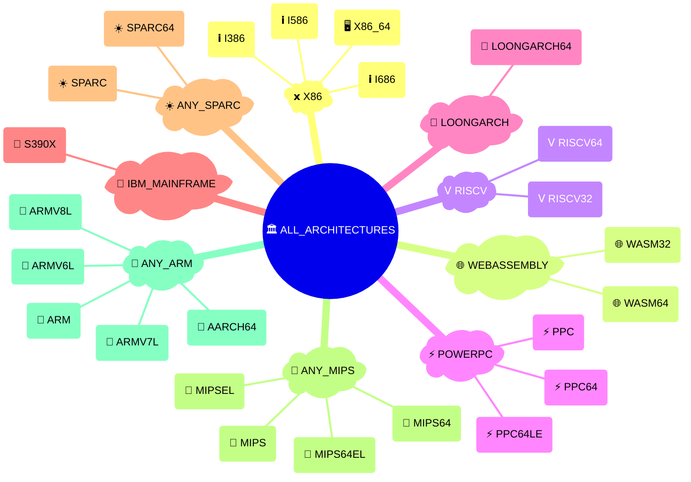

# {octicon}`cpu` Architectures

Each architecture represents a CPU instruction set, and is associated with:

- a unique architecture ID
- a human-readable name
- an icon (emoji / unicode character)
- a [detection function](detection.md)
- various metadata in its `info()` method

Each architecture is materialized by an [`Architecture` object](#extra_platforms.architecture.Architecture), from which you can access various metadata:

```pycon
>>> from extra_platforms import X86_64
>>> X86_64
Architecture(id='x86_64', name='x86-64 (AMD64)')
>>> X86_64.id
'x86_64'
>>> X86_64.current
True
>>> X86_64.info()
{'id': 'x86_64', 'name': 'x86-64 (AMD64)', 'icon': '💻', 'url': 'https://en.wikipedia.org/wiki/X86-64', 'current': True, 'machine': None, 'processor': None}
```

To check if the current architecture matches a specific architecture, use the corresponding [detection function](detection.md):

```pycon
>>> from extra_platforms import is_x86_64
>>> is_x86_64()
True
```

The current architecture can be obtained via the `current_architecture()` function:

```pycon
>>> from extra_platforms import current_architecture
>>> current_architecture()
Architecture(id='x86_64', name='x86-64 (AMD64)')
```

## Recognized architectures

<!-- architecture-table-start -->

| Icon | Symbol                                                          | Name                           | Detection function                                                          |
| :--: | :-------------------------------------------------------------- | :----------------------------- | :-------------------------------------------------------------------------- |
|  📱  | [`AARCH64`](#extra_platforms.architecture_data.AARCH64)         | ARM64 (AArch64)                | [`is_aarch64()`](detection.md#extra_platforms.detection.is_aarch64)         |
|  📱  | [`ARM`](#extra_platforms.architecture_data.ARM)                 | ARM (32-bit)                   | [`is_arm()`](detection.md#extra_platforms.detection.is_arm)                 |
|  📱  | [`ARMV6L`](#extra_platforms.architecture_data.ARMV6L)           | ARMv6 (little-endian)          | [`is_armv6l()`](detection.md#extra_platforms.detection.is_armv6l)           |
|  📱  | [`ARMV7L`](#extra_platforms.architecture_data.ARMV7L)           | ARMv7 (little-endian)          | [`is_armv7l()`](detection.md#extra_platforms.detection.is_armv7l)           |
|  📱  | [`ARMV8L`](#extra_platforms.architecture_data.ARMV8L)           | ARMv8 (32-bit, little-endian)  | [`is_armv8l()`](detection.md#extra_platforms.detection.is_armv8l)           |
|  𝗶   | [`I386`](#extra_platforms.architecture_data.I386)               | Intel 80386 (i386)             | [`is_i386()`](detection.md#extra_platforms.detection.is_i386)               |
|  𝗶   | [`I586`](#extra_platforms.architecture_data.I586)               | Intel Pentium (i586)           | [`is_i586()`](detection.md#extra_platforms.detection.is_i586)               |
|  𝗶   | [`I686`](#extra_platforms.architecture_data.I686)               | Intel Pentium Pro (i686)       | [`is_i686()`](detection.md#extra_platforms.detection.is_i686)               |
|  🐉  | [`LOONGARCH64`](#extra_platforms.architecture_data.LOONGARCH64) | LoongArch (64-bit)             | [`is_loongarch64()`](detection.md#extra_platforms.detection.is_loongarch64) |
|  🔲  | [`MIPS`](#extra_platforms.architecture_data.MIPS)               | MIPS (32-bit, big-endian)      | [`is_mips()`](detection.md#extra_platforms.detection.is_mips)               |
|  🔲  | [`MIPS64`](#extra_platforms.architecture_data.MIPS64)           | MIPS64 (big-endian)            | [`is_mips64()`](detection.md#extra_platforms.detection.is_mips64)           |
|  🔲  | [`MIPS64EL`](#extra_platforms.architecture_data.MIPS64EL)       | MIPS64 (little-endian)         | [`is_mips64el()`](detection.md#extra_platforms.detection.is_mips64el)       |
|  🔲  | [`MIPSEL`](#extra_platforms.architecture_data.MIPSEL)           | MIPS (32-bit, little-endian)   | [`is_mipsel()`](detection.md#extra_platforms.detection.is_mipsel)           |
|  ⚡  | [`PPC`](#extra_platforms.architecture_data.PPC)                 | PowerPC (32-bit)               | [`is_ppc()`](detection.md#extra_platforms.detection.is_ppc)                 |
|  ⚡  | [`PPC64`](#extra_platforms.architecture_data.PPC64)             | PowerPC 64-bit (big-endian)    | [`is_ppc64()`](detection.md#extra_platforms.detection.is_ppc64)             |
|  ⚡  | [`PPC64LE`](#extra_platforms.architecture_data.PPC64LE)         | PowerPC 64-bit (little-endian) | [`is_ppc64le()`](detection.md#extra_platforms.detection.is_ppc64le)         |
|  Ⅴ   | [`RISCV32`](#extra_platforms.architecture_data.RISCV32)         | RISC-V (32-bit)                | [`is_riscv32()`](detection.md#extra_platforms.detection.is_riscv32)         |
|  Ⅴ   | [`RISCV64`](#extra_platforms.architecture_data.RISCV64)         | RISC-V (64-bit)                | [`is_riscv64()`](detection.md#extra_platforms.detection.is_riscv64)         |
|  🏢  | [`S390X`](#extra_platforms.architecture_data.S390X)             | IBM z/Architecture (s390x)     | [`is_s390x()`](detection.md#extra_platforms.detection.is_s390x)             |
|  ☀️  | [`SPARC`](#extra_platforms.architecture_data.SPARC)             | SPARC (32-bit)                 | [`is_sparc()`](detection.md#extra_platforms.detection.is_sparc)             |
|  ☀️  | [`SPARC64`](#extra_platforms.architecture_data.SPARC64)         | SPARC (64-bit)                 | [`is_sparc64()`](detection.md#extra_platforms.detection.is_sparc64)         |
|  🌐  | [`WASM32`](#extra_platforms.architecture_data.WASM32)           | WebAssembly (32-bit)           | [`is_wasm32()`](detection.md#extra_platforms.detection.is_wasm32)           |
|  🌐  | [`WASM64`](#extra_platforms.architecture_data.WASM64)           | WebAssembly (64-bit)           | [`is_wasm64()`](detection.md#extra_platforms.detection.is_wasm64)           |
|  🖥️  | [`X86_64`](#extra_platforms.architecture_data.X86_64)           | x86-64 (AMD64)                 | [`is_x86_64()`](detection.md#extra_platforms.detection.is_x86_64)           |

```{hint}
The [`UNKNOWN_ARCHITECTURE`](#extra_platforms.architecture_data.UNKNOWN_ARCHITECTURE) trait represents an unrecognized architecture. It is not included in the [`ALL_ARCHITECTURES`](groups.md#extra_platforms.group_data.ALL_ARCHITECTURES) group, and will be returned by `current_architecture()` if the current architecture is not recognized.
```

<!-- architecture-table-end -->

## Groups of architectures

All recognized architectures are grouped in families, with each architecture belonging to exactly one family.

Here are the non-overlapping families that encompass all recognized architectures, visualized as a Sankey diagram:

<!-- architecture-multi-level-sankey-start -->


```mermaid
---
config: {"sankey": {"showValues": false, "width": 800, "height": 800}}
---
sankey-beta

ALL_ARCHITECTURES,ANY_ARM,5
ALL_ARCHITECTURES,X86,4
ALL_ARCHITECTURES,ANY_MIPS,4
ALL_ARCHITECTURES,POWERPC,3
ALL_ARCHITECTURES,WEBASSEMBLY,2
ALL_ARCHITECTURES,RISCV,2
ALL_ARCHITECTURES,ANY_SPARC,2
ALL_ARCHITECTURES,LOONGARCH,1
ALL_ARCHITECTURES,IBM_MAINFRAME,1
ANY_ARM,AARCH64,1
ANY_ARM,ARM,1
ANY_ARM,ARMV6L,1
ANY_ARM,ARMV7L,1
ANY_ARM,ARMV8L,1
X86,I386,1
X86,I586,1
X86,I686,1
X86,X86_64,1
ANY_MIPS,MIPS,1
ANY_MIPS,MIPS64,1
ANY_MIPS,MIPS64EL,1
ANY_MIPS,MIPSEL,1
POWERPC,PPC,1
POWERPC,PPC64,1
POWERPC,PPC64LE,1
WEBASSEMBLY,WASM32,1
WEBASSEMBLY,WASM64,1
RISCV,RISCV32,1
RISCV,RISCV64,1
ANY_SPARC,SPARC,1
ANY_SPARC,SPARC64,1
LOONGARCH,LOONGARCH64,1
IBM_MAINFRAME,S390X,1
```

<!-- architecture-multi-level-sankey-end -->

And the same families visualized as a mindmap:

<!-- architecture-mindmap-start -->


```mermaid
---
config: {"mindmap": {"padding": 5}}
---
mindmap
    ((🏛️ ALL_ARCHITECTURES))
        )𝘅 X86(
            (𝗶 I386)
            (𝗶 I586)
            (𝗶 I686)
            (🖥️ X86_64)
        )🌐 WEBASSEMBLY(
            (🌐 WASM32)
            (🌐 WASM64)
        )Ⅴ RISCV(
            (Ⅴ RISCV32)
            (Ⅴ RISCV64)
        )⚡ POWERPC(
            (⚡ PPC)
            (⚡ PPC64)
            (⚡ PPC64LE)
        )🐉 LOONGARCH(
            (🐉 LOONGARCH64)
        )🏢 IBM_MAINFRAME(
            (🏢 S390X)
        )☀️ ANY_SPARC(
            (☀️ SPARC)
            (☀️ SPARC64)
        )🔲 ANY_MIPS(
            (🔲 MIPS)
            (🔲 MIPS64)
            (🔲 MIPS64EL)
            (🔲 MIPSEL)
        )📱 ANY_ARM(
            (📱 AARCH64)
            (📱 ARM)
            (📱 ARMV6L)
            (📱 ARMV7L)
            (📱 ARMV8L)
```

<!-- architecture-mindmap-end -->

### All architecture groups

<!-- architecture-groups-table-start -->

| Icon | Symbol                                                                        | Description            | Canonical | Member count |
| :--: | :---------------------------------------------------------------------------- | :--------------------- | :-------: | -----------: |
|  🏛️  | [`ALL_ARCHITECTURES`](groups.md#extra_platforms.group_data.ALL_ARCHITECTURES) | All architectures      |           |           24 |
|  📱  | [`ANY_ARM`](groups.md#extra_platforms.group_data.ANY_ARM)                     | Any ARM architecture   |     ⬥     |            5 |
|  🔲  | [`ANY_MIPS`](groups.md#extra_platforms.group_data.ANY_MIPS)                   | Any MIPS architecture  |     ⬥     |            4 |
|  ☀️  | [`ANY_SPARC`](groups.md#extra_platforms.group_data.ANY_SPARC)                 | Any SPARC architecture |     ⬥     |            2 |
|  🏢  | [`IBM_MAINFRAME`](groups.md#extra_platforms.group_data.IBM_MAINFRAME)         | IBM mainframe          |     ⬥     |            1 |
|  🐉  | [`LOONGARCH`](groups.md#extra_platforms.group_data.LOONGARCH)                 | LoongArch              |     ⬥     |            1 |
|  ⚡  | [`POWERPC`](groups.md#extra_platforms.group_data.POWERPC)                     | PowerPC family         |     ⬥     |            3 |
|  Ⅴ   | [`RISCV`](groups.md#extra_platforms.group_data.RISCV)                         | RISC-V family          |     ⬥     |            2 |
|  🌐  | [`WEBASSEMBLY`](groups.md#extra_platforms.group_data.WEBASSEMBLY)             | WebAssembly            |     ⬥     |            2 |
|  𝘅   | [`X86`](groups.md#extra_platforms.group_data.X86)                             | x86 family             |     ⬥     |            4 |

```{hint}
Canonical groups are non-overlapping groups that together cover all recognized traits. They are marked with a ⬥ icon in the table above.

Other groups are provided for convenience, but overlap with each other or with canonical groups.
```

<!-- architecture-groups-table-end -->

## `extra_platforms.architecture_data` API

```{eval-rst}
.. autoclasstree:: extra_platforms.architecture_data
   :strict:
```

```{eval-rst}
.. automodule:: extra_platforms.architecture_data
```

<!-- architecture-data-autodata-start -->

```{eval-rst}
.. autodata:: extra_platforms.architecture_data.AARCH64
.. autodata:: extra_platforms.architecture_data.ARM
.. autodata:: extra_platforms.architecture_data.ARMV6L
.. autodata:: extra_platforms.architecture_data.ARMV7L
.. autodata:: extra_platforms.architecture_data.ARMV8L
.. autodata:: extra_platforms.architecture_data.I386
.. autodata:: extra_platforms.architecture_data.I586
.. autodata:: extra_platforms.architecture_data.I686
.. autodata:: extra_platforms.architecture_data.LOONGARCH64
.. autodata:: extra_platforms.architecture_data.MIPS
.. autodata:: extra_platforms.architecture_data.MIPS64
.. autodata:: extra_platforms.architecture_data.MIPS64EL
.. autodata:: extra_platforms.architecture_data.MIPSEL
.. autodata:: extra_platforms.architecture_data.PPC
.. autodata:: extra_platforms.architecture_data.PPC64
.. autodata:: extra_platforms.architecture_data.PPC64LE
.. autodata:: extra_platforms.architecture_data.RISCV32
.. autodata:: extra_platforms.architecture_data.RISCV64
.. autodata:: extra_platforms.architecture_data.S390X
.. autodata:: extra_platforms.architecture_data.SPARC
.. autodata:: extra_platforms.architecture_data.SPARC64
.. autodata:: extra_platforms.architecture_data.UNKNOWN_ARCHITECTURE
.. autodata:: extra_platforms.architecture_data.WASM32
.. autodata:: extra_platforms.architecture_data.WASM64
.. autodata:: extra_platforms.architecture_data.X86_64
```

<!-- architecture-data-autodata-end -->
