# {octicon}`cpu` Architectures

Each architecture represents a CPU instruction set, and is associated with:

- a unique architecture ID
- a human-readable name
- an icon (emoji / unicode character)
- a [detection function](detection.md)
- various metadata in its `info()` method

Each architecture is materialized by an [`Architecture` object](#extra_platforms.architecture.Architecture), from which you can access various metadata:

```pycon
>>> from extra_platforms import X86_64
>>> X86_64
Architecture(id='x86_64', name='x86-64 (AMD64)')
>>> X86_64.id
'x86_64'
>>> X86_64.current
True
>>> X86_64.info()
{'id': 'x86_64', 'name': 'x86-64 (AMD64)', 'icon': '💻', 'url': 'https://en.wikipedia.org/wiki/X86-64', 'current': True, 'machine': None, 'processor': None}
```

To check if the current architecture matches a specific architecture, use the corresponding [detection function](detection.md):

```pycon
>>> from extra_platforms import is_x86_64
>>> is_x86_64()
True
```

The current architecture can be obtained via the `current_architecture()` function:

```pycon
>>> from extra_platforms import current_architecture
>>> current_architecture()
Architecture(id='x86_64', name='x86-64 (AMD64)')
```

## Recognized architectures

<!-- architecture-table-start -->

|  Icon  | Symbol                                                                            | Name                           | Detection function                                                                            |
| :--: | :-------------------------------------------------------------------------------- | :----------------------------- | :-------------------------------------------------------------------------------------------- |
|   📱   | [`AARCH64`](#extra_platforms.architecture_data.AARCH64)                           | ARM64 (AArch64)                | [`is_aarch64()`](detection.md#extra_platforms.detection.is_aarch64)                           |
|   📱   | [`ARM`](#extra_platforms.architecture_data.ARM)                                   | ARM (32-bit)                   | [`is_arm()`](detection.md#extra_platforms.detection.is_arm)                                   |
|   📱   | [`ARMV6L`](#extra_platforms.architecture_data.ARMV6L)                             | ARMv6 (little-endian)          | [`is_armv6l()`](detection.md#extra_platforms.detection.is_armv6l)                             |
|   📱   | [`ARMV7L`](#extra_platforms.architecture_data.ARMV7L)                             | ARMv7 (little-endian)          | [`is_armv7l()`](detection.md#extra_platforms.detection.is_armv7l)                             |
|   📱   | [`ARMV8L`](#extra_platforms.architecture_data.ARMV8L)                             | ARMv8 (32-bit, little-endian)  | [`is_armv8l()`](detection.md#extra_platforms.detection.is_armv8l)                             |
|   𝗶    | [`I386`](#extra_platforms.architecture_data.I386)                                 | Intel 80386 (i386)             | [`is_i386()`](detection.md#extra_platforms.detection.is_i386)                                 |
|   𝗶    | [`I586`](#extra_platforms.architecture_data.I586)                                 | Intel Pentium (i586)           | [`is_i586()`](detection.md#extra_platforms.detection.is_i586)                                 |
|   𝗶    | [`I686`](#extra_platforms.architecture_data.I686)                                 | Intel Pentium Pro (i686)       | [`is_i686()`](detection.md#extra_platforms.detection.is_i686)                                 |
|   🐉   | [`LOONGARCH64`](#extra_platforms.architecture_data.LOONGARCH64)                   | LoongArch (64-bit)             | [`is_loongarch64()`](detection.md#extra_platforms.detection.is_loongarch64)                   |
|   🔲   | [`MIPS`](#extra_platforms.architecture_data.MIPS)                                 | MIPS (32-bit, big-endian)      | [`is_mips()`](detection.md#extra_platforms.detection.is_mips)                                 |
|   🔲   | [`MIPS64`](#extra_platforms.architecture_data.MIPS64)                             | MIPS64 (big-endian)            | [`is_mips64()`](detection.md#extra_platforms.detection.is_mips64)                             |
|   🔲   | [`MIPS64EL`](#extra_platforms.architecture_data.MIPS64EL)                         | MIPS64 (little-endian)         | [`is_mips64el()`](detection.md#extra_platforms.detection.is_mips64el)                         |
|   🔲   | [`MIPSEL`](#extra_platforms.architecture_data.MIPSEL)                             | MIPS (32-bit, little-endian)   | [`is_mipsel()`](detection.md#extra_platforms.detection.is_mipsel)                             |
|   ⚡   | [`PPC`](#extra_platforms.architecture_data.PPC)                                   | PowerPC (32-bit)               | [`is_ppc()`](detection.md#extra_platforms.detection.is_ppc)                                   |
|   ⚡   | [`PPC64`](#extra_platforms.architecture_data.PPC64)                               | PowerPC 64-bit (big-endian)    | [`is_ppc64()`](detection.md#extra_platforms.detection.is_ppc64)                               |
|   ⚡   | [`PPC64LE`](#extra_platforms.architecture_data.PPC64LE)                           | PowerPC 64-bit (little-endian) | [`is_ppc64le()`](detection.md#extra_platforms.detection.is_ppc64le)                           |
|   Ⅴ    | [`RISCV32`](#extra_platforms.architecture_data.RISCV32)                           | RISC-V (32-bit)                | [`is_riscv32()`](detection.md#extra_platforms.detection.is_riscv32)                           |
|   Ⅴ    | [`RISCV64`](#extra_platforms.architecture_data.RISCV64)                           | RISC-V (64-bit)                | [`is_riscv64()`](detection.md#extra_platforms.detection.is_riscv64)                           |
|   🏢   | [`S390X`](#extra_platforms.architecture_data.S390X)                               | IBM z/Architecture (s390x)     | [`is_s390x()`](detection.md#extra_platforms.detection.is_s390x)                               |
|   ☀️   | [`SPARC`](#extra_platforms.architecture_data.SPARC)                               | SPARC (32-bit)                 | [`is_sparc()`](detection.md#extra_platforms.detection.is_sparc)                               |
|   ☀️   | [`SPARC64`](#extra_platforms.architecture_data.SPARC64)                           | SPARC (64-bit)                 | [`is_sparc64()`](detection.md#extra_platforms.detection.is_sparc64)                           |
|   ❓   | [`UNKNOWN_ARCHITECTURE`](#extra_platforms.architecture_data.UNKNOWN_ARCHITECTURE) | Unknown architecture           | [`is_unknown_architecture()`](detection.md#extra_platforms.detection.is_unknown_architecture) |
|   🌐   | [`WASM32`](#extra_platforms.architecture_data.WASM32)                             | WebAssembly (32-bit)           | [`is_wasm32()`](detection.md#extra_platforms.detection.is_wasm32)                             |
|   🌐   | [`WASM64`](#extra_platforms.architecture_data.WASM64)                             | WebAssembly (64-bit)           | [`is_wasm64()`](detection.md#extra_platforms.detection.is_wasm64)                             |
|   🖥️   | [`X86_64`](#extra_platforms.architecture_data.X86_64)                             | x86-64 (AMD64)                 | [`is_x86_64()`](detection.md#extra_platforms.detection.is_x86_64)                             |

<!-- architecture-table-end -->

## Groups of architectures

All recognized architectures are grouped in families, with each architecture belonging to exactly one family.

Here are the non-overlapping families that encompass all recognized architectures, visualized as a Sankey diagram:

<!-- architecture-multi-level-sankey-start -->


<!-- architecture-multi-level-sankey-end -->

And the same families visualized as a mindmap:

```mermaid
---
config: {"mindmap": {"padding": 5}}
---
mindmap
    ((🏛️ all_architectures))
        )𝘅 X86(
            (𝗶 i386)
            (𝗶 i586)
            (𝗶 i686)
            (🖥️ x86_64)
        )🌐 WEBASSEMBLY(
            (🌐 wasm32)
            (🌐 wasm64)
        )Ⅴ RISCV(
            (Ⅴ riscv32)
            (Ⅴ riscv64)
        )⚡ POWERPC(
            (⚡ ppc)
            (⚡ ppc64)
            (⚡ ppc64le)
        )🐉 LOONGARCH(
            (🐉 loongarch64)
        )🏢 IBM_MAINFRAME(
            (🏢 s390x)
        )☀️ ANY_SPARC(
            (☀️ sparc)
            (☀️ sparc64)
        )🔲 ANY_MIPS(
            (🔲 mips)
            (🔲 mips64)
            (🔲 mips64el)
            (🔲 mipsel)
        )📱 ANY_ARM(
            (📱 aarch64)
            (📱 arm)
            (📱 armv6l)
            (📱 armv7l)
            (📱 armv8l)
        (❓ unknown_architecture)
```

<!-- architecture-mindmap-start -->



<!-- architecture-mindmap-end -->

### All architecture groups

<!-- architecture-groups-table-start -->

|  Icon  | Symbol                                                                        | Description            |  Canonical  |   Member count |
| :--: | :---------------------------------------------------------------------------- | :--------------------- | :-------: | -----------: |
|   🏛️   | [`ALL_ARCHITECTURES`](groups.md#extra_platforms.group_data.ALL_ARCHITECTURES) | All architectures      |             |             25 |
|   📱   | [`ANY_ARM`](groups.md#extra_platforms.group_data.ANY_ARM)                     | Any ARM architecture   |      ⬥      |              5 |
|   🔲   | [`ANY_MIPS`](groups.md#extra_platforms.group_data.ANY_MIPS)                   | Any MIPS architecture  |      ⬥      |              4 |
|   ☀️   | [`ANY_SPARC`](groups.md#extra_platforms.group_data.ANY_SPARC)                 | Any SPARC architecture |      ⬥      |              2 |
|   🏢   | [`IBM_MAINFRAME`](groups.md#extra_platforms.group_data.IBM_MAINFRAME)         | IBM mainframe          |      ⬥      |              1 |
|   🐉   | [`LOONGARCH`](groups.md#extra_platforms.group_data.LOONGARCH)                 | LoongArch              |      ⬥      |              1 |
|   ⚡   | [`POWERPC`](groups.md#extra_platforms.group_data.POWERPC)                     | PowerPC family         |      ⬥      |              3 |
|   Ⅴ    | [`RISCV`](groups.md#extra_platforms.group_data.RISCV)                         | RISC-V family          |      ⬥      |              2 |
|   🌐   | [`WEBASSEMBLY`](groups.md#extra_platforms.group_data.WEBASSEMBLY)             | WebAssembly            |      ⬥      |              2 |
|   𝘅    | [`X86`](groups.md#extra_platforms.group_data.X86)                             | x86 family             |      ⬥      |              4 |

<!-- architecture-groups-table-end -->

```{hint}
Canonical groups are non-overlapping groups that together cover all recognized architectures. They are marked with a ✅ icon in the table above.

Other groups are provided for convenience, but overlap with each other or with canonical groups.
```

## `extra_platforms.architecture` API

```{eval-rst}
.. autoclasstree:: extra_platforms.architecture
   :strict:
```

```{eval-rst}
.. automodule:: extra_platforms.architecture
   :members:
   :undoc-members:
   :show-inheritance:
```

## `extra_platforms.architecture_data` API

```{eval-rst}
.. autoclasstree:: extra_platforms.architecture_data
   :strict:
```

```{eval-rst}
.. automodule:: extra_platforms.architecture_data
```

<!-- architecture-data-autodata-start -->

```{eval-rst}
.. autodata:: extra_platforms.architecture_data.AARCH64
.. autodata:: extra_platforms.architecture_data.ARM
.. autodata:: extra_platforms.architecture_data.ARMV6L
.. autodata:: extra_platforms.architecture_data.ARMV7L
.. autodata:: extra_platforms.architecture_data.ARMV8L
.. autodata:: extra_platforms.architecture_data.I386
.. autodata:: extra_platforms.architecture_data.I586
.. autodata:: extra_platforms.architecture_data.I686
.. autodata:: extra_platforms.architecture_data.LOONGARCH64
.. autodata:: extra_platforms.architecture_data.MIPS
.. autodata:: extra_platforms.architecture_data.MIPS64
.. autodata:: extra_platforms.architecture_data.MIPS64EL
.. autodata:: extra_platforms.architecture_data.MIPSEL
.. autodata:: extra_platforms.architecture_data.PPC
.. autodata:: extra_platforms.architecture_data.PPC64
.. autodata:: extra_platforms.architecture_data.PPC64LE
.. autodata:: extra_platforms.architecture_data.RISCV32
.. autodata:: extra_platforms.architecture_data.RISCV64
.. autodata:: extra_platforms.architecture_data.S390X
.. autodata:: extra_platforms.architecture_data.SPARC
.. autodata:: extra_platforms.architecture_data.SPARC64
.. autodata:: extra_platforms.architecture_data.UNKNOWN_ARCHITECTURE
.. autodata:: extra_platforms.architecture_data.WASM32
.. autodata:: extra_platforms.architecture_data.WASM64
.. autodata:: extra_platforms.architecture_data.X86_64
```

<!-- architecture-data-autodata-end -->
