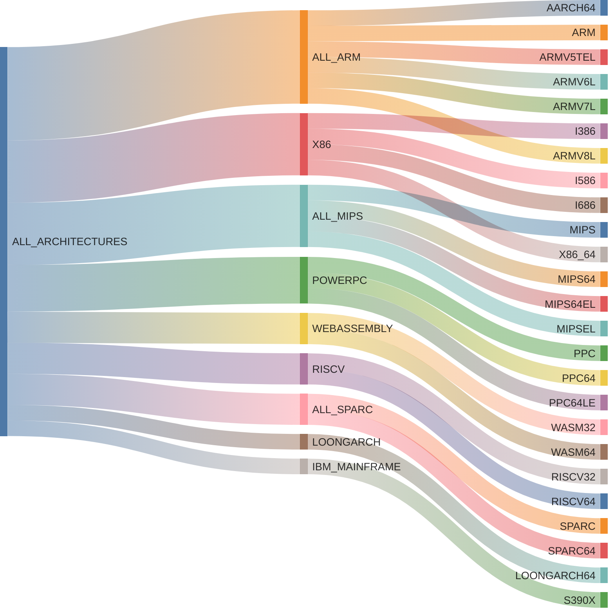
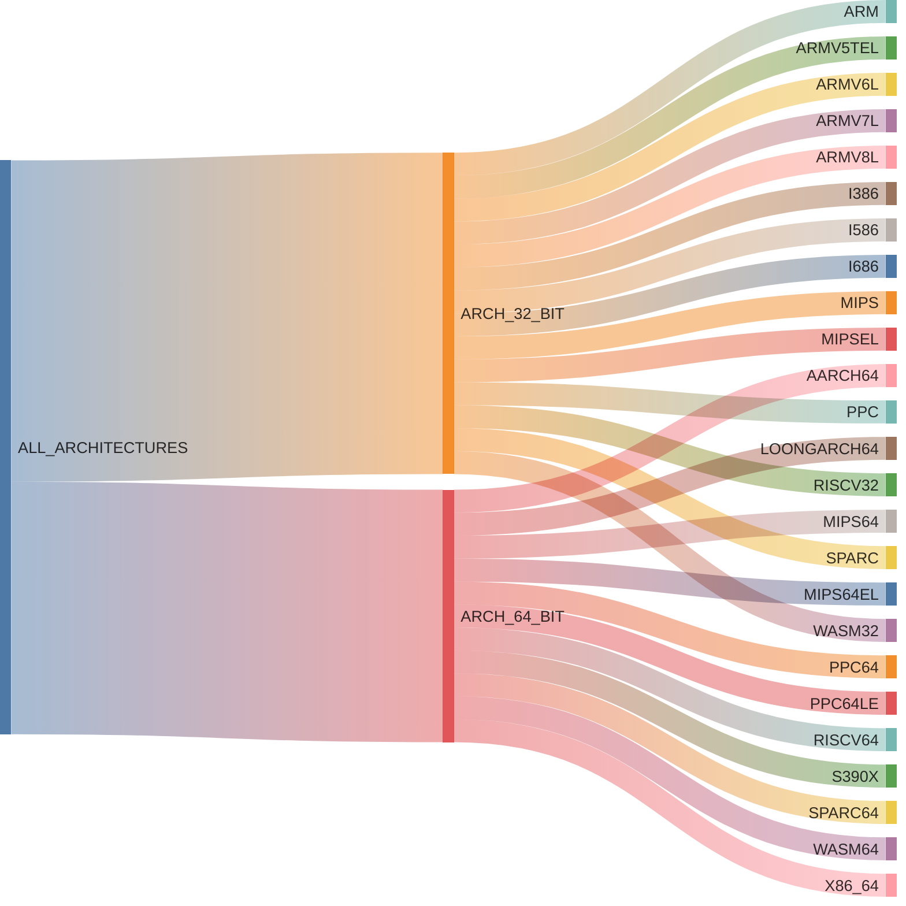
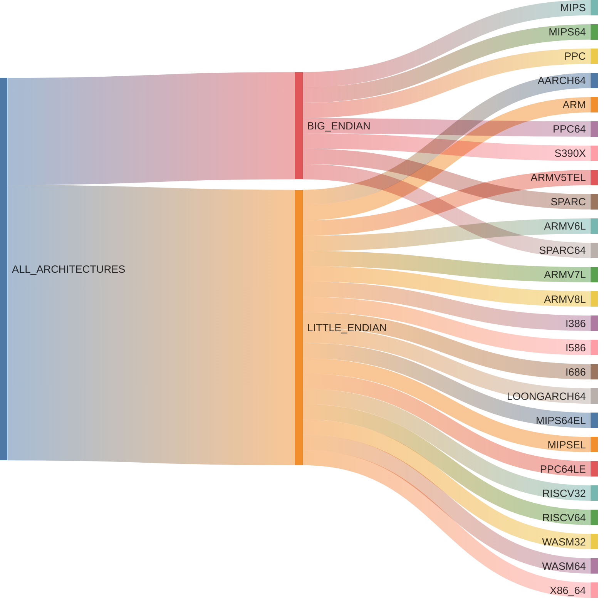

# {octicon}`cpu` Architectures

```{py:currentmodule} extra_platforms
```

Each architecture represents a CPU instruction set, and is associated with:

- a unique architecture ID
- a human-readable name
- an icon (emoji / unicode character)
- a [detection function](detection.md)
- various metadata in its `info()` method

## Architecture usage

Each architecture is materialized by an {class}`~Architecture` object, from which you can access various metadata:

```pycon
>>> from extra_platforms import X86_64
>>> X86_64
Architecture(id='x86_64', name='x86-64 (AMD64)')
>>> X86_64.id
'x86_64'
>>> X86_64.current
True
>>> X86_64.info()
{'id': 'x86_64', 'name': 'x86-64 (AMD64)', 'icon': '💻', 'url': 'https://en.wikipedia.org/wiki/X86-64', 'current': True, 'machine': None, 'processor': None}
```

To check if the current architecture matches a specific architecture, use the corresponding [detection function](detection.md):

```pycon
>>> from extra_platforms import is_x86_64
>>> is_x86_64()
True
```

The current architecture can be obtained via the `current_architecture()` function:

```pycon
>>> from extra_platforms import current_architecture
>>> current_architecture()
Architecture(id='x86_64', name='x86-64 (AMD64)')
```

## Recognized architectures

<!-- architecture-table-start -->

| Icon | Symbol               | Name                           | Detection function      |
| :--: | :------------------- | :----------------------------- | :---------------------- |
|  📱  | {data}`~AARCH64`     | ARM64 (AArch64)                | {func}`~is_aarch64`     |
|  📱  | {data}`~ARM`         | ARM (32-bit)                   | {func}`~is_arm`         |
|  📱  | {data}`~ARMV5TEL`    | ARMv5TE (little-endian)        | {func}`~is_armv5tel`    |
|  📱  | {data}`~ARMV6L`      | ARMv6 (little-endian)          | {func}`~is_armv6l`      |
|  📱  | {data}`~ARMV7L`      | ARMv7 (little-endian)          | {func}`~is_armv7l`      |
|  📱  | {data}`~ARMV8L`      | ARMv8 (32-bit, little-endian)  | {func}`~is_armv8l`      |
|  𝗶   | {data}`~I386`        | Intel 80386 (i386)             | {func}`~is_i386`        |
|  𝗶   | {data}`~I586`        | Intel Pentium (i586)           | {func}`~is_i586`        |
|  𝗶   | {data}`~I686`        | Intel Pentium Pro (i686)       | {func}`~is_i686`        |
|  🐉  | {data}`~LOONGARCH64` | LoongArch (64-bit)             | {func}`~is_loongarch64` |
|  🔲  | {data}`~MIPS`        | MIPS (32-bit, big-endian)      | {func}`~is_mips`        |
|  🔲  | {data}`~MIPS64`      | MIPS64 (big-endian)            | {func}`~is_mips64`      |
|  🔲  | {data}`~MIPS64EL`    | MIPS64 (little-endian)         | {func}`~is_mips64el`    |
|  🔲  | {data}`~MIPSEL`      | MIPS (32-bit, little-endian)   | {func}`~is_mipsel`      |
|  ⚡  | {data}`~PPC`         | PowerPC (32-bit)               | {func}`~is_ppc`         |
|  ⚡  | {data}`~PPC64`       | PowerPC 64-bit (big-endian)    | {func}`~is_ppc64`       |
|  ⚡  | {data}`~PPC64LE`     | PowerPC 64-bit (little-endian) | {func}`~is_ppc64le`     |
|  Ⅴ   | {data}`~RISCV32`     | RISC-V (32-bit)                | {func}`~is_riscv32`     |
|  Ⅴ   | {data}`~RISCV64`     | RISC-V (64-bit)                | {func}`~is_riscv64`     |
|  🏢  | {data}`~S390X`       | IBM z/Architecture (s390x)     | {func}`~is_s390x`       |
|  ☀️  | {data}`~SPARC`       | SPARC (32-bit)                 | {func}`~is_sparc`       |
|  ☀️  | {data}`~SPARC64`     | SPARC (64-bit)                 | {func}`~is_sparc64`     |
|  🌐  | {data}`~WASM32`      | WebAssembly (32-bit)           | {func}`~is_wasm32`      |
|  🌐  | {data}`~WASM64`      | WebAssembly (64-bit)           | {func}`~is_wasm64`      |
|  🖥️  | {data}`~X86_64`      | x86-64 (AMD64)                 | {func}`~is_x86_64`      |

```{hint}
The {data}`~UNKNOWN_ARCHITECTURE` trait represents an unrecognized
architecture. It is not included in the {data}`~ALL_ARCHITECTURES` group,
and will be returned by {func}`~current_architecture` if the current
architecture is not recognized.
```

<!-- architecture-table-end -->

## Groups of architectures

### All architecture groups

<!-- architecture-groups-table-start -->

| Icon | Symbol                     | Description                 | [Detection](detection.md)    | [Canonical](groups.md#extra_platforms.group.Group.canonical) |
| :--: | :------------------------- | :-------------------------- | :--------------------------- | :----------------------------------------------------------: |
|  🏛️  | {data}`~ALL_ARCHITECTURES` | All architectures           | {func}`~is_any_architecture` |                                                              |
|  📱  | {data}`~ALL_ARM`           | ARM architectures           | {func}`~is_any_arm`          |                              ⬥                               |
|  🔲  | {data}`~ALL_MIPS`          | MIPS architectures          | {func}`~is_any_mips`         |                              ⬥                               |
|  ☀️  | {data}`~ALL_SPARC`         | SPARC architectures         | {func}`~is_any_sparc`        |                              ⬥                               |
|  ³²  | {data}`~ARCH_32_BIT`       | 32-bit architectures        | {func}`~is_arch_32_bit`      |                                                              |
|  ⁶⁴  | {data}`~ARCH_64_BIT`       | 64-bit architectures        | {func}`~is_arch_64_bit`      |                                                              |
|  ⬆️  | {data}`~BIG_ENDIAN`        | Big-endian architectures    | {func}`~is_big_endian`       |                                                              |
|  🏢  | {data}`~IBM_MAINFRAME`     | IBM mainframe               | {func}`~is_ibm_mainframe`    |                              ⬥                               |
|  ⬇️  | {data}`~LITTLE_ENDIAN`     | Little-endian architectures | {func}`~is_little_endian`    |                                                              |
|  🐉  | {data}`~LOONGARCH`         | LoongArch                   | {func}`~is_loongarch`        |                              ⬥                               |
|  ⚡  | {data}`~POWERPC`           | PowerPC family              | {func}`~is_powerpc`          |                              ⬥                               |
|  Ⅴ   | {data}`~RISCV`             | RISC-V family               | {func}`~is_riscv`            |                              ⬥                               |
|  🌐  | {data}`~WEBASSEMBLY`       | WebAssembly                 | {func}`~is_webassembly`      |                              ⬥                               |
|  𝘅   | {data}`~X86`               | x86 family                  | {func}`~is_x86`              |                              ⬥                               |

```{hint}
Canonical groups are non-overlapping groups that together cover all
recognized traits. They are marked with a ⬥ icon in the table above.

Other groups are provided for convenience, but overlap with each other or
with canonical groups.
```

<!-- architecture-groups-table-end -->

### Canonical groups

All recognized architectures are grouped in canonical families, with each architecture belonging to exactly one family.

Here are the non-overlapping families that encompass all recognized architectures, visualized as a Sankey diagram:

<!-- architecture-canonical-sankey-start -->



<!-- architecture-canonical-sankey-end -->

And the same families visualized as a mindmap:

```mermaid
---
config: {"mindmap": {"padding": 5}}
---
mindmap
    ((🏛️ ALL_ARCHITECTURES))
        )𝘅 X86(
            (𝗶 I386)
            (𝗶 I586)
            (𝗶 I686)
            (🖥️ X86_64)
        )🌐 WEBASSEMBLY(
            (🌐 WASM32)
            (🌐 WASM64)
        )Ⅴ RISCV(
            (Ⅴ RISCV32)
            (Ⅴ RISCV64)
        )⚡ POWERPC(
            (⚡ PPC)
            (⚡ PPC64)
            (⚡ PPC64LE)
        )🐉 LOONGARCH(
            (🐉 LOONGARCH64)
        )🏢 IBM_MAINFRAME(
            (🏢 S390X)
        )☀️ ALL_SPARC(
            (☀️ SPARC)
            (☀️ SPARC64)
        )🔲 ALL_MIPS(
            (🔲 MIPS)
            (🔲 MIPS64)
            (🔲 MIPS64EL)
            (🔲 MIPSEL)
        )📱 ALL_ARM(
            (📱 AARCH64)
            (📱 ARM)
            (📱 ARMV5TEL)
            (📱 ARMV6L)
            (📱 ARMV7L)
            (📱 ARMV8L)
```

<!-- architecture-canonical-mindmap-start -->



<!-- architecture-canonical-mindmap-end -->

### Bitness groups

Architectures are also grouped by bitness (32-bit vs 64-bit), visualized as a Sankey diagram:

<!-- architecture-bitness-sankey-start -->



<!-- architecture-bitness-sankey-end -->

And the same bitness groups visualized as a mindmap:

```mermaid
---
config: {"mindmap": {"padding": 5}}
---
mindmap
    ((🏛️ ALL_ARCHITECTURES))
        )⁶⁴ ARCH_64_BIT(
            (📱 AARCH64)
            (🐉 LOONGARCH64)
            (🔲 MIPS64)
            (🔲 MIPS64EL)
            (⚡ PPC64)
            (⚡ PPC64LE)
            (Ⅴ RISCV64)
            (🏢 S390X)
            (☀️ SPARC64)
            (🌐 WASM64)
            (🖥️ X86_64)
        )³² ARCH_32_BIT(
            (📱 ARM)
            (📱 ARMV5TEL)
            (📱 ARMV6L)
            (📱 ARMV7L)
            (📱 ARMV8L)
            (𝗶 I386)
            (𝗶 I586)
            (𝗶 I686)
            (🔲 MIPS)
            (🔲 MIPSEL)
            (⚡ PPC)
            (Ⅴ RISCV32)
            (☀️ SPARC)
            (🌐 WASM32)
```

<!-- architecture-bitness-mindmap-start -->



<!-- architecture-bitness-mindmap-end -->

### Endianness groups

Architectures are also grouped by endianness (big-endian vs little-endian), visualized as a Sankey diagram:

<!-- architecture-endianness-sankey-start -->



<!-- architecture-endianness-sankey-end -->

And the same endianness groups visualized as a mindmap:

```mermaid
---
config: {"mindmap": {"padding": 5}}
---
mindmap
    ((🏛️ ALL_ARCHITECTURES))
        )⬇️ LITTLE_ENDIAN(
            (📱 AARCH64)
            (📱 ARM)
            (📱 ARMV5TEL)
            (📱 ARMV6L)
            (📱 ARMV7L)
            (📱 ARMV8L)
            (𝗶 I386)
            (𝗶 I586)
            (𝗶 I686)
            (🐉 LOONGARCH64)
            (🔲 MIPS64EL)
            (🔲 MIPSEL)
            (⚡ PPC64LE)
            (Ⅴ RISCV32)
            (Ⅴ RISCV64)
            (🌐 WASM32)
            (🌐 WASM64)
            (🖥️ X86_64)
        )⬆️ BIG_ENDIAN(
            (🔲 MIPS)
            (🔲 MIPS64)
            (⚡ PPC)
            (⚡ PPC64)
            (🏢 S390X)
            (☀️ SPARC)
            (☀️ SPARC64)
```

<!-- architecture-endianness-mindmap-start -->



<!-- architecture-endianness-mindmap-end -->

## Predefined architectures

```{eval-rst}
.. autoclasstree:: extra_platforms.architecture_data
   :strict:
```

```{eval-rst}
.. automodule:: extra_platforms.architecture_data
   :no-index:
```

<!-- architecture-data-autodata-start -->

```{eval-rst}
.. autodata:: extra_platforms.AARCH64
.. autodata:: extra_platforms.ARM
.. autodata:: extra_platforms.ARMV5TEL
.. autodata:: extra_platforms.ARMV6L
.. autodata:: extra_platforms.ARMV7L
.. autodata:: extra_platforms.ARMV8L
.. autodata:: extra_platforms.I386
.. autodata:: extra_platforms.I586
.. autodata:: extra_platforms.I686
.. autodata:: extra_platforms.LOONGARCH64
.. autodata:: extra_platforms.MIPS
.. autodata:: extra_platforms.MIPS64
.. autodata:: extra_platforms.MIPS64EL
.. autodata:: extra_platforms.MIPSEL
.. autodata:: extra_platforms.PPC
.. autodata:: extra_platforms.PPC64
.. autodata:: extra_platforms.PPC64LE
.. autodata:: extra_platforms.RISCV32
.. autodata:: extra_platforms.RISCV64
.. autodata:: extra_platforms.S390X
.. autodata:: extra_platforms.SPARC
.. autodata:: extra_platforms.SPARC64
.. autodata:: extra_platforms.UNKNOWN_ARCHITECTURE
.. autodata:: extra_platforms.WASM32
.. autodata:: extra_platforms.WASM64
.. autodata:: extra_platforms.X86_64
```

<!-- architecture-data-autodata-end -->
