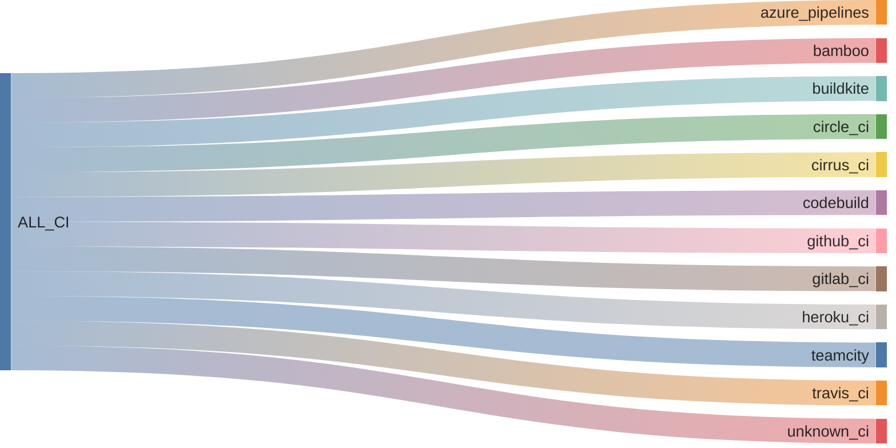

# {octicon}`container` CI systems

## Recognized CI

<!-- ci-table-start -->

| Icon | Name | CI ID |
|:----:|:------|:-------------|
| ═ | [Azure Pipelines](https://azure.microsoft.com/en-us/products/devops/pipelines/) | `azure_pipelines` |
| ⟲ | [Bamboo](https://www.atlassian.com/software/bamboo) | `bamboo` |
| 🪁 | [Buildkite](https://buildkite.com) | `buildkite` |
| ⪾ | [Circle CI](https://circleci.com) | `circle_ci` |
| ≋ | [Cirrus CI](https://cirrus-ci.org) | `cirrus_ci` |
| ᚙ | [CodeBuild](https://aws.amazon.com/codebuild/) | `codebuild` |
| 🐙 | [GitHub Actions runner](https://docs.github.com/en/actions) | `github_ci` |
| 🦊 | [GitLab CI](https://docs.gitlab.com/topics/build_your_application/) | `gitlab_ci` |
| ⥁ | [Heroku CI](https://www.heroku.com/continuous-integration/) | `heroku_ci` |
| 🏙️ | [TeamCity](https://www.jetbrains.com/teamcity/) | `teamcity` |
| 👷 | [Travis CI](https://www.travis-ci.com) | `travis_ci` |
| ♲ | [Unknown CI](https://en.wikipedia.org/wiki/Continuous_integration) | `unknown_ci` |

<!-- ci-table-end -->

## Groups of CI

There is only one group defined for CI systems: `ALL_CI`, which includes all recognized CI systems.

<!-- ci-sankey-start -->



<!-- ci-sankey-end -->

## `extra_platforms.ci` API

```{eval-rst}
.. autoclasstree:: extra_platforms.ci
   :strict:
```

```{eval-rst}
.. automodule:: extra_platforms.ci
   :members:
   :undoc-members:
   :show-inheritance:
```

## `extra_platforms.ci_data` API

```{eval-rst}
.. autoclasstree:: extra_platforms.ci_data
   :strict:
```

```{eval-rst}
.. automodule:: extra_platforms.ci_data
   :members:
   :undoc-members:
   :show-inheritance:
```
