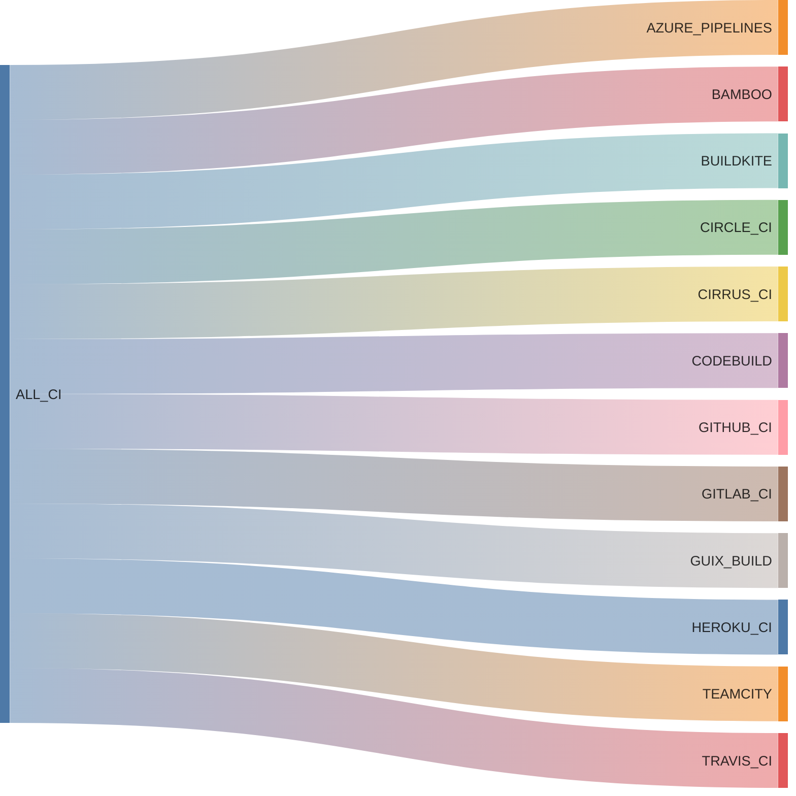
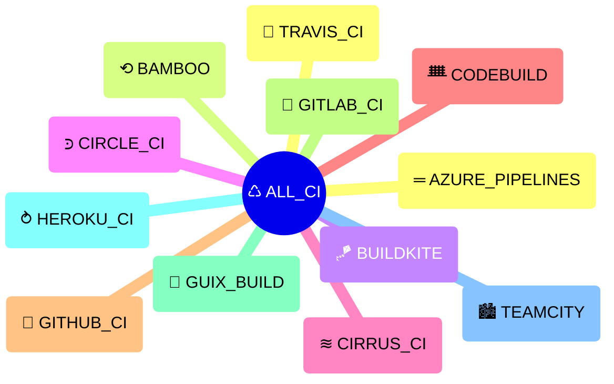

# {octicon}`container` CI systems

```{py:currentmodule} extra_platforms
```

Each CI system represents a continuous integration/delivery platform, and is associated with:

- a unique CI ID
- a human-readable name
- an icon (emoji / unicode character)
- a [detection function](detection.md)
- various metadata in its `info()` method

## CI usage

Each CI system is materialized by a {class}`~CI` object, from which you can access various metadata:

```pycon
>>> from extra_platforms import GITHUB_CI
>>> GITHUB_CI
CI(id='github_ci', name='GitHub Actions runner')
>>> GITHUB_CI.id
'github_ci'
>>> GITHUB_CI.current
False
>>> GITHUB_CI.info()
{'id': 'github_ci', 'name': 'GitHub Actions runner', 'icon': '🐙', 'url': 'https://docs.github.com/en/actions', 'current': False}
```

To check if the current environment is running in a specific CI system, use the corresponding [detection function](detection.md):

```pycon
>>> from extra_platforms import is_github_ci
>>> is_github_ci()
False
```

The current CI system can be obtained via the `current_ci()` function:

```pycon
>>> from extra_platforms import current_ci
>>> current_ci()
CI(id='unknown_ci', name='Unknown CI')
```

## Absence is the normal case

Each CI system advertises itself through vendor-specific environment variables, like `GITHUB_ACTIONS` for GitHub Actions runners or `TF_BUILD` for Azure Pipelines. Only one system can realistically announce itself at a time: {func}`~current_ci` raises `RuntimeError` if several ever match.

Outside CI, every detection function returns `False` and {func}`~current_ci` returns {data}`~UNKNOWN_CI`. This makes {func}`~is_unknown_ci` the idiomatic "not running in CI" check.

Most vendors also set the generic `CI` variable, which is used as an expectation signal: when `CI` is set but no system is recognized, the miss is logged as a `WARNING` (a detection heuristic is probably missing and worth [reporting](https://github.com/kdeldycke/extra-platforms/issues)); otherwise it is only logged as `INFO`.

## Recognized CI

<!-- ci-table-start -->

| Icon | Symbol                   | Name                  | Detection function          |
| :--: | :----------------------- | :-------------------- | :-------------------------- |
|  ═   | {data}`~AZURE_PIPELINES` | Azure Pipelines       | {func}`~is_azure_pipelines` |
|  ⟲   | {data}`~BAMBOO`          | Bamboo                | {func}`~is_bamboo`          |
|  🪁  | {data}`~BUILDKITE`       | Buildkite             | {func}`~is_buildkite`       |
|  ⪾   | {data}`~CIRCLE_CI`       | Circle CI             | {func}`~is_circle_ci`       |
|  ≋   | {data}`~CIRRUS_CI`       | Cirrus CI             | {func}`~is_cirrus_ci`       |
|  ᚙ   | {data}`~CODEBUILD`       | CodeBuild             | {func}`~is_codebuild`       |
|  🐙  | {data}`~GITHUB_CI`       | GitHub Actions runner | {func}`~is_github_ci`       |
|  🦊  | {data}`~GITLAB_CI`       | GitLab CI             | {func}`~is_gitlab_ci`       |
|  🐂  | {data}`~GUIX_BUILD`      | Guix Build            | {func}`~is_guix_build`      |
|  ⥁   | {data}`~HEROKU_CI`       | Heroku CI             | {func}`~is_heroku_ci`       |
|  🏙️  | {data}`~TEAMCITY`        | TeamCity              | {func}`~is_teamcity`        |
|  👷  | {data}`~TRAVIS_CI`       | Travis CI             | {func}`~is_travis_ci`       |

```{hint}
The {data}`~UNKNOWN_CI` trait represents an unrecognized
CI system. It is not included in the {data}`~ALL_CI` group,
and will be returned by {func}`~current_ci` if the current
CI system is not recognized.
```

<!-- ci-table-end -->

## Groups of CI

There is only one group defined for CI systems: `ALL_CI`, which includes all recognized CI systems.

<!-- ci-groups-table-start -->

| Icon | Symbol          | Description    | [Detection](detection.md) | {attr}`Canonical <Group.canonical>` |
| :--: | :-------------- | :------------- | :------------------------ | :---------------------------------: |
|  ♺   | {data}`~ALL_CI` | All CI systems | {func}`~is_any_ci`        |                  ⬥                  |

<!-- ci-groups-table-end -->

<!-- ci-sankey-start -->


```mermaid
---
config: {"sankey": {"showValues": false, "width": 800, "height": 800}}
---
sankey-beta

ALL_CI,AZURE_PIPELINES,1
ALL_CI,BAMBOO,1
ALL_CI,BUILDKITE,1
ALL_CI,CIRCLE_CI,1
ALL_CI,CIRRUS_CI,1
ALL_CI,CODEBUILD,1
ALL_CI,GITHUB_CI,1
ALL_CI,GITLAB_CI,1
ALL_CI,GUIX_BUILD,1
ALL_CI,HEROKU_CI,1
ALL_CI,TEAMCITY,1
ALL_CI,TRAVIS_CI,1
```

<!-- ci-sankey-end -->

<!-- ci-mindmap-start -->


```mermaid
---
config: {"mindmap": {"padding": 5}}
---
mindmap
    ((♺ ALL_CI))
        (═ AZURE_PIPELINES)
        (⟲ BAMBOO)
        (🪁 BUILDKITE)
        (⪾ CIRCLE_CI)
        (≋ CIRRUS_CI)
        (ᚙ CODEBUILD)
        (🐙 GITHUB_CI)
        (🦊 GITLAB_CI)
        (🐂 GUIX_BUILD)
        (⥁ HEROKU_CI)
        (🏙️ TEAMCITY)
        (👷 TRAVIS_CI)
```

<!-- ci-mindmap-end -->

## Predefined CI

```{eval-rst}
.. autoclasstree:: extra_platforms.ci_data
   :strict:
```

```{eval-rst}
.. automodule:: extra_platforms.ci_data
   :no-index:
```

<!-- ci-data-autodata-start -->

```{eval-rst}
.. autodata:: extra_platforms.AZURE_PIPELINES
.. autodata:: extra_platforms.BAMBOO
.. autodata:: extra_platforms.BUILDKITE
.. autodata:: extra_platforms.CIRCLE_CI
.. autodata:: extra_platforms.CIRRUS_CI
.. autodata:: extra_platforms.CODEBUILD
.. autodata:: extra_platforms.GITHUB_CI
.. autodata:: extra_platforms.GITLAB_CI
.. autodata:: extra_platforms.GUIX_BUILD
.. autodata:: extra_platforms.HEROKU_CI
.. autodata:: extra_platforms.TEAMCITY
.. autodata:: extra_platforms.TRAVIS_CI
.. autodata:: extra_platforms.UNKNOWN_CI
```

<!-- ci-data-autodata-end -->
