# {octicon}`container` CI systems

Each CI system represents a continuous integration/delivery platform, and is associated with:

- a unique CI ID
- a human-readable name
- an icon (emoji / unicode character)
- a [detection function](detection.md)
- various metadata in its `info()` method

Each CI system is materialized by a [`CI` object](#extra_platforms.ci.CI), from which you can access various metadata:

```pycon
>>> from extra_platforms import GITHUB_CI
>>> GITHUB_CI
CI(id='github_ci', name='GitHub Actions runner')
>>> GITHUB_CI.id
'github_ci'
>>> GITHUB_CI.current
False
>>> GITHUB_CI.info()
{'id': 'github_ci', 'name': 'GitHub Actions runner', 'icon': '🐙', 'url': 'https://docs.github.com/en/actions', 'current': False}
```

To check if the current environment is running in a specific CI system, use the corresponding [detection function](detection.md):

```pycon
>>> from extra_platforms import is_github_ci
>>> is_github_ci()
False
```

The current CI system can be obtained via the `current_ci()` function:

```pycon
>>> from extra_platforms import current_ci
>>> current_ci()
CI(id='unknown_ci', name='Unknown CI')
```

## Recognized CI

<!-- ci-table-start -->

|  Icon  | Name                                                                            | ID                | Detection function                                                                  |
| :--: | :------------------------------------------------------------------------------ | :---------------- | :---------------------------------------------------------------------------------- |
|   ═    | [Azure Pipelines](https://azure.microsoft.com/en-us/products/devops/pipelines/) | `azure_pipelines` | [`is_azure_pipelines()`](detection.md#extra_platforms.detection.is_azure_pipelines) |
|   ⟲    | [Bamboo](https://www.atlassian.com/software/bamboo)                             | `bamboo`          | [`is_bamboo()`](detection.md#extra_platforms.detection.is_bamboo)                   |
|   🪁   | [Buildkite](https://buildkite.com)                                              | `buildkite`       | [`is_buildkite()`](detection.md#extra_platforms.detection.is_buildkite)             |
|   ⪾    | [Circle CI](https://circleci.com)                                               | `circle_ci`       | [`is_circle_ci()`](detection.md#extra_platforms.detection.is_circle_ci)             |
|   ≋    | [Cirrus CI](https://cirrus-ci.org)                                              | `cirrus_ci`       | [`is_cirrus_ci()`](detection.md#extra_platforms.detection.is_cirrus_ci)             |
|   ᚙ    | [CodeBuild](https://aws.amazon.com/codebuild/)                                  | `codebuild`       | [`is_codebuild()`](detection.md#extra_platforms.detection.is_codebuild)             |
|   🐙   | [GitHub Actions runner](https://docs.github.com/en/actions)                     | `github_ci`       | [`is_github_ci()`](detection.md#extra_platforms.detection.is_github_ci)             |
|   🦊   | [GitLab CI](https://docs.gitlab.com/topics/build_your_application/)             | `gitlab_ci`       | [`is_gitlab_ci()`](detection.md#extra_platforms.detection.is_gitlab_ci)             |
|   ⥁    | [Heroku CI](https://www.heroku.com/continuous-integration/)                     | `heroku_ci`       | [`is_heroku_ci()`](detection.md#extra_platforms.detection.is_heroku_ci)             |
|   🏙️   | [TeamCity](https://www.jetbrains.com/teamcity/)                                 | `teamcity`        | [`is_teamcity()`](detection.md#extra_platforms.detection.is_teamcity)               |
|   👷   | [Travis CI](https://www.travis-ci.com)                                          | `travis_ci`       | [`is_travis_ci()`](detection.md#extra_platforms.detection.is_travis_ci)             |
|   ♲    | [Unknown CI](https://en.wikipedia.org/wiki/Continuous_integration)              | `unknown_ci`      | [`is_unknown_ci()`](detection.md#extra_platforms.detection.is_unknown_ci)           |

<!-- ci-table-end -->

## Groups of CI

There is only one group defined for CI systems: `ALL_CI`, which includes all recognized CI systems.

<!-- ci-sankey-start -->


<!-- ci-sankey-end -->

<!-- ci-mindmap-start -->



<!-- ci-mindmap-end -->

```mermaid
---
config: {"mindmap": {"padding": 5}}
---
mindmap
    ((♺ all_ci))
        (═ azure_pipelines)
        (⟲ bamboo)
        (🪁 buildkite)
        (⪾ circle_ci)
        (≋ cirrus_ci)
        (ᚙ codebuild)
        (🐙 github_ci)
        (🦊 gitlab_ci)
        (⥁ heroku_ci)
        (🏙️ teamcity)
        (👷 travis_ci)
        (♲ unknown_ci)
```

## `extra_platforms.ci` API

```{eval-rst}
.. autoclasstree:: extra_platforms.ci
   :strict:
```

```{eval-rst}
.. automodule:: extra_platforms.ci
   :members:
   :undoc-members:
   :show-inheritance:
```

## `extra_platforms.ci_data` API

```{eval-rst}
.. autoclasstree:: extra_platforms.ci_data
   :strict:
```

```{eval-rst}
.. automodule:: extra_platforms.ci_data
```

<!-- ci-data-autodata-start -->

```{eval-rst}
.. autodata:: extra_platforms.ci_data.AZURE_PIPELINES
.. autodata:: extra_platforms.ci_data.BAMBOO
.. autodata:: extra_platforms.ci_data.BUILDKITE
.. autodata:: extra_platforms.ci_data.CIRCLE_CI
.. autodata:: extra_platforms.ci_data.CIRRUS_CI
.. autodata:: extra_platforms.ci_data.CODEBUILD
.. autodata:: extra_platforms.ci_data.GITHUB_CI
.. autodata:: extra_platforms.ci_data.GITLAB_CI
.. autodata:: extra_platforms.ci_data.HEROKU_CI
.. autodata:: extra_platforms.ci_data.TEAMCITY
.. autodata:: extra_platforms.ci_data.TRAVIS_CI
.. autodata:: extra_platforms.ci_data.UNKNOWN_CI
```

<!-- ci-data-autodata-end -->
