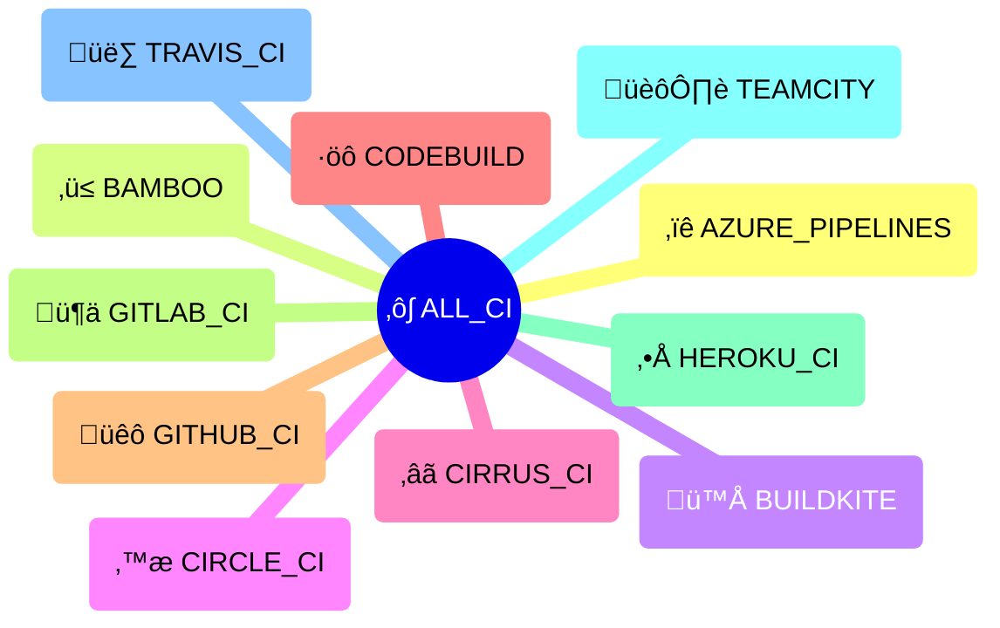

# {octicon}`container` CI systems

Each CI system represents a continuous integration/delivery platform, and is associated with:

- a unique CI ID
- a human-readable name
- an icon (emoji / unicode character)
- a [detection function](detection.md)
- various metadata in its `info()` method

## CI usage

Each CI system is materialized by a [`CI` object](trait.md#extra_platforms.trait.CI), from which you can access various metadata:

```pycon
>>> from extra_platforms import GITHUB_CI
>>> GITHUB_CI
CI(id='github_ci', name='GitHub Actions runner')
>>> GITHUB_CI.id
'github_ci'
>>> GITHUB_CI.current
False
>>> GITHUB_CI.info()
{'id': 'github_ci', 'name': 'GitHub Actions runner', 'icon': '🐙', 'url': 'https://docs.github.com/en/actions', 'current': False}
```

To check if the current environment is running in a specific CI system, use the corresponding [detection function](detection.md):

```pycon
>>> from extra_platforms import is_github_ci
>>> is_github_ci()
False
```

The current CI system can be obtained via the `current_ci()` function:

```pycon
>>> from extra_platforms import current_ci
>>> current_ci()
CI(id='unknown_ci', name='Unknown CI')
```

## Recognized CI

<!-- ci-table-start -->

| Icon | Symbol                                                | Name                  | Detection function                                                        |
| :--: | :---------------------------------------------------- | :-------------------- | :------------------------------------------------------------------------ |
|  ═   | [`AZURE_PIPELINES`](#extra_platforms.AZURE_PIPELINES) | Azure Pipelines       | [`is_azure_pipelines()`](detection.md#extra_platforms.is_azure_pipelines) |
|  ⟲   | [`BAMBOO`](#extra_platforms.BAMBOO)                   | Bamboo                | [`is_bamboo()`](detection.md#extra_platforms.is_bamboo)                   |
|  🪁  | [`BUILDKITE`](#extra_platforms.BUILDKITE)             | Buildkite             | [`is_buildkite()`](detection.md#extra_platforms.is_buildkite)             |
|  ⪾   | [`CIRCLE_CI`](#extra_platforms.CIRCLE_CI)             | Circle CI             | [`is_circle_ci()`](detection.md#extra_platforms.is_circle_ci)             |
|  ≋   | [`CIRRUS_CI`](#extra_platforms.CIRRUS_CI)             | Cirrus CI             | [`is_cirrus_ci()`](detection.md#extra_platforms.is_cirrus_ci)             |
|  ᚙ   | [`CODEBUILD`](#extra_platforms.CODEBUILD)             | CodeBuild             | [`is_codebuild()`](detection.md#extra_platforms.is_codebuild)             |
|  🐙  | [`GITHUB_CI`](#extra_platforms.GITHUB_CI)             | GitHub Actions runner | [`is_github_ci()`](detection.md#extra_platforms.is_github_ci)             |
|  🦊  | [`GITLAB_CI`](#extra_platforms.GITLAB_CI)             | GitLab CI             | [`is_gitlab_ci()`](detection.md#extra_platforms.is_gitlab_ci)             |
|  ⥁   | [`HEROKU_CI`](#extra_platforms.HEROKU_CI)             | Heroku CI             | [`is_heroku_ci()`](detection.md#extra_platforms.is_heroku_ci)             |
|  🏙️  | [`TEAMCITY`](#extra_platforms.TEAMCITY)               | TeamCity              | [`is_teamcity()`](detection.md#extra_platforms.is_teamcity)               |
|  👷  | [`TRAVIS_CI`](#extra_platforms.TRAVIS_CI)             | Travis CI             | [`is_travis_ci()`](detection.md#extra_platforms.is_travis_ci)             |

```{hint}
The [`UNKNOWN_CI`](#extra_platforms.UNKNOWN_CI) trait represents an unrecognized CI system. It is not included in the [`ALL_CI`](groups.md#extra_platforms.ALL_CI) group, and will be returned by `current_ci()` if the current CI system is not recognized.
```

<!-- ci-table-end -->

## Groups of CI

There is only one group defined for CI systems: `ALL_CI`, which includes all recognized CI systems.

<!-- ci-groups-table-start -->

| Icon | Symbol                                       | Description    | [Detection](detection.md)                               | [Canonical](groups.md#extra_platforms.group.Group.canonical) |
| :--: | :------------------------------------------- | :------------- | :------------------------------------------------------ | :----------------------------------------------------------: |
|  ♺   | [`ALL_CI`](groups.md#extra_platforms.ALL_CI) | All CI systems | [`is_any_ci()`](detection.md#extra_platforms.is_any_ci) |                              ⬥                               |

<!-- ci-groups-table-end -->

<!-- ci-sankey-start -->


<!-- ci-sankey-end -->

<!-- ci-mindmap-start -->



<!-- ci-mindmap-end -->

## Predefined CI

```{eval-rst}
.. autoclasstree:: extra_platforms.ci_data
   :strict:
```

```{eval-rst}
.. automodule:: extra_platforms.ci_data
```

<!-- ci-data-autodata-start -->

```{eval-rst}
.. autodata:: extra_platforms.AZURE_PIPELINES
.. autodata:: extra_platforms.BAMBOO
.. autodata:: extra_platforms.BUILDKITE
.. autodata:: extra_platforms.CIRCLE_CI
.. autodata:: extra_platforms.CIRRUS_CI
.. autodata:: extra_platforms.CODEBUILD
.. autodata:: extra_platforms.GITHUB_CI
.. autodata:: extra_platforms.GITLAB_CI
.. autodata:: extra_platforms.HEROKU_CI
.. autodata:: extra_platforms.TEAMCITY
.. autodata:: extra_platforms.TRAVIS_CI
.. autodata:: extra_platforms.UNKNOWN_CI
```

<!-- ci-data-autodata-end -->
