# Groups

## OS families

Each platform is assigned to a group of non-overlpaping families:

```mermaid
---
title: <code>extra_platforms.NON_OVERLAPPING_GROUPS</code> - Non-overlapping groups.
---
flowchart

    subgraph "<code>extra_platforms.ANY_WINDOWS</code><br/>🪟 <em>Any Windows</em>"
        any_windows_windows(<code>windows</code><br/>🪟 <em>Windows</em>)
    end
    subgraph "<code>extra_platforms.BSD</code><br/>🅱️+ <em>Any BSD</em>"
        bsd_freebsd(<code>freebsd</code><br/>😈 <em>FreeBSD</em>)
        bsd_macos(<code>macos</code><br/>🍎 <em>macOS</em>)
        bsd_midnightbsd(<code>midnightbsd</code><br/>🌘 <em>MidnightBSD</em>)
        bsd_netbsd(<code>netbsd</code><br/>🚩 <em>NetBSD</em>)
        bsd_openbsd(<code>openbsd</code><br/>🐡 <em>OpenBSD</em>)
        bsd_sunos(<code>sunos</code><br/>☀️ <em>SunOS</em>)
    end
    subgraph "<code>extra_platforms.CI</code><br/>♺ <em>CI systems</em>"
        ci_github_ci(<code>github_ci</code><br/>🐙 <em>GitHub Actions runner</em>)
        ci_gitlab_ci(<code>gitlab_ci</code><br/>🦊 <em>GitLab CI</em>)
        ci_unknown_ci(<code>unknown_ci</code><br/>♲ <em>Unknown CI</em>)
    end
    subgraph "<code>extra_platforms.LINUX</code><br/>🐧 <em>Any Linux distribution</em>"
        linux_altlinux(<code>altlinux</code><br/>🐧 <em>ALT Linux</em>)
        linux_amzn(<code>amzn</code><br/>🙂 <em>Amazon Linux</em>)
        linux_android(<code>android</code><br/>🤖 <em>Android</em>)
        linux_arch(<code>arch</code><br/>🎗️ <em>Arch Linux</em>)
        linux_buildroot(<code>buildroot</code><br/>⛑️ <em>Buildroot</em>)
        linux_centos(<code>centos</code><br/>💠 <em>CentOS</em>)
        linux_cloudlinux(<code>cloudlinux</code><br/>꩜ <em>CloudLinux OS</em>)
        linux_debian(<code>debian</code><br/>🌀 <em>Debian</em>)
        linux_exherbo(<code>exherbo</code><br/>🐽 <em>Exherbo Linux</em>)
        linux_fedora(<code>fedora</code><br/>🎩 <em>Fedora</em>)
        linux_gentoo(<code>gentoo</code><br/>🗜️ <em>Gentoo Linux</em>)
        linux_guix(<code>guix</code><br/>🐃 <em>Guix System</em>)
        linux_ibm_powerkvm(<code>ibm_powerkvm</code><br/>🤹 <em>IBM PowerKVM</em>)
        linux_kvmibm(<code>kvmibm</code><br/>🤹 <em>KVM for IBM z Systems</em>)
        linux_linuxmint(<code>linuxmint</code><br/>🌿 <em>Linux Mint</em>)
        linux_mageia(<code>mageia</code><br/>⍥ <em>Mageia</em>)
        linux_mandriva(<code>mandriva</code><br/>💫 <em>Mandriva Linux</em>)
        linux_nobara(<code>nobara</code><br/> <em>Nobara</em>)
        linux_opensuse(<code>opensuse</code><br/>🦎 <em>openSUSE</em>)
        linux_oracle(<code>oracle</code><br/>🦴 <em>Oracle Linux</em>)
        linux_parallels(<code>parallels</code><br/>∥ <em>Parallels</em>)
        linux_pidora(<code>pidora</code><br/>🍓 <em>Pidora</em>)
        linux_raspbian(<code>raspbian</code><br/>🍓 <em>Raspbian</em>)
        linux_rhel(<code>rhel</code><br/>🎩 <em>RedHat Enterprise Linux</em>)
        linux_rocky(<code>rocky</code><br/>⛰️ <em>Rocky Linux</em>)
        linux_scientific(<code>scientific</code><br/>⚛️ <em>Scientific Linux</em>)
        linux_slackware(<code>slackware</code><br/>🚬 <em>Slackware</em>)
        linux_sles(<code>sles</code><br/>🦎 <em>SUSE Linux Enterprise Server</em>)
        linux_tumbleweed(<code>tumbleweed</code><br/>↻ <em>openSUSE Tumbleweed</em>)
        linux_tuxedo(<code>tuxedo</code><br/>🤵 <em>Tuxedo OS</em>)
        linux_ubuntu(<code>ubuntu</code><br/>🎯 <em>Ubuntu</em>)
        linux_unknown_linux(<code>unknown_linux</code><br/>🐧 <em>Unknown Linux</em>)
        linux_xenserver(<code>xenserver</code><br/>Ⓧ <em>XenServer</em>)
    end
    subgraph "<code>extra_platforms.LINUX_LAYERS</code><br/>≚ <em>Any Linux compatibility layers</em>"
        linux_layers_wsl1(<code>wsl1</code><br/>⊞ <em>Windows Subsystem for Linux v1</em>)
        linux_layers_wsl2(<code>wsl2</code><br/>⊞ <em>Windows Subsystem for Linux v2</em>)
    end
    subgraph "<code>extra_platforms.OTHER_UNIX</code><br/>⊎ <em>Any other Unix</em>"
        other_unix_hurd(<code>hurd</code><br/>🐃 <em>GNU/Hurd</em>)
    end
    subgraph "<code>extra_platforms.SYSTEM_V</code><br/>Ⅴ <em>Any Unix derived from AT&amp;T System Five</em>"
        system_v_aix(<code>aix</code><br/>➿ <em>IBM AIX</em>)
        system_v_solaris(<code>solaris</code><br/>🌞 <em>Solaris</em>)
    end
    subgraph "<code>extra_platforms.UNIX_LAYERS</code><br/>≛ <em>Any Unix compatibility layers</em>"
        unix_layers_cygwin(<code>cygwin</code><br/>Ͼ <em>Cygwin</em>)
    end
```

<!-- NON_OVERLAPPING_GROUPS-graph-start -->



<!-- NON_OVERLAPPING_GROUPS-graph-end -->

## Other groups

Other groups are available for convenience, but these overlaps:

```mermaid
---
title: <code>extra_platforms.EXTRA_GROUPS</code> - Overlapping groups, defined for convenience.
---
flowchart

    subgraph "<code>extra_platforms.ALL_PLATFORMS</code><br/>🖥️ <em>All platforms</em>"
        all_platforms_aix(<code>aix</code><br/>➿ <em>IBM AIX</em>)
        all_platforms_altlinux(<code>altlinux</code><br/>🐧 <em>ALT Linux</em>)
        all_platforms_amzn(<code>amzn</code><br/>🙂 <em>Amazon Linux</em>)
        all_platforms_android(<code>android</code><br/>🤖 <em>Android</em>)
        all_platforms_arch(<code>arch</code><br/>🎗️ <em>Arch Linux</em>)
        all_platforms_buildroot(<code>buildroot</code><br/>⛑️ <em>Buildroot</em>)
        all_platforms_centos(<code>centos</code><br/>💠 <em>CentOS</em>)
        all_platforms_cloudlinux(<code>cloudlinux</code><br/>꩜ <em>CloudLinux OS</em>)
        all_platforms_cygwin(<code>cygwin</code><br/>Ͼ <em>Cygwin</em>)
        all_platforms_debian(<code>debian</code><br/>🌀 <em>Debian</em>)
        all_platforms_exherbo(<code>exherbo</code><br/>🐽 <em>Exherbo Linux</em>)
        all_platforms_fedora(<code>fedora</code><br/>🎩 <em>Fedora</em>)
        all_platforms_freebsd(<code>freebsd</code><br/>😈 <em>FreeBSD</em>)
        all_platforms_gentoo(<code>gentoo</code><br/>🗜️ <em>Gentoo Linux</em>)
        all_platforms_github_ci(<code>github_ci</code><br/>🐙 <em>GitHub Actions runner</em>)
        all_platforms_gitlab_ci(<code>gitlab_ci</code><br/>🦊 <em>GitLab CI</em>)
        all_platforms_guix(<code>guix</code><br/>🐃 <em>Guix System</em>)
        all_platforms_hurd(<code>hurd</code><br/>🐃 <em>GNU/Hurd</em>)
        all_platforms_ibm_powerkvm(<code>ibm_powerkvm</code><br/>🤹 <em>IBM PowerKVM</em>)
        all_platforms_kvmibm(<code>kvmibm</code><br/>🤹 <em>KVM for IBM z Systems</em>)
        all_platforms_linuxmint(<code>linuxmint</code><br/>🌿 <em>Linux Mint</em>)
        all_platforms_macos(<code>macos</code><br/>🍎 <em>macOS</em>)
        all_platforms_mageia(<code>mageia</code><br/>⍥ <em>Mageia</em>)
        all_platforms_mandriva(<code>mandriva</code><br/>💫 <em>Mandriva Linux</em>)
        all_platforms_midnightbsd(<code>midnightbsd</code><br/>🌘 <em>MidnightBSD</em>)
        all_platforms_netbsd(<code>netbsd</code><br/>🚩 <em>NetBSD</em>)
        all_platforms_nobara(<code>nobara</code><br/> <em>Nobara</em>)
        all_platforms_openbsd(<code>openbsd</code><br/>🐡 <em>OpenBSD</em>)
        all_platforms_opensuse(<code>opensuse</code><br/>🦎 <em>openSUSE</em>)
        all_platforms_oracle(<code>oracle</code><br/>🦴 <em>Oracle Linux</em>)
        all_platforms_parallels(<code>parallels</code><br/>∥ <em>Parallels</em>)
        all_platforms_pidora(<code>pidora</code><br/>🍓 <em>Pidora</em>)
        all_platforms_raspbian(<code>raspbian</code><br/>🍓 <em>Raspbian</em>)
        all_platforms_rhel(<code>rhel</code><br/>🎩 <em>RedHat Enterprise Linux</em>)
        all_platforms_rocky(<code>rocky</code><br/>⛰️ <em>Rocky Linux</em>)
        all_platforms_scientific(<code>scientific</code><br/>⚛️ <em>Scientific Linux</em>)
        all_platforms_slackware(<code>slackware</code><br/>🚬 <em>Slackware</em>)
        all_platforms_sles(<code>sles</code><br/>🦎 <em>SUSE Linux Enterprise Server</em>)
        all_platforms_solaris(<code>solaris</code><br/>🌞 <em>Solaris</em>)
        all_platforms_sunos(<code>sunos</code><br/>☀️ <em>SunOS</em>)
        all_platforms_tumbleweed(<code>tumbleweed</code><br/>↻ <em>openSUSE Tumbleweed</em>)
        all_platforms_tuxedo(<code>tuxedo</code><br/>🤵 <em>Tuxedo OS</em>)
        all_platforms_ubuntu(<code>ubuntu</code><br/>🎯 <em>Ubuntu</em>)
        all_platforms_unknown_ci(<code>unknown_ci</code><br/>♲ <em>Unknown CI</em>)
        all_platforms_unknown_linux(<code>unknown_linux</code><br/>🐧 <em>Unknown Linux</em>)
        all_platforms_windows(<code>windows</code><br/>🪟 <em>Windows</em>)
        all_platforms_wsl1(<code>wsl1</code><br/>⊞ <em>Windows Subsystem for Linux v1</em>)
        all_platforms_wsl2(<code>wsl2</code><br/>⊞ <em>Windows Subsystem for Linux v2</em>)
        all_platforms_xenserver(<code>xenserver</code><br/>Ⓧ <em>XenServer</em>)
    end
    subgraph "<code>extra_platforms.BSD_WITHOUT_MACOS</code><br/>🅱️ <em>Any BSD excluding macOS</em>"
        bsd_without_macos_freebsd(<code>freebsd</code><br/>😈 <em>FreeBSD</em>)
        bsd_without_macos_midnightbsd(<code>midnightbsd</code><br/>🌘 <em>MidnightBSD</em>)
        bsd_without_macos_netbsd(<code>netbsd</code><br/>🚩 <em>NetBSD</em>)
        bsd_without_macos_openbsd(<code>openbsd</code><br/>🐡 <em>OpenBSD</em>)
        bsd_without_macos_sunos(<code>sunos</code><br/>☀️ <em>SunOS</em>)
    end
    subgraph "<code>extra_platforms.LINUX_LIKE</code><br/>🐧+ <em>Any Linux and compatibility layers</em>"
        linux_like_altlinux(<code>altlinux</code><br/>🐧 <em>ALT Linux</em>)
        linux_like_amzn(<code>amzn</code><br/>🙂 <em>Amazon Linux</em>)
        linux_like_android(<code>android</code><br/>🤖 <em>Android</em>)
        linux_like_arch(<code>arch</code><br/>🎗️ <em>Arch Linux</em>)
        linux_like_buildroot(<code>buildroot</code><br/>⛑️ <em>Buildroot</em>)
        linux_like_centos(<code>centos</code><br/>💠 <em>CentOS</em>)
        linux_like_cloudlinux(<code>cloudlinux</code><br/>꩜ <em>CloudLinux OS</em>)
        linux_like_debian(<code>debian</code><br/>🌀 <em>Debian</em>)
        linux_like_exherbo(<code>exherbo</code><br/>🐽 <em>Exherbo Linux</em>)
        linux_like_fedora(<code>fedora</code><br/>🎩 <em>Fedora</em>)
        linux_like_gentoo(<code>gentoo</code><br/>🗜️ <em>Gentoo Linux</em>)
        linux_like_guix(<code>guix</code><br/>🐃 <em>Guix System</em>)
        linux_like_ibm_powerkvm(<code>ibm_powerkvm</code><br/>🤹 <em>IBM PowerKVM</em>)
        linux_like_kvmibm(<code>kvmibm</code><br/>🤹 <em>KVM for IBM z Systems</em>)
        linux_like_linuxmint(<code>linuxmint</code><br/>🌿 <em>Linux Mint</em>)
        linux_like_mageia(<code>mageia</code><br/>⍥ <em>Mageia</em>)
        linux_like_mandriva(<code>mandriva</code><br/>💫 <em>Mandriva Linux</em>)
        linux_like_nobara(<code>nobara</code><br/> <em>Nobara</em>)
        linux_like_opensuse(<code>opensuse</code><br/>🦎 <em>openSUSE</em>)
        linux_like_oracle(<code>oracle</code><br/>🦴 <em>Oracle Linux</em>)
        linux_like_parallels(<code>parallels</code><br/>∥ <em>Parallels</em>)
        linux_like_pidora(<code>pidora</code><br/>🍓 <em>Pidora</em>)
        linux_like_raspbian(<code>raspbian</code><br/>🍓 <em>Raspbian</em>)
        linux_like_rhel(<code>rhel</code><br/>🎩 <em>RedHat Enterprise Linux</em>)
        linux_like_rocky(<code>rocky</code><br/>⛰️ <em>Rocky Linux</em>)
        linux_like_scientific(<code>scientific</code><br/>⚛️ <em>Scientific Linux</em>)
        linux_like_slackware(<code>slackware</code><br/>🚬 <em>Slackware</em>)
        linux_like_sles(<code>sles</code><br/>🦎 <em>SUSE Linux Enterprise Server</em>)
        linux_like_tumbleweed(<code>tumbleweed</code><br/>↻ <em>openSUSE Tumbleweed</em>)
        linux_like_tuxedo(<code>tuxedo</code><br/>🤵 <em>Tuxedo OS</em>)
        linux_like_ubuntu(<code>ubuntu</code><br/>🎯 <em>Ubuntu</em>)
        linux_like_unknown_linux(<code>unknown_linux</code><br/>🐧 <em>Unknown Linux</em>)
        linux_like_wsl1(<code>wsl1</code><br/>⊞ <em>Windows Subsystem for Linux v1</em>)
        linux_like_wsl2(<code>wsl2</code><br/>⊞ <em>Windows Subsystem for Linux v2</em>)
        linux_like_xenserver(<code>xenserver</code><br/>Ⓧ <em>XenServer</em>)
    end
    subgraph "<code>extra_platforms.UNIX</code><br/>⨷ <em>Any Unix</em>"
        unix_aix(<code>aix</code><br/>➿ <em>IBM AIX</em>)
        unix_altlinux(<code>altlinux</code><br/>🐧 <em>ALT Linux</em>)
        unix_amzn(<code>amzn</code><br/>🙂 <em>Amazon Linux</em>)
        unix_android(<code>android</code><br/>🤖 <em>Android</em>)
        unix_arch(<code>arch</code><br/>🎗️ <em>Arch Linux</em>)
        unix_buildroot(<code>buildroot</code><br/>⛑️ <em>Buildroot</em>)
        unix_centos(<code>centos</code><br/>💠 <em>CentOS</em>)
        unix_cloudlinux(<code>cloudlinux</code><br/>꩜ <em>CloudLinux OS</em>)
        unix_cygwin(<code>cygwin</code><br/>Ͼ <em>Cygwin</em>)
        unix_debian(<code>debian</code><br/>🌀 <em>Debian</em>)
        unix_exherbo(<code>exherbo</code><br/>🐽 <em>Exherbo Linux</em>)
        unix_fedora(<code>fedora</code><br/>🎩 <em>Fedora</em>)
        unix_freebsd(<code>freebsd</code><br/>😈 <em>FreeBSD</em>)
        unix_gentoo(<code>gentoo</code><br/>🗜️ <em>Gentoo Linux</em>)
        unix_guix(<code>guix</code><br/>🐃 <em>Guix System</em>)
        unix_hurd(<code>hurd</code><br/>🐃 <em>GNU/Hurd</em>)
        unix_ibm_powerkvm(<code>ibm_powerkvm</code><br/>🤹 <em>IBM PowerKVM</em>)
        unix_kvmibm(<code>kvmibm</code><br/>🤹 <em>KVM for IBM z Systems</em>)
        unix_linuxmint(<code>linuxmint</code><br/>🌿 <em>Linux Mint</em>)
        unix_macos(<code>macos</code><br/>🍎 <em>macOS</em>)
        unix_mageia(<code>mageia</code><br/>⍥ <em>Mageia</em>)
        unix_mandriva(<code>mandriva</code><br/>💫 <em>Mandriva Linux</em>)
        unix_midnightbsd(<code>midnightbsd</code><br/>🌘 <em>MidnightBSD</em>)
        unix_netbsd(<code>netbsd</code><br/>🚩 <em>NetBSD</em>)
        unix_nobara(<code>nobara</code><br/> <em>Nobara</em>)
        unix_openbsd(<code>openbsd</code><br/>🐡 <em>OpenBSD</em>)
        unix_opensuse(<code>opensuse</code><br/>🦎 <em>openSUSE</em>)
        unix_oracle(<code>oracle</code><br/>🦴 <em>Oracle Linux</em>)
        unix_parallels(<code>parallels</code><br/>∥ <em>Parallels</em>)
        unix_pidora(<code>pidora</code><br/>🍓 <em>Pidora</em>)
        unix_raspbian(<code>raspbian</code><br/>🍓 <em>Raspbian</em>)
        unix_rhel(<code>rhel</code><br/>🎩 <em>RedHat Enterprise Linux</em>)
        unix_rocky(<code>rocky</code><br/>⛰️ <em>Rocky Linux</em>)
        unix_scientific(<code>scientific</code><br/>⚛️ <em>Scientific Linux</em>)
        unix_slackware(<code>slackware</code><br/>🚬 <em>Slackware</em>)
        unix_sles(<code>sles</code><br/>🦎 <em>SUSE Linux Enterprise Server</em>)
        unix_solaris(<code>solaris</code><br/>🌞 <em>Solaris</em>)
        unix_sunos(<code>sunos</code><br/>☀️ <em>SunOS</em>)
        unix_tumbleweed(<code>tumbleweed</code><br/>↻ <em>openSUSE Tumbleweed</em>)
        unix_tuxedo(<code>tuxedo</code><br/>🤵 <em>Tuxedo OS</em>)
        unix_ubuntu(<code>ubuntu</code><br/>🎯 <em>Ubuntu</em>)
        unix_unknown_linux(<code>unknown_linux</code><br/>🐧 <em>Unknown Linux</em>)
        unix_wsl1(<code>wsl1</code><br/>⊞ <em>Windows Subsystem for Linux v1</em>)
        unix_wsl2(<code>wsl2</code><br/>⊞ <em>Windows Subsystem for Linux v2</em>)
        unix_xenserver(<code>xenserver</code><br/>Ⓧ <em>XenServer</em>)
    end
    subgraph "<code>extra_platforms.UNIX_WITHOUT_MACOS</code><br/>⨂ <em>Any Unix excluding macOS</em>"
        unix_without_macos_aix(<code>aix</code><br/>➿ <em>IBM AIX</em>)
        unix_without_macos_altlinux(<code>altlinux</code><br/>🐧 <em>ALT Linux</em>)
        unix_without_macos_amzn(<code>amzn</code><br/>🙂 <em>Amazon Linux</em>)
        unix_without_macos_android(<code>android</code><br/>🤖 <em>Android</em>)
        unix_without_macos_arch(<code>arch</code><br/>🎗️ <em>Arch Linux</em>)
        unix_without_macos_buildroot(<code>buildroot</code><br/>⛑️ <em>Buildroot</em>)
        unix_without_macos_centos(<code>centos</code><br/>💠 <em>CentOS</em>)
        unix_without_macos_cloudlinux(<code>cloudlinux</code><br/>꩜ <em>CloudLinux OS</em>)
        unix_without_macos_cygwin(<code>cygwin</code><br/>Ͼ <em>Cygwin</em>)
        unix_without_macos_debian(<code>debian</code><br/>🌀 <em>Debian</em>)
        unix_without_macos_exherbo(<code>exherbo</code><br/>🐽 <em>Exherbo Linux</em>)
        unix_without_macos_fedora(<code>fedora</code><br/>🎩 <em>Fedora</em>)
        unix_without_macos_freebsd(<code>freebsd</code><br/>😈 <em>FreeBSD</em>)
        unix_without_macos_gentoo(<code>gentoo</code><br/>🗜️ <em>Gentoo Linux</em>)
        unix_without_macos_guix(<code>guix</code><br/>🐃 <em>Guix System</em>)
        unix_without_macos_hurd(<code>hurd</code><br/>🐃 <em>GNU/Hurd</em>)
        unix_without_macos_ibm_powerkvm(<code>ibm_powerkvm</code><br/>🤹 <em>IBM PowerKVM</em>)
        unix_without_macos_kvmibm(<code>kvmibm</code><br/>🤹 <em>KVM for IBM z Systems</em>)
        unix_without_macos_linuxmint(<code>linuxmint</code><br/>🌿 <em>Linux Mint</em>)
        unix_without_macos_mageia(<code>mageia</code><br/>⍥ <em>Mageia</em>)
        unix_without_macos_mandriva(<code>mandriva</code><br/>💫 <em>Mandriva Linux</em>)
        unix_without_macos_midnightbsd(<code>midnightbsd</code><br/>🌘 <em>MidnightBSD</em>)
        unix_without_macos_netbsd(<code>netbsd</code><br/>🚩 <em>NetBSD</em>)
        unix_without_macos_nobara(<code>nobara</code><br/> <em>Nobara</em>)
        unix_without_macos_openbsd(<code>openbsd</code><br/>🐡 <em>OpenBSD</em>)
        unix_without_macos_opensuse(<code>opensuse</code><br/>🦎 <em>openSUSE</em>)
        unix_without_macos_oracle(<code>oracle</code><br/>🦴 <em>Oracle Linux</em>)
        unix_without_macos_parallels(<code>parallels</code><br/>∥ <em>Parallels</em>)
        unix_without_macos_pidora(<code>pidora</code><br/>🍓 <em>Pidora</em>)
        unix_without_macos_raspbian(<code>raspbian</code><br/>🍓 <em>Raspbian</em>)
        unix_without_macos_rhel(<code>rhel</code><br/>🎩 <em>RedHat Enterprise Linux</em>)
        unix_without_macos_rocky(<code>rocky</code><br/>⛰️ <em>Rocky Linux</em>)
        unix_without_macos_scientific(<code>scientific</code><br/>⚛️ <em>Scientific Linux</em>)
        unix_without_macos_slackware(<code>slackware</code><br/>🚬 <em>Slackware</em>)
        unix_without_macos_sles(<code>sles</code><br/>🦎 <em>SUSE Linux Enterprise Server</em>)
        unix_without_macos_solaris(<code>solaris</code><br/>🌞 <em>Solaris</em>)
        unix_without_macos_sunos(<code>sunos</code><br/>☀️ <em>SunOS</em>)
        unix_without_macos_tumbleweed(<code>tumbleweed</code><br/>↻ <em>openSUSE Tumbleweed</em>)
        unix_without_macos_tuxedo(<code>tuxedo</code><br/>🤵 <em>Tuxedo OS</em>)
        unix_without_macos_ubuntu(<code>ubuntu</code><br/>🎯 <em>Ubuntu</em>)
        unix_without_macos_unknown_linux(<code>unknown_linux</code><br/>🐧 <em>Unknown Linux</em>)
        unix_without_macos_wsl1(<code>wsl1</code><br/>⊞ <em>Windows Subsystem for Linux v1</em>)
        unix_without_macos_wsl2(<code>wsl2</code><br/>⊞ <em>Windows Subsystem for Linux v2</em>)
        unix_without_macos_xenserver(<code>xenserver</code><br/>Ⓧ <em>XenServer</em>)
    end
```

<!-- EXTRA_GROUPS-graph-start -->



<!-- EXTRA_GROUPS-graph-end -->

> [!IMPORTANT]
> All the graphs above would be better off if merged. Unfortunately Graphviz is not capable of producing [Euler diagrams](https://xkcd.com/2721/). Only non-overlapping clusters can be rendered.
>
> There's still a chance to [have them supported by Mermaid](https://github.com/mermaid-js/mermaid/issues/2583) so we can switch to that if the feature materialize.

## `extra_platforms.group` API

```{eval-rst}
.. autoclasstree:: extra_platforms.group
   :strict:
```

```{eval-rst}
.. automodule:: extra_platforms.group
   :members:
   :undoc-members:
   :show-inheritance:
```

## `extra_platforms.group_data` API

```{eval-rst}
.. autoclasstree:: extra_platforms.group_data
   :strict:
```

```{eval-rst}
.. automodule:: extra_platforms.group_data
   :members:
   :undoc-members:
   :show-inheritance:
```
