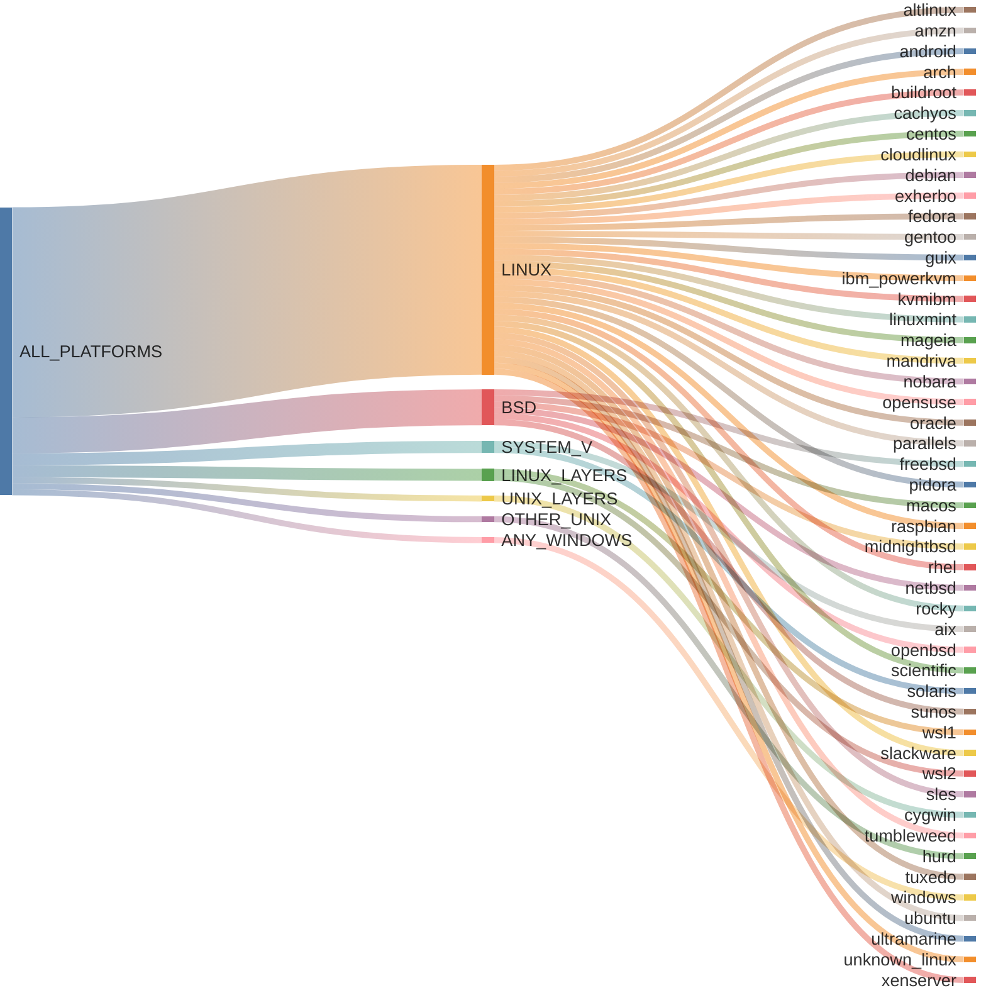
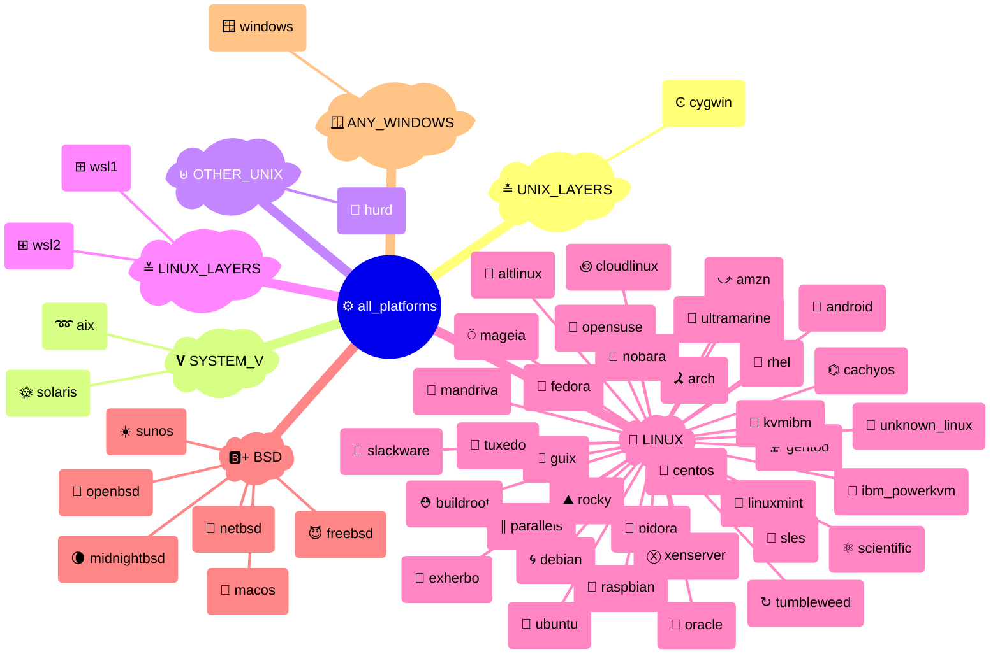

# {octicon}`codespaces` Platforms

Each platform represents an operating system or OS-like environment, and is associated with:

- a unique platform ID
- a human-readable name
- an icon (emoji / unicode character)
- a [detection function](detection.md)
- various metadata in its `info()` method

Each platform is materialized by a [`Platform` object](#extra_platforms.platform.Platform), from which you can access various metadata:

```pycon
>>> from extra_platforms import DEBIAN
>>> DEBIAN
Platform(id='debian', name='Debian')
>>> DEBIAN.id
'debian'
>>> DEBIAN.current
False
>>> DEBIAN.info()
{'id': 'debian', 'name': 'Debian', 'icon': '🌀', 'url': 'https://debian.org', 'current': False, 'distro_id': None, 'version': None, 'version_parts': {'major': None, 'minor': None, 'build_number': None}, 'like': None, 'codename': None}
```

To check if the current platform matches a specific platform, use the corresponding [detection function](detection.md):

```pycon
>>> from extra_platforms import is_macos
>>> is_macos()
True
```

The current platform can be obtained via the `current_platform()` function:

```pycon
>>> from extra_platforms import current_platform
>>> current_platform()
Platform(id='macos', name='macOS')
```

## Recognized platforms

<!-- platform-table-start -->

|  Icon  | Symbol                                                          | Name                           | Detection function                                                              |
| :--: | :-------------------------------------------------------------- | :----------------------------- | :------------------------------------------------------------------------------ |
|   ➿   | [`AIX`](#extra_platforms.platform_data.AIX)                     | IBM AIX                        | [`is_aix()`](detection.md#extra_platforms.detection.is_aix)                     |
|   🐧   | [`ALTLINUX`](#extra_platforms.platform_data.ALTLINUX)           | ALT Linux                      | [`is_altlinux()`](detection.md#extra_platforms.detection.is_altlinux)           |
|   ⤻    | [`AMZN`](#extra_platforms.platform_data.AMZN)                   | Amazon Linux                   | [`is_amzn()`](detection.md#extra_platforms.detection.is_amzn)                   |
|   🤖   | [`ANDROID`](#extra_platforms.platform_data.ANDROID)             | Android                        | [`is_android()`](detection.md#extra_platforms.detection.is_android)             |
|   🎗️   | [`ARCH`](#extra_platforms.platform_data.ARCH)                   | Arch Linux                     | [`is_arch()`](detection.md#extra_platforms.detection.is_arch)                   |
|   ⛑️   | [`BUILDROOT`](#extra_platforms.platform_data.BUILDROOT)         | Buildroot                      | [`is_buildroot()`](detection.md#extra_platforms.detection.is_buildroot)         |
|   ⌬    | [`CACHYOS`](#extra_platforms.platform_data.CACHYOS)             | CachyOS                        | [`is_cachyos()`](detection.md#extra_platforms.detection.is_cachyos)             |
|   💠   | [`CENTOS`](#extra_platforms.platform_data.CENTOS)               | CentOS                         | [`is_centos()`](detection.md#extra_platforms.detection.is_centos)               |
|   ꩜    | [`CLOUDLINUX`](#extra_platforms.platform_data.CLOUDLINUX)       | CloudLinux OS                  | [`is_cloudlinux()`](detection.md#extra_platforms.detection.is_cloudlinux)       |
|   Ͼ    | [`CYGWIN`](#extra_platforms.platform_data.CYGWIN)               | Cygwin                         | [`is_cygwin()`](detection.md#extra_platforms.detection.is_cygwin)               |
|   🌀   | [`DEBIAN`](#extra_platforms.platform_data.DEBIAN)               | Debian                         | [`is_debian()`](detection.md#extra_platforms.detection.is_debian)               |
|   🐽   | [`EXHERBO`](#extra_platforms.platform_data.EXHERBO)             | Exherbo Linux                  | [`is_exherbo()`](detection.md#extra_platforms.detection.is_exherbo)             |
|   🎩   | [`FEDORA`](#extra_platforms.platform_data.FEDORA)               | Fedora                         | [`is_fedora()`](detection.md#extra_platforms.detection.is_fedora)               |
|   😈   | [`FREEBSD`](#extra_platforms.platform_data.FREEBSD)             | FreeBSD                        | [`is_freebsd()`](detection.md#extra_platforms.detection.is_freebsd)             |
|   🗜️   | [`GENTOO`](#extra_platforms.platform_data.GENTOO)               | Gentoo Linux                   | [`is_gentoo()`](detection.md#extra_platforms.detection.is_gentoo)               |
|   🐃   | [`GUIX`](#extra_platforms.platform_data.GUIX)                   | Guix System                    | [`is_guix()`](detection.md#extra_platforms.detection.is_guix)                   |
|   🐃   | [`HURD`](#extra_platforms.platform_data.HURD)                   | GNU/Hurd                       | [`is_hurd()`](detection.md#extra_platforms.detection.is_hurd)                   |
|   🤹   | [`IBM_POWERKVM`](#extra_platforms.platform_data.IBM_POWERKVM)   | IBM PowerKVM                   | [`is_ibm_powerkvm()`](detection.md#extra_platforms.detection.is_ibm_powerkvm)   |
|   🤹   | [`KVMIBM`](#extra_platforms.platform_data.KVMIBM)               | KVM for IBM z Systems          | [`is_kvmibm()`](detection.md#extra_platforms.detection.is_kvmibm)               |
|   🌿   | [`LINUXMINT`](#extra_platforms.platform_data.LINUXMINT)         | Linux Mint                     | [`is_linuxmint()`](detection.md#extra_platforms.detection.is_linuxmint)         |
|   🍎   | [`MACOS`](#extra_platforms.platform_data.MACOS)                 | macOS                          | [`is_macos()`](detection.md#extra_platforms.detection.is_macos)                 |
|   ⍥    | [`MAGEIA`](#extra_platforms.platform_data.MAGEIA)               | Mageia                         | [`is_mageia()`](detection.md#extra_platforms.detection.is_mageia)               |
|   💫   | [`MANDRIVA`](#extra_platforms.platform_data.MANDRIVA)           | Mandriva Linux                 | [`is_mandriva()`](detection.md#extra_platforms.detection.is_mandriva)           |
|   🌘   | [`MIDNIGHTBSD`](#extra_platforms.platform_data.MIDNIGHTBSD)     | MidnightBSD                    | [`is_midnightbsd()`](detection.md#extra_platforms.detection.is_midnightbsd)     |
|   🚩   | [`NETBSD`](#extra_platforms.platform_data.NETBSD)               | NetBSD                         | [`is_netbsd()`](detection.md#extra_platforms.detection.is_netbsd)               |
|       | [`NOBARA`](#extra_platforms.platform_data.NOBARA)               | Nobara                         | [`is_nobara()`](detection.md#extra_platforms.detection.is_nobara)               |
|   🐡   | [`OPENBSD`](#extra_platforms.platform_data.OPENBSD)             | OpenBSD                        | [`is_openbsd()`](detection.md#extra_platforms.detection.is_openbsd)             |
|   🦎   | [`OPENSUSE`](#extra_platforms.platform_data.OPENSUSE)           | openSUSE                       | [`is_opensuse()`](detection.md#extra_platforms.detection.is_opensuse)           |
|   🦴   | [`ORACLE`](#extra_platforms.platform_data.ORACLE)               | Oracle Linux                   | [`is_oracle()`](detection.md#extra_platforms.detection.is_oracle)               |
|   ∥    | [`PARALLELS`](#extra_platforms.platform_data.PARALLELS)         | Parallels                      | [`is_parallels()`](detection.md#extra_platforms.detection.is_parallels)         |
|   🍓   | [`PIDORA`](#extra_platforms.platform_data.PIDORA)               | Pidora                         | [`is_pidora()`](detection.md#extra_platforms.detection.is_pidora)               |
|   🍓   | [`RASPBIAN`](#extra_platforms.platform_data.RASPBIAN)           | Raspbian                       | [`is_raspbian()`](detection.md#extra_platforms.detection.is_raspbian)           |
|   🎩   | [`RHEL`](#extra_platforms.platform_data.RHEL)                   | RedHat Enterprise Linux        | [`is_rhel()`](detection.md#extra_platforms.detection.is_rhel)                   |
|   ⛰️   | [`ROCKY`](#extra_platforms.platform_data.ROCKY)                 | Rocky Linux                    | [`is_rocky()`](detection.md#extra_platforms.detection.is_rocky)                 |
|   ⚛️   | [`SCIENTIFIC`](#extra_platforms.platform_data.SCIENTIFIC)       | Scientific Linux               | [`is_scientific()`](detection.md#extra_platforms.detection.is_scientific)       |
|   🚬   | [`SLACKWARE`](#extra_platforms.platform_data.SLACKWARE)         | Slackware                      | [`is_slackware()`](detection.md#extra_platforms.detection.is_slackware)         |
|   🦎   | [`SLES`](#extra_platforms.platform_data.SLES)                   | SUSE Linux Enterprise Server   | [`is_sles()`](detection.md#extra_platforms.detection.is_sles)                   |
|   🌞   | [`SOLARIS`](#extra_platforms.platform_data.SOLARIS)             | Solaris                        | [`is_solaris()`](detection.md#extra_platforms.detection.is_solaris)             |
|   ☀️   | [`SUNOS`](#extra_platforms.platform_data.SUNOS)                 | SunOS                          | [`is_sunos()`](detection.md#extra_platforms.detection.is_sunos)                 |
|   ↻    | [`TUMBLEWEED`](#extra_platforms.platform_data.TUMBLEWEED)       | openSUSE Tumbleweed            | [`is_tumbleweed()`](detection.md#extra_platforms.detection.is_tumbleweed)       |
|   🤵   | [`TUXEDO`](#extra_platforms.platform_data.TUXEDO)               | Tuxedo OS                      | [`is_tuxedo()`](detection.md#extra_platforms.detection.is_tuxedo)               |
|   🎯   | [`UBUNTU`](#extra_platforms.platform_data.UBUNTU)               | Ubuntu                         | [`is_ubuntu()`](detection.md#extra_platforms.detection.is_ubuntu)               |
|   🌊   | [`ULTRAMARINE`](#extra_platforms.platform_data.ULTRAMARINE)     | Ultramarine                    | [`is_ultramarine()`](detection.md#extra_platforms.detection.is_ultramarine)     |
|   🐧   | [`UNKNOWN_LINUX`](#extra_platforms.platform_data.UNKNOWN_LINUX) | Unknown Linux                  | [`is_unknown_linux()`](detection.md#extra_platforms.detection.is_unknown_linux) |
|   🪟   | [`WINDOWS`](#extra_platforms.platform_data.WINDOWS)             | Windows                        | [`is_windows()`](detection.md#extra_platforms.detection.is_windows)             |
|   ⊞    | [`WSL1`](#extra_platforms.platform_data.WSL1)                   | Windows Subsystem for Linux v1 | [`is_wsl1()`](detection.md#extra_platforms.detection.is_wsl1)                   |
|   ⊞    | [`WSL2`](#extra_platforms.platform_data.WSL2)                   | Windows Subsystem for Linux v2 | [`is_wsl2()`](detection.md#extra_platforms.detection.is_wsl2)                   |
|   Ⓧ    | [`XENSERVER`](#extra_platforms.platform_data.XENSERVER)         | XenServer                      | [`is_xenserver()`](detection.md#extra_platforms.detection.is_xenserver)         |

<!-- platform-table-end -->

## Groups of platforms

All recognized platforms are grouped in families.

### Canonical groups

All platforms are distributed in groups that are guaranteed to be non-overlapping.

Here is the canonical groups and all platforms, visualized as a Sankey diagram:

<!-- platform-multi-level-sankey-start -->



<!-- platform-multi-level-sankey-end -->

And the same groups visualized as a mindmap:

<!-- platform-mindmap-start -->



<!-- platform-mindmap-end -->

### All groups

Here is a table listing all defined platform groups:

<!-- platform-groups-table-start -->

|  Icon  | Symbol                                                                          | Description                        |  Canonical  |   Member count |
| :--: | :------------------------------------------------------------------------------ | :--------------------------------- | :-------: | -----------: |
|   ⚙️   | [`ALL_PLATFORMS`](groups.md#extra_platforms.group_data.ALL_PLATFORMS)           | All platforms                      |             |             48 |
|   🪟   | [`ANY_WINDOWS`](groups.md#extra_platforms.group_data.ANY_WINDOWS)               | Any Windows                        |      ⬥      |              1 |
|  🅱️+   | [`BSD`](groups.md#extra_platforms.group_data.BSD)                               | Any BSD                            |      ⬥      |              6 |
|   🅱️   | [`BSD_WITHOUT_MACOS`](groups.md#extra_platforms.group_data.BSD_WITHOUT_MACOS)   | Any BSD excluding macOS            |             |              5 |
|   🐧   | [`LINUX`](groups.md#extra_platforms.group_data.LINUX)                           | Any Linux distribution             |      ⬥      |             35 |
|   ≚    | [`LINUX_LAYERS`](groups.md#extra_platforms.group_data.LINUX_LAYERS)             | Any Linux compatibility layers     |      ⬥      |              2 |
|  🐧+   | [`LINUX_LIKE`](groups.md#extra_platforms.group_data.LINUX_LIKE)                 | Any Linux and compatibility layers |             |             37 |
|   ⊎    | [`OTHER_UNIX`](groups.md#extra_platforms.group_data.OTHER_UNIX)                 | Any other Unix                     |      ⬥      |              1 |
|   𝐕    | [`SYSTEM_V`](groups.md#extra_platforms.group_data.SYSTEM_V)                     | AT&T System Five                   |      ⬥      |              2 |
|   ⨷    | [`UNIX`](groups.md#extra_platforms.group_data.UNIX)                             | Any Unix                           |             |             47 |
|   ≛    | [`UNIX_LAYERS`](groups.md#extra_platforms.group_data.UNIX_LAYERS)               | Any Unix compatibility layers      |      ⬥      |              1 |
|   ⨂    | [`UNIX_WITHOUT_MACOS`](groups.md#extra_platforms.group_data.UNIX_WITHOUT_MACOS) | Any Unix excluding macOS           |             |             46 |

<!-- platform-groups-table-end -->

```{hint}
Canonical groups are non-overlapping groups that together cover all recognized platforms. They are marked with a ✅ icon in the table above.

Other groups are provided for convenience, but overlap with each other or with canonical groups.
```

## Contribution guidelines

To add a new Linux distribution, you can get inspiration from these pull requests:

- https://github.com/kdeldycke/extra-platforms/pull/156
- https://github.com/kdeldycke/extra-platforms/pull/94

## `extra_platforms.platform` API

```{eval-rst}
.. autoclasstree:: extra_platforms.platform
   :strict:
```

```{eval-rst}
.. automodule:: extra_platforms.platform
   :members:
   :undoc-members:
   :show-inheritance:
```

## `extra_platforms.platform_data` API

```{eval-rst}
.. autoclasstree:: extra_platforms.platform_data
   :strict:
```

```{eval-rst}
.. automodule:: extra_platforms.platform_data
```

<!-- platform-data-autodata-start -->

```{eval-rst}
.. autodata:: extra_platforms.platform_data.AIX
.. autodata:: extra_platforms.platform_data.ALTLINUX
.. autodata:: extra_platforms.platform_data.AMZN
.. autodata:: extra_platforms.platform_data.ANDROID
.. autodata:: extra_platforms.platform_data.ARCH
.. autodata:: extra_platforms.platform_data.BUILDROOT
.. autodata:: extra_platforms.platform_data.CACHYOS
.. autodata:: extra_platforms.platform_data.CENTOS
.. autodata:: extra_platforms.platform_data.CLOUDLINUX
.. autodata:: extra_platforms.platform_data.CYGWIN
.. autodata:: extra_platforms.platform_data.DEBIAN
.. autodata:: extra_platforms.platform_data.EXHERBO
.. autodata:: extra_platforms.platform_data.FEDORA
.. autodata:: extra_platforms.platform_data.FREEBSD
.. autodata:: extra_platforms.platform_data.GENTOO
.. autodata:: extra_platforms.platform_data.GUIX
.. autodata:: extra_platforms.platform_data.HURD
.. autodata:: extra_platforms.platform_data.IBM_POWERKVM
.. autodata:: extra_platforms.platform_data.KVMIBM
.. autodata:: extra_platforms.platform_data.LINUXMINT
.. autodata:: extra_platforms.platform_data.MACOS
.. autodata:: extra_platforms.platform_data.MAGEIA
.. autodata:: extra_platforms.platform_data.MANDRIVA
.. autodata:: extra_platforms.platform_data.MIDNIGHTBSD
.. autodata:: extra_platforms.platform_data.NETBSD
.. autodata:: extra_platforms.platform_data.NOBARA
.. autodata:: extra_platforms.platform_data.OPENBSD
.. autodata:: extra_platforms.platform_data.OPENSUSE
.. autodata:: extra_platforms.platform_data.ORACLE
.. autodata:: extra_platforms.platform_data.PARALLELS
.. autodata:: extra_platforms.platform_data.PIDORA
.. autodata:: extra_platforms.platform_data.RASPBIAN
.. autodata:: extra_platforms.platform_data.RHEL
.. autodata:: extra_platforms.platform_data.ROCKY
.. autodata:: extra_platforms.platform_data.SCIENTIFIC
.. autodata:: extra_platforms.platform_data.SLACKWARE
.. autodata:: extra_platforms.platform_data.SLES
.. autodata:: extra_platforms.platform_data.SOLARIS
.. autodata:: extra_platforms.platform_data.SUNOS
.. autodata:: extra_platforms.platform_data.TUMBLEWEED
.. autodata:: extra_platforms.platform_data.TUXEDO
.. autodata:: extra_platforms.platform_data.UBUNTU
.. autodata:: extra_platforms.platform_data.ULTRAMARINE
.. autodata:: extra_platforms.platform_data.UNKNOWN_LINUX
.. autodata:: extra_platforms.platform_data.WINDOWS
.. autodata:: extra_platforms.platform_data.WSL1
.. autodata:: extra_platforms.platform_data.WSL2
.. autodata:: extra_platforms.platform_data.XENSERVER
```

<!-- platform-data-autodata-end -->
