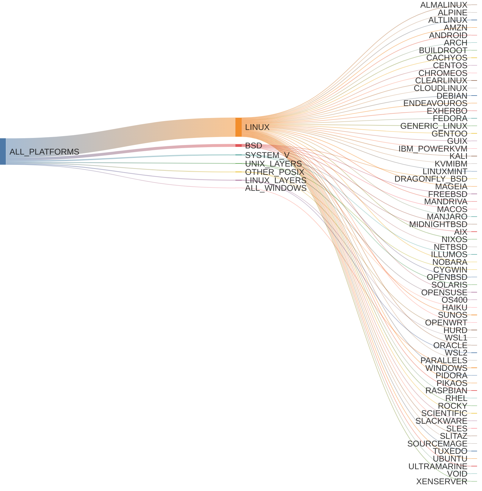
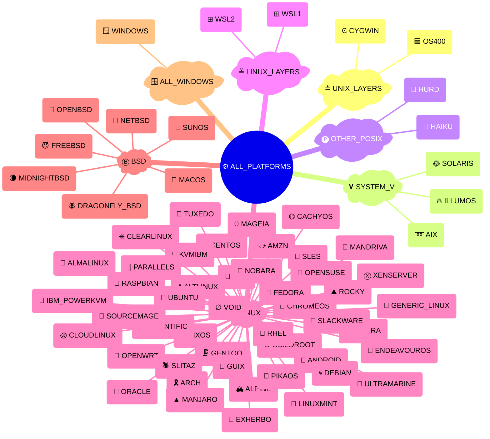

# {octicon}`codespaces` Platforms

```{py:currentmodule} extra_platforms
```

Each platform represents an operating system or OS-like environment, and is associated with:

- a unique platform ID
- a human-readable name
- an icon (emoji / unicode character)
- a [detection function](detection.md)
- various metadata in its {meth}`~Platform.info` method

## Platform usage

Each platform is materialized by a {class}`~Platform` object, from which you can access various metadata:

```pycon
>>> from extra_platforms import DEBIAN
>>> DEBIAN
Platform(id='debian', name='Debian')
>>> DEBIAN.id
'debian'
>>> DEBIAN.current
False
>>> DEBIAN.info()
{'id': 'debian', 'name': 'Debian', 'icon': '🌀', 'url': 'https://debian.org', 'current': False, 'distro_id': None, 'version': None, 'version_parts': {'major': None, 'minor': None, 'build_number': None}, 'like': None, 'codename': None}
```

To check if the current platform matches a specific platform, use the corresponding [detection function](detection.md):

```pycon
>>> from extra_platforms import is_macos
>>> is_macos()
True
```

The current platform can be obtained via the `current_platform()` function:

```pycon
>>> from extra_platforms import current_platform
>>> current_platform()
Platform(id='macos', name='macOS')
```

## Compatibility layers can match at once

Most Linux distributions are identified by the `ID` field of their [`os-release`](https://www.freedesktop.org/software/systemd/man/latest/os-release.html) file, while other systems are recognized through dedicated markers like `sys.platform` values, environment variables or vendor files.

A compatibility layer is detected alongside the system it hosts, so two platform detection functions can legitimately return `True` at the same time: inside WSL, both {func}`~is_wsl2` (or {func}`~is_wsl1`) and the hosted distribution's function like {func}`~is_ubuntu` match; inside ChromeOS's Crostini container, both {func}`~is_chromeos` and {func}`~is_debian` do.

{func}`~current_platform` narrows the matches down to the most informative one by dropping the layers ({data}`~WSL1`, {data}`~WSL2`, {data}`~CHROMEOS`) in favor of the hosted distribution. {func}`~current_traits` keeps every match.

{data}`~GENERIC_LINUX` plays the opposite role: it is not an extra match but a fallback, only firing when the kernel is Linux and the distribution cannot be identified (like minimal containers or build chroots shipping no `os-release` file). {func}`~current_platform` still returns it in that situation, while logging a warning inviting you to [report](https://github.com/kdeldycke/extra-platforms/issues) the unrecognized distribution.

## Recognized platforms

Independent derivative distributions each get a dedicated platform, even when they build on a parent distribution: Ubuntu, Kali Linux, Linux Mint, Raspbian and PikaOS are all Debian derivatives, but each is managed by its own organization. Release channels, variants and flavors of a single distribution, managed by the same organization as the parent, are folded into the parent's platform: every openSUSE channel (Tumbleweed, Leap, Slowroll, MicroOS, ...) is detected as {data}`~OPENSUSE`, while the raw channel ID remains available through {meth}`~Platform.info`.

```{python:render}
:mirror:
from extra_platforms import ALL_PLATFORMS
from extra_platforms._docs import generate_trait_table

print(generate_trait_table(ALL_PLATFORMS))
```

<!-- mirror -->

| Icon | Symbol                 | Name                           | Detection function        |
| :--: | :--------------------- | :----------------------------- | :------------------------ |
|  ➿  | {data}`~AIX`           | IBM AIX                        | {func}`~is_aix`           |
|     | {data}`~ALMALINUX`     | AlmaLinux                      | {func}`~is_almalinux`     |
|  🏔️  | {data}`~ALPINE`        | Alpine Linux                   | {func}`~is_alpine`        |
|  Δ   | {data}`~ALTLINUX`      | ALT Linux                      | {func}`~is_altlinux`      |
|  ⤻   | {data}`~AMZN`          | Amazon Linux                   | {func}`~is_amzn`          |
|  🤖  | {data}`~ANDROID`       | Android                        | {func}`~is_android`       |
|  🎗️  | {data}`~ARCH`          | Arch Linux                     | {func}`~is_arch`          |
|  ⛑️  | {data}`~BUILDROOT`     | Buildroot                      | {func}`~is_buildroot`     |
|  ⌬   | {data}`~CACHYOS`       | CachyOS                        | {func}`~is_cachyos`       |
|  💠  | {data}`~CENTOS`        | CentOS                         | {func}`~is_centos`        |
|  🧿  | {data}`~CHROMEOS`      | ChromeOS                       | {func}`~is_chromeos`      |
|  ✳️  | {data}`~CLEARLINUX`    | Clear Linux OS                 | {func}`~is_clearlinux`    |
|  ꩜   | {data}`~CLOUDLINUX`    | CloudLinux OS                  | {func}`~is_cloudlinux`    |
|  Ͼ   | {data}`~CYGWIN`        | Cygwin                         | {func}`~is_cygwin`        |
|  🌀  | {data}`~DEBIAN`        | Debian                         | {func}`~is_debian`        |
|  🪰  | {data}`~DRAGONFLY_BSD` | DragonFly BSD                  | {func}`~is_dragonfly_bsd` |
|  🚀  | {data}`~ENDEAVOUROS`   | EndeavourOS                    | {func}`~is_endeavouros`   |
|  🐽  | {data}`~EXHERBO`       | Exherbo Linux                  | {func}`~is_exherbo`       |
|  🎩  | {data}`~FEDORA`        | Fedora                         | {func}`~is_fedora`        |
|  😈  | {data}`~FREEBSD`       | FreeBSD                        | {func}`~is_freebsd`       |
|  🥚  | {data}`~GENERIC_LINUX` | Generic Linux                  | {func}`~is_generic_linux` |
|  🗜️  | {data}`~GENTOO`        | Gentoo Linux                   | {func}`~is_gentoo`        |
|  🐃  | {data}`~GUIX`          | Guix System                    | {func}`~is_guix`          |
|  🍂  | {data}`~HAIKU`         | Haiku                          | {func}`~is_haiku`         |
|  🦬  | {data}`~HURD`          | GNU/Hurd                       | {func}`~is_hurd`          |
|  🤹  | {data}`~IBM_POWERKVM`  | IBM PowerKVM                   | {func}`~is_ibm_powerkvm`  |
|  🔥  | {data}`~ILLUMOS`       | illumos                        | {func}`~is_illumos`       |
|  🔱  | {data}`~KALI`          | Kali Linux                     | {func}`~is_kali`          |
|  🤹  | {data}`~KVMIBM`        | KVM for IBM z Systems          | {func}`~is_kvmibm`        |
|  🌿  | {data}`~LINUXMINT`     | Linux Mint                     | {func}`~is_linuxmint`     |
|  🍎  | {data}`~MACOS`         | macOS                          | {func}`~is_macos`         |
|  ⍥   | {data}`~MAGEIA`        | Mageia                         | {func}`~is_mageia`        |
|  💫  | {data}`~MANDRIVA`      | Mandriva Linux                 | {func}`~is_mandriva`      |
|  ▲   | {data}`~MANJARO`       | Manjaro Linux                  | {func}`~is_manjaro`       |
|  🌘  | {data}`~MIDNIGHTBSD`   | MidnightBSD                    | {func}`~is_midnightbsd`   |
|  🚩  | {data}`~NETBSD`        | NetBSD                         | {func}`~is_netbsd`        |
|  ❄️  | {data}`~NIXOS`         | NixOS                          | {func}`~is_nixos`         |
|     | {data}`~NOBARA`        | Nobara                         | {func}`~is_nobara`        |
|  🐡  | {data}`~OPENBSD`       | OpenBSD                        | {func}`~is_openbsd`       |
|  🦎  | {data}`~OPENSUSE`      | openSUSE                       | {func}`~is_opensuse`      |
|  📶  | {data}`~OPENWRT`       | OpenWrt                        | {func}`~is_openwrt`       |
|  🦴  | {data}`~ORACLE`        | Oracle Linux                   | {func}`~is_oracle`        |
|  🟦  | {data}`~OS400`         | IBM i                          | {func}`~is_os400`         |
|  ∥   | {data}`~PARALLELS`     | Parallels                      | {func}`~is_parallels`     |
|  🍓  | {data}`~PIDORA`        | Pidora                         | {func}`~is_pidora`        |
|  🐹  | {data}`~PIKAOS`        | PikaOS                         | {func}`~is_pikaos`        |
|  🍓  | {data}`~RASPBIAN`      | Raspbian                       | {func}`~is_raspbian`      |
|  🎩  | {data}`~RHEL`          | RedHat Enterprise Linux        | {func}`~is_rhel`          |
|  ⛰️  | {data}`~ROCKY`         | Rocky Linux                    | {func}`~is_rocky`         |
|  ⚛️  | {data}`~SCIENTIFIC`    | Scientific Linux               | {func}`~is_scientific`    |
|  🚬  | {data}`~SLACKWARE`     | Slackware                      | {func}`~is_slackware`     |
|  🦎  | {data}`~SLES`          | SUSE Linux Enterprise Server   | {func}`~is_sles`          |
|  🕷️  | {data}`~SLITAZ`        | SliTaz GNU/Linux               | {func}`~is_slitaz`        |
|  🌞  | {data}`~SOLARIS`       | Solaris                        | {func}`~is_solaris`       |
|  🧙  | {data}`~SOURCEMAGE`    | Source Mage GNU/Linux          | {func}`~is_sourcemage`    |
|  🌅  | {data}`~SUNOS`         | SunOS                          | {func}`~is_sunos`         |
|  🤵  | {data}`~TUXEDO`        | Tuxedo OS                      | {func}`~is_tuxedo`        |
|  🎯  | {data}`~UBUNTU`        | Ubuntu                         | {func}`~is_ubuntu`        |
|  🌊  | {data}`~ULTRAMARINE`   | Ultramarine                    | {func}`~is_ultramarine`   |
|  ∅   | {data}`~VOID`          | Void Linux                     | {func}`~is_void`          |
|  🪟  | {data}`~WINDOWS`       | Windows                        | {func}`~is_windows`       |
|  ⊞   | {data}`~WSL1`          | Windows Subsystem for Linux v1 | {func}`~is_wsl1`          |
|  ⊞   | {data}`~WSL2`          | Windows Subsystem for Linux v2 | {func}`~is_wsl2`          |
|  Ⓧ   | {data}`~XENSERVER`     | XenServer                      | {func}`~is_xenserver`     |

```{hint}
The {data}`~UNKNOWN_PLATFORM` trait represents an unrecognized
platform. It is not included in the {data}`~ALL_PLATFORMS` group,
and will be returned by {func}`~current_platform` if the current
platform is not recognized.
```

<!-- mirror-end -->

## Groups of platforms

### All platform groups

```{python:render}
:mirror:
from extra_platforms import ALL_PLATFORM_GROUPS
from extra_platforms._docs import generate_group_table

print(generate_group_table(ALL_PLATFORM_GROUPS))
```

<!-- mirror -->

| Icon | Symbol                      | Description                      | [Detection](detection.md)  | {attr}`Canonical <Group.canonical>` |
| :--: | :-------------------------- | :------------------------------- | :------------------------- | :---------------------------------: |
|  ⚙️  | {data}`~ALL_PLATFORMS`      | All platforms                    | {func}`~is_any_platform`   |                                     |
|  🪟  | {data}`~ALL_WINDOWS`        | All Windows                      | {func}`~is_any_windows`    |                  ⬥                  |
|  Ⓑ   | {data}`~BSD`                | All BSD                          | {func}`~is_bsd`            |                  ⬥                  |
|  🅱️  | {data}`~BSD_WITHOUT_MACOS`  | All BSD excluding macOS          | {func}`~is_bsd_not_macos`  |                                     |
|  🐧  | {data}`~LINUX`              | Linux distributions              | {func}`~is_linux`          |                  ⬥                  |
|  ≚   | {data}`~LINUX_LAYERS`       | Linux compatibility layers       | {func}`~is_linux_layers`   |                  ⬥                  |
|  🐣  | {data}`~LINUX_LIKE`         | All Linux & compatibility layers | {func}`~is_linux_like`     |                                     |
|  🅟   | {data}`~OTHER_POSIX`        | Other POSIX-compliant platforms  | {func}`~is_other_posix`    |                  ⬥                  |
|  𝐕   | {data}`~SYSTEM_V`           | AT&T System Five                 | {func}`~is_system_v`       |                  ⬥                  |
|  ⨷   | {data}`~UNIX`               | All Unix                         | {func}`~is_unix`           |                                     |
|  ≛   | {data}`~UNIX_LAYERS`        | Unix compatibility layers        | {func}`~is_unix_layers`    |                  ⬥                  |
|  ⨂   | {data}`~UNIX_WITHOUT_MACOS` | All Unix excluding macOS         | {func}`~is_unix_not_macos` |                                     |

```{hint}
Canonical groups are non-overlapping groups that together cover all
recognized traits. They are marked with a ⬥ icon in the table above.

Other groups are provided for convenience, but overlap with each other or
with canonical groups.
```

<!-- mirror-end -->

### Canonical groups

All platforms are distributed in groups that are guaranteed to be non-overlapping.

Here is the canonical groups and all platforms, visualized as a Sankey diagram:

```{python:render}
:mirror:
from extra_platforms import ALL_PLATFORMS, ALL_PLATFORM_GROUPS, CANONICAL_GROUPS
from extra_platforms._docs import generate_sankey

print(generate_sankey(list(CANONICAL_GROUPS & ALL_PLATFORM_GROUPS) + [ALL_PLATFORMS]))
```

<!-- mirror -->


```mermaid
---
config: {"sankey": {"showValues": false, "width": 800, "height": 800}}
---
sankey-beta

ALL_PLATFORMS,LINUX,47
ALL_PLATFORMS,BSD,7
ALL_PLATFORMS,SYSTEM_V,3
ALL_PLATFORMS,UNIX_LAYERS,2
ALL_PLATFORMS,OTHER_POSIX,2
ALL_PLATFORMS,LINUX_LAYERS,2
ALL_PLATFORMS,ALL_WINDOWS,1
LINUX,ALMALINUX,1
LINUX,ALPINE,1
LINUX,ALTLINUX,1
LINUX,AMZN,1
LINUX,ANDROID,1
LINUX,ARCH,1
LINUX,BUILDROOT,1
LINUX,CACHYOS,1
LINUX,CENTOS,1
LINUX,CHROMEOS,1
LINUX,CLEARLINUX,1
LINUX,CLOUDLINUX,1
LINUX,DEBIAN,1
LINUX,ENDEAVOUROS,1
LINUX,EXHERBO,1
LINUX,FEDORA,1
LINUX,GENERIC_LINUX,1
LINUX,GENTOO,1
LINUX,GUIX,1
LINUX,IBM_POWERKVM,1
LINUX,KALI,1
LINUX,KVMIBM,1
LINUX,LINUXMINT,1
LINUX,MAGEIA,1
LINUX,MANDRIVA,1
LINUX,MANJARO,1
LINUX,NIXOS,1
LINUX,NOBARA,1
LINUX,OPENSUSE,1
LINUX,OPENWRT,1
LINUX,ORACLE,1
LINUX,PARALLELS,1
LINUX,PIDORA,1
LINUX,PIKAOS,1
LINUX,RASPBIAN,1
LINUX,RHEL,1
LINUX,ROCKY,1
LINUX,SCIENTIFIC,1
LINUX,SLACKWARE,1
LINUX,SLES,1
LINUX,SLITAZ,1
LINUX,SOURCEMAGE,1
LINUX,TUXEDO,1
LINUX,UBUNTU,1
LINUX,ULTRAMARINE,1
LINUX,VOID,1
LINUX,XENSERVER,1
BSD,DRAGONFLY_BSD,1
BSD,FREEBSD,1
BSD,MACOS,1
BSD,MIDNIGHTBSD,1
BSD,NETBSD,1
BSD,OPENBSD,1
BSD,SUNOS,1
SYSTEM_V,AIX,1
SYSTEM_V,ILLUMOS,1
SYSTEM_V,SOLARIS,1
UNIX_LAYERS,CYGWIN,1
UNIX_LAYERS,OS400,1
OTHER_POSIX,HAIKU,1
OTHER_POSIX,HURD,1
LINUX_LAYERS,WSL1,1
LINUX_LAYERS,WSL2,1
ALL_WINDOWS,WINDOWS,1
```

<!-- mirror-end -->

And the same groups visualized as a mindmap:

```{python:render}
:mirror:
from extra_platforms import ALL_PLATFORMS, ALL_PLATFORM_GROUPS, CANONICAL_GROUPS
from extra_platforms._docs import generate_traits_mindmap

print(generate_traits_mindmap(list(CANONICAL_GROUPS & ALL_PLATFORM_GROUPS) + [ALL_PLATFORMS]))
```

<!-- mirror -->


```mermaid
---
config: {"mindmap": {"padding": 5}}
---
mindmap
    ((⚙️ ALL_PLATFORMS))
        )≛ UNIX_LAYERS(
            (Ͼ CYGWIN)
            (🟦 OS400)
        )𝐕 SYSTEM_V(
            (➿ AIX)
            (🔥 ILLUMOS)
            (🌞 SOLARIS)
        )🅟 OTHER_POSIX(
            (🍂 HAIKU)
            (🦬 HURD)
        )≚ LINUX_LAYERS(
            (⊞ WSL1)
            (⊞ WSL2)
        )🐧 LINUX(
            ( ALMALINUX)
            (🏔️ ALPINE)
            (Δ ALTLINUX)
            (⤻ AMZN)
            (🤖 ANDROID)
            (🎗️ ARCH)
            (⛑️ BUILDROOT)
            (⌬ CACHYOS)
            (💠 CENTOS)
            (🧿 CHROMEOS)
            (✳️ CLEARLINUX)
            (꩜ CLOUDLINUX)
            (🌀 DEBIAN)
            (🚀 ENDEAVOUROS)
            (🐽 EXHERBO)
            (🎩 FEDORA)
            (🥚 GENERIC_LINUX)
            (🗜️ GENTOO)
            (🐃 GUIX)
            (🤹 IBM_POWERKVM)
            (🔱 KALI)
            (🤹 KVMIBM)
            (🌿 LINUXMINT)
            (⍥ MAGEIA)
            (💫 MANDRIVA)
            (▲ MANJARO)
            (❄️ NIXOS)
            ( NOBARA)
            (🦎 OPENSUSE)
            (📶 OPENWRT)
            (🦴 ORACLE)
            (∥ PARALLELS)
            (🍓 PIDORA)
            (🐹 PIKAOS)
            (🍓 RASPBIAN)
            (🎩 RHEL)
            (⛰️ ROCKY)
            (⚛️ SCIENTIFIC)
            (🚬 SLACKWARE)
            (🦎 SLES)
            (🕷️ SLITAZ)
            (🧙 SOURCEMAGE)
            (🤵 TUXEDO)
            (🎯 UBUNTU)
            (🌊 ULTRAMARINE)
            (∅ VOID)
            (Ⓧ XENSERVER)
        )Ⓑ BSD(
            (🪰 DRAGONFLY_BSD)
            (😈 FREEBSD)
            (🍎 MACOS)
            (🌘 MIDNIGHTBSD)
            (🚩 NETBSD)
            (🐡 OPENBSD)
            (🌅 SUNOS)
        )🪟 ALL_WINDOWS(
            (🪟 WINDOWS)
```

<!-- mirror-end -->

## Predefined platforms

```{eval-rst}
.. autoclasstree:: extra_platforms.platform_data
   :strict:
```

```{eval-rst}
.. automodule:: extra_platforms.platform_data
```

```{python:render}
from extra_platforms import ALL_PLATFORMS, UNKNOWN_PLATFORM
from extra_platforms._docs import generate_sphinx_directives

print(
    generate_sphinx_directives(
        list(ALL_PLATFORMS) + [UNKNOWN_PLATFORM], "autodata", "symbol_id"
    )
)
```

## Platform information

```{py:currentmodule} extra_platforms
```

Version and codename details behind {meth}`~Platform.info` are gathered by the
`platform_info` module: Linux distributions through `/etc/os-release`, with
`systemd-hostnamed` as a fallback for systems hiding that file, macOS and
Windows through their own {mod}`platform` primitives.

```{eval-rst}
.. automodule:: extra_platforms.platform_info
```
