# {octicon}`codespaces` Platforms

Each platform represents an operating system or OS-like environment, and is associated with:

- a unique platform ID
- a human-readable name
- an icon (emoji / unicode character)
- a [detection function](detection.md)
- various metadata in its `info()` method

## Platform usage

Each platform is materialized by a [`Platform` object](trait.md#extra_platforms.trait.Platform), from which you can access various metadata:

```pycon
>>> from extra_platforms import DEBIAN
>>> DEBIAN
Platform(id='debian', name='Debian')
>>> DEBIAN.id
'debian'
>>> DEBIAN.current
False
>>> DEBIAN.info()
{'id': 'debian', 'name': 'Debian', 'icon': '🌀', 'url': 'https://debian.org', 'current': False, 'distro_id': None, 'version': None, 'version_parts': {'major': None, 'minor': None, 'build_number': None}, 'like': None, 'codename': None}
```

To check if the current platform matches a specific platform, use the corresponding [detection function](detection.md):

```pycon
>>> from extra_platforms import is_macos
>>> is_macos()
True
```

The current platform can be obtained via the `current_platform()` function:

```pycon
>>> from extra_platforms import current_platform
>>> current_platform()
Platform(id='macos', name='macOS')
```

## Recognized platforms

<!-- platform-table-start -->

| Icon | Symbol                                            | Name                           | Detection function                                                    |
| :--: | :------------------------------------------------ | :----------------------------- | :-------------------------------------------------------------------- |
|  ➿  | [`AIX`](#extra_platforms.AIX)                     | IBM AIX                        | [`is_aix()`](detection.md#extra_platforms.is_aix)                     |
|  🐧  | [`ALTLINUX`](#extra_platforms.ALTLINUX)           | ALT Linux                      | [`is_altlinux()`](detection.md#extra_platforms.is_altlinux)           |
|  ⤻   | [`AMZN`](#extra_platforms.AMZN)                   | Amazon Linux                   | [`is_amzn()`](detection.md#extra_platforms.is_amzn)                   |
|  🤖  | [`ANDROID`](#extra_platforms.ANDROID)             | Android                        | [`is_android()`](detection.md#extra_platforms.is_android)             |
|  🎗️  | [`ARCH`](#extra_platforms.ARCH)                   | Arch Linux                     | [`is_arch()`](detection.md#extra_platforms.is_arch)                   |
|  ⛑️  | [`BUILDROOT`](#extra_platforms.BUILDROOT)         | Buildroot                      | [`is_buildroot()`](detection.md#extra_platforms.is_buildroot)         |
|  ⌬   | [`CACHYOS`](#extra_platforms.CACHYOS)             | CachyOS                        | [`is_cachyos()`](detection.md#extra_platforms.is_cachyos)             |
|  💠  | [`CENTOS`](#extra_platforms.CENTOS)               | CentOS                         | [`is_centos()`](detection.md#extra_platforms.is_centos)               |
|  ꩜   | [`CLOUDLINUX`](#extra_platforms.CLOUDLINUX)       | CloudLinux OS                  | [`is_cloudlinux()`](detection.md#extra_platforms.is_cloudlinux)       |
|  Ͼ   | [`CYGWIN`](#extra_platforms.CYGWIN)               | Cygwin                         | [`is_cygwin()`](detection.md#extra_platforms.is_cygwin)               |
|  🌀  | [`DEBIAN`](#extra_platforms.DEBIAN)               | Debian                         | [`is_debian()`](detection.md#extra_platforms.is_debian)               |
|  🪰  | [`DRAGONFLY_BSD`](#extra_platforms.DRAGONFLY_BSD) | DragonFly BSD                  | [`is_dragonfly_bsd()`](detection.md#extra_platforms.is_dragonfly_bsd) |
|  🐽  | [`EXHERBO`](#extra_platforms.EXHERBO)             | Exherbo Linux                  | [`is_exherbo()`](detection.md#extra_platforms.is_exherbo)             |
|  🎩  | [`FEDORA`](#extra_platforms.FEDORA)               | Fedora                         | [`is_fedora()`](detection.md#extra_platforms.is_fedora)               |
|  😈  | [`FREEBSD`](#extra_platforms.FREEBSD)             | FreeBSD                        | [`is_freebsd()`](detection.md#extra_platforms.is_freebsd)             |
|  🗜️  | [`GENTOO`](#extra_platforms.GENTOO)               | Gentoo Linux                   | [`is_gentoo()`](detection.md#extra_platforms.is_gentoo)               |
|  🐃  | [`GUIX`](#extra_platforms.GUIX)                   | Guix System                    | [`is_guix()`](detection.md#extra_platforms.is_guix)                   |
|  🍂  | [`HAIKU`](#extra_platforms.HAIKU)                 | Haiku                          | [`is_haiku()`](detection.md#extra_platforms.is_haiku)                 |
|  🐃  | [`HURD`](#extra_platforms.HURD)                   | GNU/Hurd                       | [`is_hurd()`](detection.md#extra_platforms.is_hurd)                   |
|  🤹  | [`IBM_POWERKVM`](#extra_platforms.IBM_POWERKVM)   | IBM PowerKVM                   | [`is_ibm_powerkvm()`](detection.md#extra_platforms.is_ibm_powerkvm)   |
|  🔥  | [`ILLUMOS`](#extra_platforms.ILLUMOS)             | illumos                        | [`is_illumos()`](detection.md#extra_platforms.is_illumos)             |
|  🤹  | [`KVMIBM`](#extra_platforms.KVMIBM)               | KVM for IBM z Systems          | [`is_kvmibm()`](detection.md#extra_platforms.is_kvmibm)               |
|  🌿  | [`LINUXMINT`](#extra_platforms.LINUXMINT)         | Linux Mint                     | [`is_linuxmint()`](detection.md#extra_platforms.is_linuxmint)         |
|  🍎  | [`MACOS`](#extra_platforms.MACOS)                 | macOS                          | [`is_macos()`](detection.md#extra_platforms.is_macos)                 |
|  ⍥   | [`MAGEIA`](#extra_platforms.MAGEIA)               | Mageia                         | [`is_mageia()`](detection.md#extra_platforms.is_mageia)               |
|  💫  | [`MANDRIVA`](#extra_platforms.MANDRIVA)           | Mandriva Linux                 | [`is_mandriva()`](detection.md#extra_platforms.is_mandriva)           |
|  🌘  | [`MIDNIGHTBSD`](#extra_platforms.MIDNIGHTBSD)     | MidnightBSD                    | [`is_midnightbsd()`](detection.md#extra_platforms.is_midnightbsd)     |
|  🚩  | [`NETBSD`](#extra_platforms.NETBSD)               | NetBSD                         | [`is_netbsd()`](detection.md#extra_platforms.is_netbsd)               |
|     | [`NOBARA`](#extra_platforms.NOBARA)               | Nobara                         | [`is_nobara()`](detection.md#extra_platforms.is_nobara)               |
|  🐡  | [`OPENBSD`](#extra_platforms.OPENBSD)             | OpenBSD                        | [`is_openbsd()`](detection.md#extra_platforms.is_openbsd)             |
|  🦎  | [`OPENSUSE`](#extra_platforms.OPENSUSE)           | openSUSE                       | [`is_opensuse()`](detection.md#extra_platforms.is_opensuse)           |
|  🦴  | [`ORACLE`](#extra_platforms.ORACLE)               | Oracle Linux                   | [`is_oracle()`](detection.md#extra_platforms.is_oracle)               |
|  ∥   | [`PARALLELS`](#extra_platforms.PARALLELS)         | Parallels                      | [`is_parallels()`](detection.md#extra_platforms.is_parallels)         |
|  🍓  | [`PIDORA`](#extra_platforms.PIDORA)               | Pidora                         | [`is_pidora()`](detection.md#extra_platforms.is_pidora)               |
|  🍓  | [`RASPBIAN`](#extra_platforms.RASPBIAN)           | Raspbian                       | [`is_raspbian()`](detection.md#extra_platforms.is_raspbian)           |
|  🎩  | [`RHEL`](#extra_platforms.RHEL)                   | RedHat Enterprise Linux        | [`is_rhel()`](detection.md#extra_platforms.is_rhel)                   |
|  ⛰️  | [`ROCKY`](#extra_platforms.ROCKY)                 | Rocky Linux                    | [`is_rocky()`](detection.md#extra_platforms.is_rocky)                 |
|  ⚛️  | [`SCIENTIFIC`](#extra_platforms.SCIENTIFIC)       | Scientific Linux               | [`is_scientific()`](detection.md#extra_platforms.is_scientific)       |
|  🚬  | [`SLACKWARE`](#extra_platforms.SLACKWARE)         | Slackware                      | [`is_slackware()`](detection.md#extra_platforms.is_slackware)         |
|  🦎  | [`SLES`](#extra_platforms.SLES)                   | SUSE Linux Enterprise Server   | [`is_sles()`](detection.md#extra_platforms.is_sles)                   |
|  🌞  | [`SOLARIS`](#extra_platforms.SOLARIS)             | Solaris                        | [`is_solaris()`](detection.md#extra_platforms.is_solaris)             |
|  ☀️  | [`SUNOS`](#extra_platforms.SUNOS)                 | SunOS                          | [`is_sunos()`](detection.md#extra_platforms.is_sunos)                 |
|  ↻   | [`TUMBLEWEED`](#extra_platforms.TUMBLEWEED)       | openSUSE Tumbleweed            | [`is_tumbleweed()`](detection.md#extra_platforms.is_tumbleweed)       |
|  🤵  | [`TUXEDO`](#extra_platforms.TUXEDO)               | Tuxedo OS                      | [`is_tuxedo()`](detection.md#extra_platforms.is_tuxedo)               |
|  🎯  | [`UBUNTU`](#extra_platforms.UBUNTU)               | Ubuntu                         | [`is_ubuntu()`](detection.md#extra_platforms.is_ubuntu)               |
|  🌊  | [`ULTRAMARINE`](#extra_platforms.ULTRAMARINE)     | Ultramarine                    | [`is_ultramarine()`](detection.md#extra_platforms.is_ultramarine)     |
|  🪟  | [`WINDOWS`](#extra_platforms.WINDOWS)             | Windows                        | [`is_windows()`](detection.md#extra_platforms.is_windows)             |
|  ⊞   | [`WSL1`](#extra_platforms.WSL1)                   | Windows Subsystem for Linux v1 | [`is_wsl1()`](detection.md#extra_platforms.is_wsl1)                   |
|  ⊞   | [`WSL2`](#extra_platforms.WSL2)                   | Windows Subsystem for Linux v2 | [`is_wsl2()`](detection.md#extra_platforms.is_wsl2)                   |
|  Ⓧ   | [`XENSERVER`](#extra_platforms.XENSERVER)         | XenServer                      | [`is_xenserver()`](detection.md#extra_platforms.is_xenserver)         |

```{hint}
The [`UNKNOWN_PLATFORM`](#extra_platforms.UNKNOWN_PLATFORM) trait represents an unrecognized
platform. It is not included in the [`ALL_PLATFORMS`](groups.md#extra_platforms.ALL_PLATFORMS) group,
and will be returned by `current_platform()` if the current
platform is not recognized.
```

<!-- platform-table-end -->

## Groups of platforms

### All platform groups

<!-- platform-groups-table-start -->

| Icon | Symbol                                                               | Description                      | [Detection](detection.md)                                               | [Canonical](groups.md#extra_platforms.group.Group.canonical) |
| :--: | :------------------------------------------------------------------- | :------------------------------- | :---------------------------------------------------------------------- | :----------------------------------------------------------: |
|  ⚙️  | [`ALL_PLATFORMS`](groups.md#extra_platforms.ALL_PLATFORMS)           | All platforms                    | [`is_any_platform()`](detection.md#extra_platforms.is_any_platform)     |                                                              |
|  🪟  | [`ALL_WINDOWS`](groups.md#extra_platforms.ALL_WINDOWS)               | All Windows                      | [`is_any_windows()`](detection.md#extra_platforms.is_any_windows)       |                              ⬥                               |
| 🅱️+  | [`BSD`](groups.md#extra_platforms.BSD)                               | All BSD                          | [`is_bsd()`](detection.md#extra_platforms.is_bsd)                       |                              ⬥                               |
|  🅱️  | [`BSD_WITHOUT_MACOS`](groups.md#extra_platforms.BSD_WITHOUT_MACOS)   | All BSD excluding macOS          | [`is_bsd_not_macos()`](detection.md#extra_platforms.is_bsd_not_macos)   |                                                              |
|  🐧  | [`LINUX`](groups.md#extra_platforms.LINUX)                           | Linux distributions              | [`is_linux()`](detection.md#extra_platforms.is_linux)                   |                              ⬥                               |
|  ≚   | [`LINUX_LAYERS`](groups.md#extra_platforms.LINUX_LAYERS)             | Linux compatibility layers       | [`is_linux_layers()`](detection.md#extra_platforms.is_linux_layers)     |                              ⬥                               |
| 🐧+  | [`LINUX_LIKE`](groups.md#extra_platforms.LINUX_LIKE)                 | All Linux & compatibility layers | [`is_linux_like()`](detection.md#extra_platforms.is_linux_like)         |                                                              |
|  🅟   | [`OTHER_POSIX`](groups.md#extra_platforms.OTHER_POSIX)               | Other POSIX-compliant platforms  | [`is_other_posix()`](detection.md#extra_platforms.is_other_posix)       |                              ⬥                               |
|  𝐕   | [`SYSTEM_V`](groups.md#extra_platforms.SYSTEM_V)                     | AT&T System Five                 | [`is_system_v()`](detection.md#extra_platforms.is_system_v)             |                              ⬥                               |
|  ⨷   | [`UNIX`](groups.md#extra_platforms.UNIX)                             | All Unix                         | [`is_unix()`](detection.md#extra_platforms.is_unix)                     |                                                              |
|  ≛   | [`UNIX_LAYERS`](groups.md#extra_platforms.UNIX_LAYERS)               | Unix compatibility layers        | [`is_unix_layers()`](detection.md#extra_platforms.is_unix_layers)       |                              ⬥                               |
|  ⨂   | [`UNIX_WITHOUT_MACOS`](groups.md#extra_platforms.UNIX_WITHOUT_MACOS) | All Unix excluding macOS         | [`is_unix_not_macos()`](detection.md#extra_platforms.is_unix_not_macos) |                                                              |

```{hint}
Canonical groups are non-overlapping groups that together cover all
recognized traits. They are marked with a ⬥ icon in the table above.

Other groups are provided for convenience, but overlap with each other or
with canonical groups.
```

<!-- platform-groups-table-end -->

### Canonical groups

All platforms are distributed in groups that are guaranteed to be non-overlapping.

Here is the canonical groups and all platforms, visualized as a Sankey diagram:

<!-- platform-multi-level-sankey-start -->


<!-- platform-multi-level-sankey-end -->

And the same groups visualized as a mindmap:

```mermaid
---
config: {"mindmap": {"padding": 5}}
---
mindmap
    ((⚙️ ALL_PLATFORMS))
        )≛ UNIX_LAYERS(
            (Ͼ CYGWIN)
        )𝐕 SYSTEM_V(
            (➿ AIX)
            (🔥 ILLUMOS)
            (🌞 SOLARIS)
        )🅟 OTHER_POSIX(
            (🍂 HAIKU)
            (🐃 HURD)
        )≚ LINUX_LAYERS(
            (⊞ WSL1)
            (⊞ WSL2)
        )🐧 LINUX(
            (🐧 ALTLINUX)
            (⤻ AMZN)
            (🤖 ANDROID)
            (🎗️ ARCH)
            (⛑️ BUILDROOT)
            (⌬ CACHYOS)
            (💠 CENTOS)
            (꩜ CLOUDLINUX)
            (🌀 DEBIAN)
            (🐽 EXHERBO)
            (🎩 FEDORA)
            (🗜️ GENTOO)
            (🐃 GUIX)
            (🤹 IBM_POWERKVM)
            (🤹 KVMIBM)
            (🌿 LINUXMINT)
            (⍥ MAGEIA)
            (💫 MANDRIVA)
            ( NOBARA)
            (🦎 OPENSUSE)
            (🦴 ORACLE)
            (∥ PARALLELS)
            (🍓 PIDORA)
            (🍓 RASPBIAN)
            (🎩 RHEL)
            (⛰️ ROCKY)
            (⚛️ SCIENTIFIC)
            (🚬 SLACKWARE)
            (🦎 SLES)
            (↻ TUMBLEWEED)
            (🤵 TUXEDO)
            (🎯 UBUNTU)
            (🌊 ULTRAMARINE)
            (Ⓧ XENSERVER)
        )🅱️+ BSD(
            (🪰 DRAGONFLY_BSD)
            (😈 FREEBSD)
            (🍎 MACOS)
            (🌘 MIDNIGHTBSD)
            (🚩 NETBSD)
            (🐡 OPENBSD)
            (☀️ SUNOS)
        )🪟 ALL_WINDOWS(
            (🪟 WINDOWS)
```

<!-- platform-mindmap-start -->



<!-- platform-mindmap-end -->

## Predefined platforms

```{eval-rst}
.. autoclasstree:: extra_platforms.platform_data
   :strict:
```

```{eval-rst}
.. automodule:: extra_platforms.platform_data
```

<!-- platform-data-autodata-start -->

```{eval-rst}
.. autodata:: extra_platforms.AIX
.. autodata:: extra_platforms.ALTLINUX
.. autodata:: extra_platforms.AMZN
.. autodata:: extra_platforms.ANDROID
.. autodata:: extra_platforms.ARCH
.. autodata:: extra_platforms.BUILDROOT
.. autodata:: extra_platforms.CACHYOS
.. autodata:: extra_platforms.CENTOS
.. autodata:: extra_platforms.CLOUDLINUX
.. autodata:: extra_platforms.CYGWIN
.. autodata:: extra_platforms.DEBIAN
.. autodata:: extra_platforms.DRAGONFLY_BSD
.. autodata:: extra_platforms.EXHERBO
.. autodata:: extra_platforms.FEDORA
.. autodata:: extra_platforms.FREEBSD
.. autodata:: extra_platforms.GENTOO
.. autodata:: extra_platforms.GUIX
.. autodata:: extra_platforms.HAIKU
.. autodata:: extra_platforms.HURD
.. autodata:: extra_platforms.IBM_POWERKVM
.. autodata:: extra_platforms.ILLUMOS
.. autodata:: extra_platforms.KVMIBM
.. autodata:: extra_platforms.LINUXMINT
.. autodata:: extra_platforms.MACOS
.. autodata:: extra_platforms.MAGEIA
.. autodata:: extra_platforms.MANDRIVA
.. autodata:: extra_platforms.MIDNIGHTBSD
.. autodata:: extra_platforms.NETBSD
.. autodata:: extra_platforms.NOBARA
.. autodata:: extra_platforms.OPENBSD
.. autodata:: extra_platforms.OPENSUSE
.. autodata:: extra_platforms.ORACLE
.. autodata:: extra_platforms.PARALLELS
.. autodata:: extra_platforms.PIDORA
.. autodata:: extra_platforms.RASPBIAN
.. autodata:: extra_platforms.RHEL
.. autodata:: extra_platforms.ROCKY
.. autodata:: extra_platforms.SCIENTIFIC
.. autodata:: extra_platforms.SLACKWARE
.. autodata:: extra_platforms.SLES
.. autodata:: extra_platforms.SOLARIS
.. autodata:: extra_platforms.SUNOS
.. autodata:: extra_platforms.TUMBLEWEED
.. autodata:: extra_platforms.TUXEDO
.. autodata:: extra_platforms.UBUNTU
.. autodata:: extra_platforms.ULTRAMARINE
.. autodata:: extra_platforms.UNKNOWN_PLATFORM
.. autodata:: extra_platforms.WINDOWS
.. autodata:: extra_platforms.WSL1
.. autodata:: extra_platforms.WSL2
.. autodata:: extra_platforms.XENSERVER
```

<!-- platform-data-autodata-end -->
