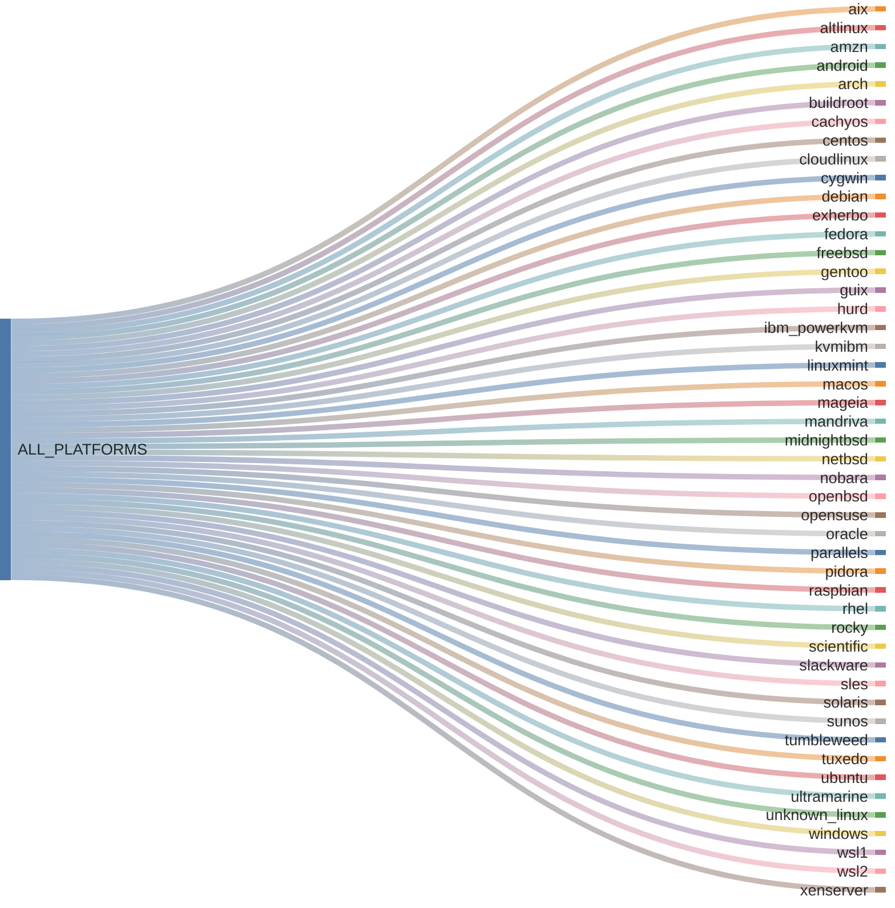
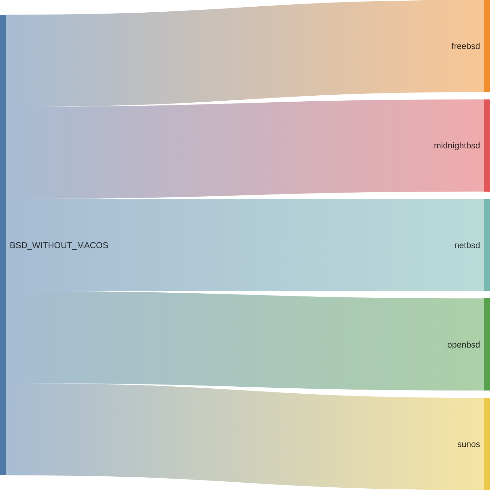
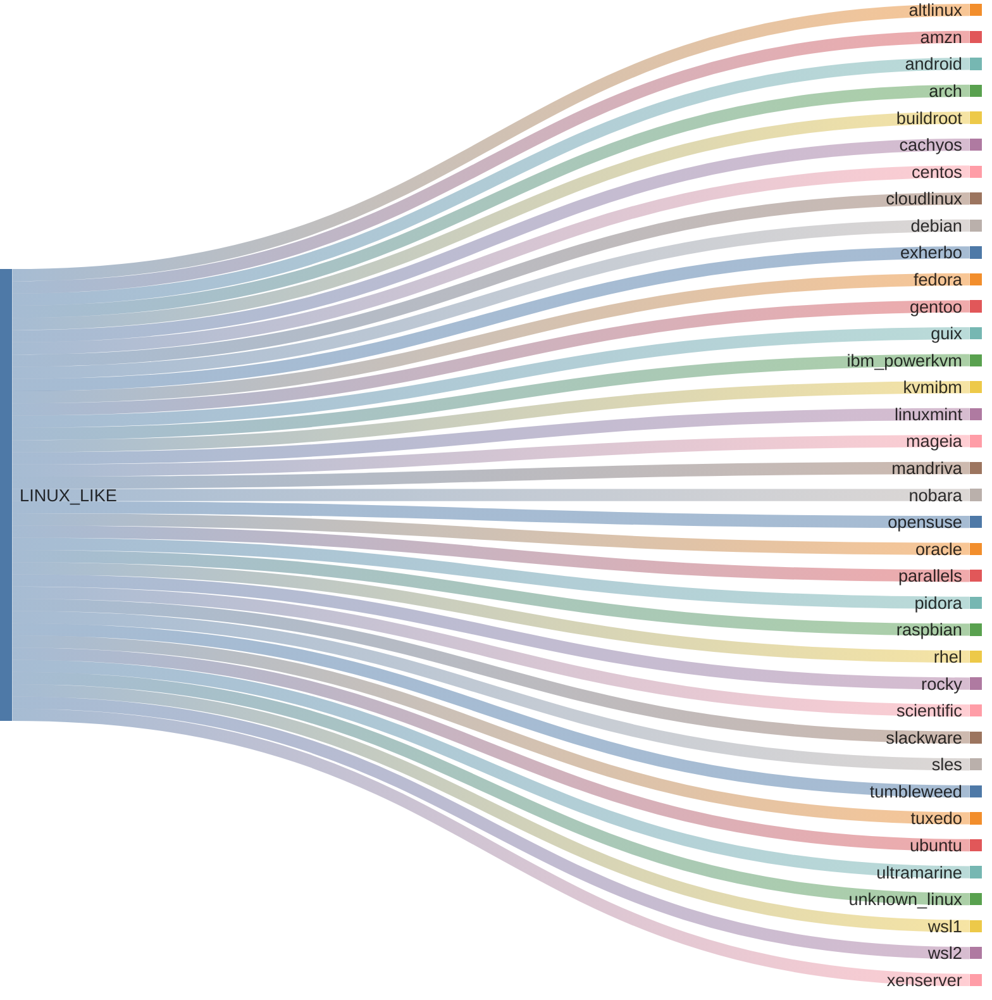
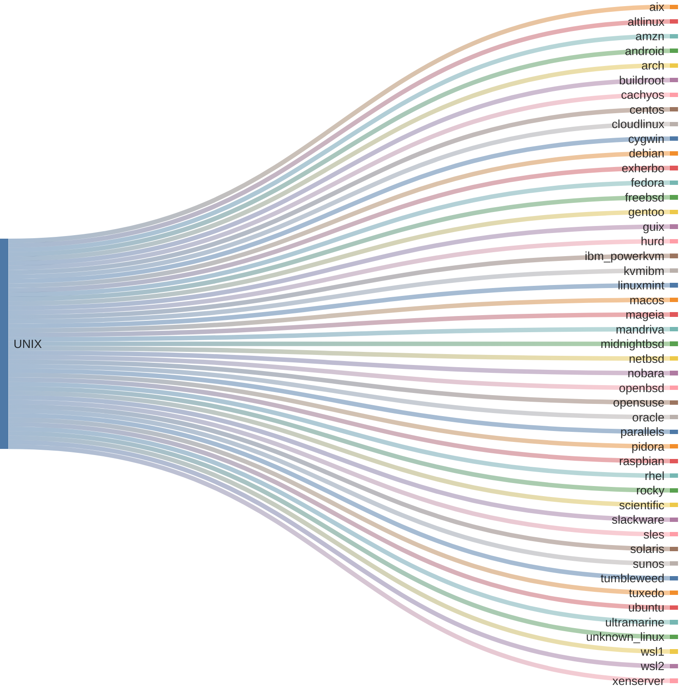
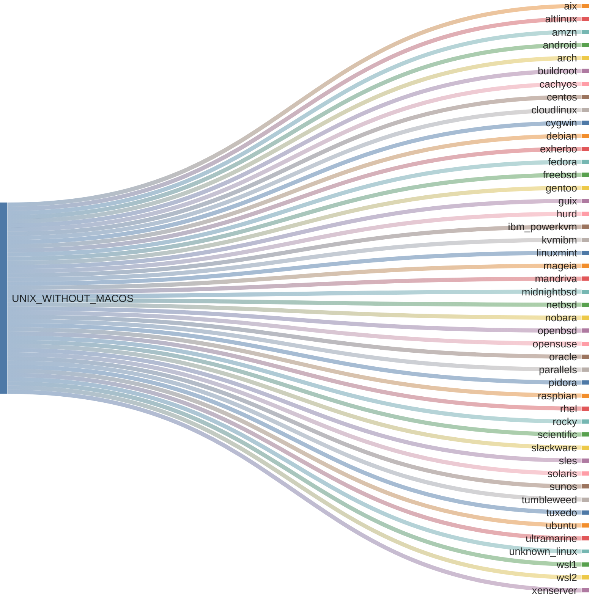

# {octicon}`codespaces` Platforms

Each platform represents an operating system or OS-like environment, and is associated with:
- a unique platform ID
- a human-readable name
- an icon (emoji / unicode character)
- a [detection function](detection.md)
- various metadata in its `info()` method

Each platform is materialized by a [`Platform` object](#extra_platforms.platform.Platform), from which you can access various metadata:

```pycon
>>> from extra_platforms import DEBIAN
>>> DEBIAN
Platform(id='debian', name='Debian')
>>> DEBIAN.id
'debian'
>>> DEBIAN.current
False
>>> DEBIAN.info()
{'id': 'debian', 'name': 'Debian', 'icon': '🌀', 'url': 'https://debian.org', 'current': False, 'distro_id': None, 'version': None, 'version_parts': {'major': None, 'minor': None, 'build_number': None}, 'like': None, 'codename': None}
```

To check if the current platform matches a specific platform, use the corresponding [detection function](detection.md):

```pycon
>>> from extra_platforms import is_macos
>>> is_macos()
True
```

The current platform can be obtained via the `current_platform()` function:

```pycon
>>> from extra_platforms import current_platform
>>> current_platform()
Platform(id='macos', name='macOS')
```

## Recognized platforms

<!-- platform-table-start -->

|  Icon  | Name                                                                                      | Platform ID     | Detection function                                                              |
| :--: | :---------------------------------------------------------------------------------------- | :-------------- | :------------------------------------------------------------------------------ |
|   ➿   | [IBM AIX](https://ibm.com/products/aix/)                                                  | `aix`           | [`is_aix()`](detection.md#extra_platforms.detection.is_aix)                     |
|   🐧   | [ALT Linux](https://altlinux.org)                                                         | `altlinux`      | [`is_altlinux()`](detection.md#extra_platforms.detection.is_altlinux)           |
|   ⤻    | [Amazon Linux](https://aws.amazon.com/amazon-linux-ami/)                                  | `amzn`          | [`is_amzn()`](detection.md#extra_platforms.detection.is_amzn)                   |
|   🤖   | [Android](https://android.com)                                                            | `android`       | [`is_android()`](detection.md#extra_platforms.detection.is_android)             |
|   🎗️   | [Arch Linux](https://archlinux.org)                                                       | `arch`          | [`is_arch()`](detection.md#extra_platforms.detection.is_arch)                   |
|   ⛑️   | [Buildroot](https://buildroot.org)                                                        | `buildroot`     | [`is_buildroot()`](detection.md#extra_platforms.detection.is_buildroot)         |
|   ⌬    | [CachyOS](https://cachyos.org)                                                            | `cachyos`       | [`is_cachyos()`](detection.md#extra_platforms.detection.is_cachyos)             |
|   💠   | [CentOS](https://centos.org)                                                              | `centos`        | [`is_centos()`](detection.md#extra_platforms.detection.is_centos)               |
|   ꩜    | [CloudLinux OS](https://cloudlinux.com)                                                   | `cloudlinux`    | [`is_cloudlinux()`](detection.md#extra_platforms.detection.is_cloudlinux)       |
|   Ͼ    | [Cygwin](https://cygwin.com)                                                              | `cygwin`        | [`is_cygwin()`](detection.md#extra_platforms.detection.is_cygwin)               |
|   🌀   | [Debian](https://debian.org)                                                              | `debian`        | [`is_debian()`](detection.md#extra_platforms.detection.is_debian)               |
|   🐽   | [Exherbo Linux](https://exherbolinux.org)                                                 | `exherbo`       | [`is_exherbo()`](detection.md#extra_platforms.detection.is_exherbo)             |
|   🎩   | [Fedora](https://fedoraproject.org)                                                       | `fedora`        | [`is_fedora()`](detection.md#extra_platforms.detection.is_fedora)               |
|   😈   | [FreeBSD](https://freebsd.org)                                                            | `freebsd`       | [`is_freebsd()`](detection.md#extra_platforms.detection.is_freebsd)             |
|   🗜️   | [Gentoo Linux](https://gentoo.org)                                                        | `gentoo`        | [`is_gentoo()`](detection.md#extra_platforms.detection.is_gentoo)               |
|   🐃   | [Guix System](https://guix.gnu.org)                                                       | `guix`          | [`is_guix()`](detection.md#extra_platforms.detection.is_guix)                   |
|   🐃   | [GNU/Hurd](https://gnu.org/software/hurd/)                                                | `hurd`          | [`is_hurd()`](detection.md#extra_platforms.detection.is_hurd)                   |
|   🤹   | [IBM PowerKVM](https://ibm.com/mysupport/s/topic/0TO50000000QkyPGAS/)                     | `ibm_powerkvm`  | [`is_ibm_powerkvm()`](detection.md#extra_platforms.detection.is_ibm_powerkvm)   |
|   🤹   | [KVM for IBM z Systems](https://ibm.com/products/kvm/)                                    | `kvmibm`        | [`is_kvmibm()`](detection.md#extra_platforms.detection.is_kvmibm)               |
|   🌿   | [Linux Mint](https://linuxmint.com)                                                       | `linuxmint`     | [`is_linuxmint()`](detection.md#extra_platforms.detection.is_linuxmint)         |
|   🍎   | [macOS](https://apple.com/macos/)                                                         | `macos`         | [`is_macos()`](detection.md#extra_platforms.detection.is_macos)                 |
|   ⍥    | [Mageia](https://mageia.org)                                                              | `mageia`        | [`is_mageia()`](detection.md#extra_platforms.detection.is_mageia)               |
|   💫   | [Mandriva Linux](https://web.archive.org/web/20150522203942/https://mandriva.com/en/mbs/) | `mandriva`      | [`is_mandriva()`](detection.md#extra_platforms.detection.is_mandriva)           |
|   🌘   | [MidnightBSD](https://midnightbsd.org)                                                    | `midnightbsd`   | [`is_midnightbsd()`](detection.md#extra_platforms.detection.is_midnightbsd)     |
|   🚩   | [NetBSD](https://netbsd.org)                                                              | `netbsd`        | [`is_netbsd()`](detection.md#extra_platforms.detection.is_netbsd)               |
|       | [Nobara](https://nobaraproject.org)                                                       | `nobara`        | [`is_nobara()`](detection.md#extra_platforms.detection.is_nobara)               |
|   🐡   | [OpenBSD](https://openbsd.org)                                                            | `openbsd`       | [`is_openbsd()`](detection.md#extra_platforms.detection.is_openbsd)             |
|   🦎   | [openSUSE](https://opensuse.org)                                                          | `opensuse`      | [`is_opensuse()`](detection.md#extra_platforms.detection.is_opensuse)           |
|   🦴   | [Oracle Linux](https://oracle.com/linux/)                                                 | `oracle`        | [`is_oracle()`](detection.md#extra_platforms.detection.is_oracle)               |
|   ∥    | [Parallels](https://parallels.com)                                                        | `parallels`     | [`is_parallels()`](detection.md#extra_platforms.detection.is_parallels)         |
|   🍓   | [Pidora](https://web.archive.org/web/20200227132047/http://pidora.ca:80/)                 | `pidora`        | [`is_pidora()`](detection.md#extra_platforms.detection.is_pidora)               |
|   🍓   | [Raspbian](https://raspberrypi.com/software/)                                             | `raspbian`      | [`is_raspbian()`](detection.md#extra_platforms.detection.is_raspbian)           |
|   🎩   | [RedHat Enterprise Linux](https://redhat.com/rhel/)                                       | `rhel`          | [`is_rhel()`](detection.md#extra_platforms.detection.is_rhel)                   |
|   ⛰️   | [Rocky Linux](https://rockylinux.org)                                                     | `rocky`         | [`is_rocky()`](detection.md#extra_platforms.detection.is_rocky)                 |
|   ⚛️   | [Scientific Linux](https://scientificlinux.org)                                           | `scientific`    | [`is_scientific()`](detection.md#extra_platforms.detection.is_scientific)       |
|   🚬   | [Slackware](https://www.slackware.com)                                                    | `slackware`     | [`is_slackware()`](detection.md#extra_platforms.detection.is_slackware)         |
|   🦎   | [SUSE Linux Enterprise Server](https://suse.com/products/server/)                         | `sles`          | [`is_sles()`](detection.md#extra_platforms.detection.is_sles)                   |
|   🌞   | [Solaris](https://oracle.com/solaris)                                                     | `solaris`       | [`is_solaris()`](detection.md#extra_platforms.detection.is_solaris)             |
|   ☀️   | [SunOS](https://wikipedia.org/wiki/SunOS)                                                 | `sunos`         | [`is_sunos()`](detection.md#extra_platforms.detection.is_sunos)                 |
|   ↻    | [openSUSE Tumbleweed](https://get.opensuse.org/tumbleweed/)                               | `tumbleweed`    | [`is_tumbleweed()`](detection.md#extra_platforms.detection.is_tumbleweed)       |
|   🤵   | [Tuxedo OS](https://tuxedocomputers.com/os)                                               | `tuxedo`        | [`is_tuxedo()`](detection.md#extra_platforms.detection.is_tuxedo)               |
|   🎯   | [Ubuntu](https://ubuntu.com)                                                              | `ubuntu`        | [`is_ubuntu()`](detection.md#extra_platforms.detection.is_ubuntu)               |
|   🌊   | [Ultramarine](https://ultramarine-linux.org)                                              | `ultramarine`   | [`is_ultramarine()`](detection.md#extra_platforms.detection.is_ultramarine)     |
|   🐧   | [Unknown Linux](https://kernel.org)                                                       | `unknown_linux` | [`is_unknown_linux()`](detection.md#extra_platforms.detection.is_unknown_linux) |
|   🪟   | [Windows](https://windows.com)                                                            | `windows`       | [`is_windows()`](detection.md#extra_platforms.detection.is_windows)             |
|   ⊞    | [Windows Subsystem for Linux v1](https://learn.microsoft.com/windows/wsl)                 | `wsl1`          | [`is_wsl1()`](detection.md#extra_platforms.detection.is_wsl1)                   |
|   ⊞    | [Windows Subsystem for Linux v2](https://learn.microsoft.com/windows/wsl)                 | `wsl2`          | [`is_wsl2()`](detection.md#extra_platforms.detection.is_wsl2)                   |
|   Ⓧ    | [XenServer](https://xenproject.org)                                                       | `xenserver`     | [`is_xenserver()`](detection.md#extra_platforms.detection.is_xenserver)         |

<!-- platform-table-end -->

## Groups of platforms

All recognized platforms are grouped in families.

### Non-overlapping groups

All platforms are distributed in groups that are guaranteed to be non-overlapping.

Here is the list of non-overlapping groups that encompass all recognized platforms, visualized as a Sankey diagram:

<!-- platform-multi-level-sankey-start -->


<!-- platform-multi-level-sankey-end -->

And the same groups visualized as a mindmap:

```mermaid
---
config: {"mindmap": {"padding": 5}}
---
mindmap
    ((⚙️ all_platforms))
        )≛ UNIX_LAYERS(
            (Ͼ cygwin)
        )Ⅴ SYSTEM_V(
            (➿ aix)
            (🌞 solaris)
        )⊎ OTHER_UNIX(
            (🐃 hurd)
        )≚ LINUX_LAYERS(
            (⊞ wsl1)
            (⊞ wsl2)
        )🐧 LINUX(
            (🐧 altlinux)
            (⤻ amzn)
            (🤖 android)
            (🎗️ arch)
            (⛑️ buildroot)
            (⌬ cachyos)
            (💠 centos)
            (꩜ cloudlinux)
            (🌀 debian)
            (🐽 exherbo)
            (🎩 fedora)
            (🗜️ gentoo)
            (🐃 guix)
            (🤹 ibm_powerkvm)
            (🤹 kvmibm)
            (🌿 linuxmint)
            (⍥ mageia)
            (💫 mandriva)
            ( nobara)
            (🦎 opensuse)
            (🦴 oracle)
            (∥ parallels)
            (🍓 pidora)
            (🍓 raspbian)
            (🎩 rhel)
            (⛰️ rocky)
            (⚛️ scientific)
            (🚬 slackware)
            (🦎 sles)
            (↻ tumbleweed)
            (🤵 tuxedo)
            (🎯 ubuntu)
            (🌊 ultramarine)
            (🐧 unknown_linux)
            (Ⓧ xenserver)
        )🅱️+ BSD(
            (😈 freebsd)
            (🍎 macos)
            (🌘 midnightbsd)
            (🚩 netbsd)
            (🐡 openbsd)
            (☀️ sunos)
        )🪟 ANY_WINDOWS(
            (🪟 windows)
```

<!-- platform-mindmap-start -->



<!-- platform-mindmap-end -->

### All groups

For convenience a multitude of groups are defined, some of which may overlap. Here is a table listing all defined platform groups:

<!-- platform-groups-table-start -->

|  Icon  | Group ID             | Description                        |   Member count |  Non-overlapping  |
| :--: | :------------------- | :--------------------------------- | -----------: | :-------------: |
|   ⚙️   | `all_platforms`      | All platforms                      |             48 |        ⚠️         |
|   🪟   | `any_windows`        | Any Windows                        |              1 |        ✅         |
|  🅱️+   | `bsd`                | Any BSD                            |              6 |        ✅         |
|   🅱️   | `bsd_without_macos`  | Any BSD excluding macOS            |              5 |        ⚠️         |
|   🐧   | `linux`              | Any Linux distribution             |             35 |        ✅         |
|   ≚    | `linux_layers`       | Any Linux compatibility layers     |              2 |        ✅         |
|  🐧+   | `linux_like`         | Any Linux and compatibility layers |             37 |        ⚠️         |
|   ⊎    | `other_unix`         | Any other Unix                     |              1 |        ✅         |
|   Ⅴ    | `system_v`           | AT&T System Five                   |              2 |        ✅         |
|   ⨷    | `unix`               | Any Unix                           |             47 |        ⚠️         |
|   ≛    | `unix_layers`        | Any Unix compatibility layers      |              1 |        ✅         |
|   ⨂    | `unix_without_macos` | Any Unix excluding macOS           |             46 |        ⚠️         |

<!-- platform-groups-table-end -->


<!-- extra-platform-groups-sankey-start -->











<!-- extra-platform-groups-sankey-end -->

## Contribution guidelines

To add a new Linux distribution, you can get inspiration from these pull requests:

- https://github.com/kdeldycke/extra-platforms/pull/156
- https://github.com/kdeldycke/extra-platforms/pull/94

## `extra_platforms.platform` API

```{eval-rst}
.. autoclasstree:: extra_platforms.platform
   :strict:
```

```{eval-rst}
.. automodule:: extra_platforms.platform
   :members:
   :undoc-members:
   :show-inheritance:
```

## `extra_platforms.platform_data` API

```{eval-rst}
.. autoclasstree:: extra_platforms.platform_data
   :strict:
```

```{eval-rst}
.. automodule:: extra_platforms.platform_data
   :members:
   :undoc-members:
   :show-inheritance:
```
