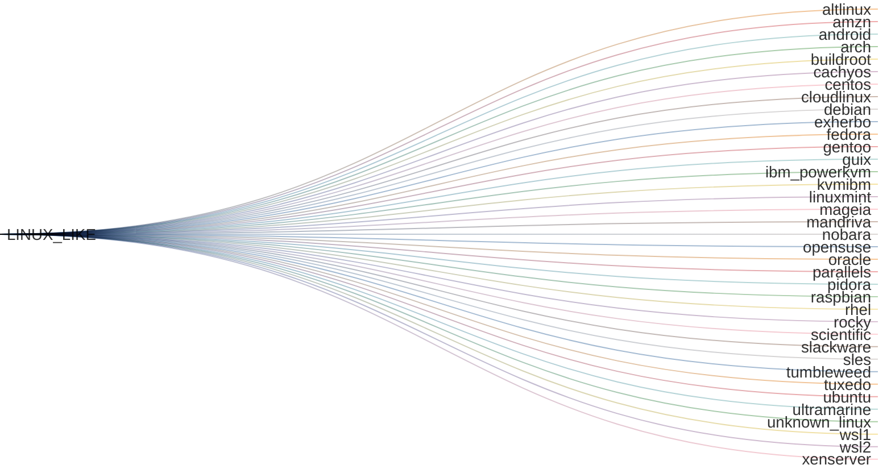
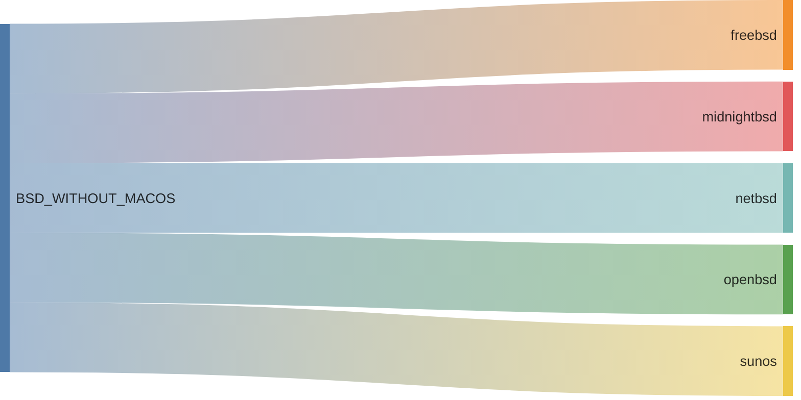
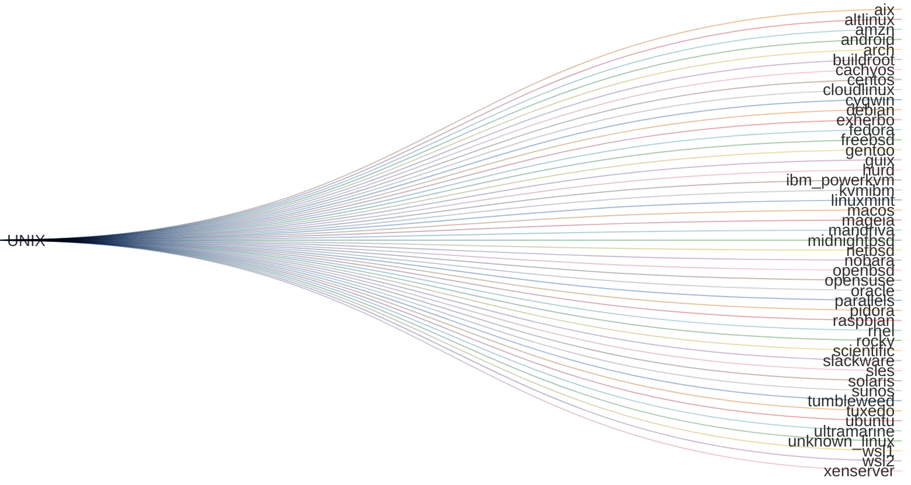
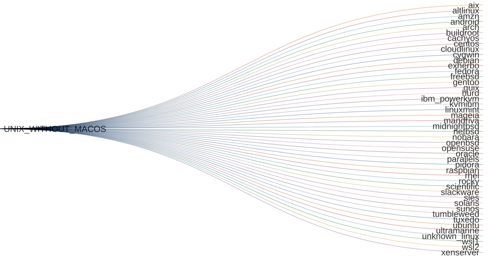
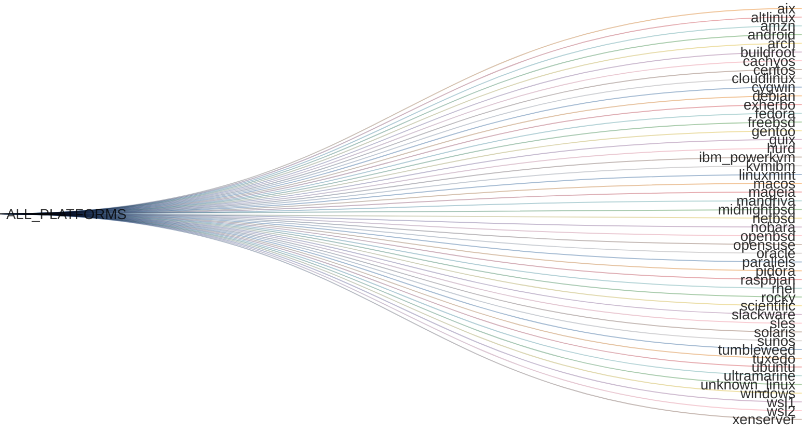

# {octicon}`codespaces` Platforms

To add a new Linux distribution, you can get inspiration from these pull requests:

- https://github.com/kdeldycke/extra-platforms/pull/156
- https://github.com/kdeldycke/extra-platforms/pull/94

## Recognized platforms

<!-- platform-table-start -->

| Icon | Name | Platform ID |
|:----:|:------|:-------------|
| ➿ | [IBM AIX](https://ibm.com/products/aix/) | `aix` |
| 🐧 | [ALT Linux](https://altlinux.org) | `altlinux` |
| ⤻ | [Amazon Linux](https://aws.amazon.com/amazon-linux-ami/) | `amzn` |
| 🤖 | [Android](https://android.com) | `android` |
| 🎗️ | [Arch Linux](https://archlinux.org) | `arch` |
| ⛑️ | [Buildroot](https://buildroot.org) | `buildroot` |
| ⌬ | [CachyOS](https://cachyos.org) | `cachyos` |
| 💠 | [CentOS](https://centos.org) | `centos` |
| ꩜ | [CloudLinux OS](https://cloudlinux.com) | `cloudlinux` |
| Ͼ | [Cygwin](https://cygwin.com) | `cygwin` |
| 🌀 | [Debian](https://debian.org) | `debian` |
| 🐽 | [Exherbo Linux](https://exherbolinux.org) | `exherbo` |
| 🎩 | [Fedora](https://fedoraproject.org) | `fedora` |
| 😈 | [FreeBSD](https://freebsd.org) | `freebsd` |
| 🗜️ | [Gentoo Linux](https://gentoo.org) | `gentoo` |
| 🐃 | [Guix System](https://guix.gnu.org) | `guix` |
| 🐃 | [GNU/Hurd](https://gnu.org/software/hurd/) | `hurd` |
| 🤹 | [IBM PowerKVM](https://ibm.com/mysupport/s/topic/0TO50000000QkyPGAS/) | `ibm_powerkvm` |
| 🤹 | [KVM for IBM z Systems](https://ibm.com/products/kvm/) | `kvmibm` |
| 🌿 | [Linux Mint](https://linuxmint.com) | `linuxmint` |
| 🍎 | [macOS](https://apple.com/macos/) | `macos` |
| ⍥ | [Mageia](https://mageia.org) | `mageia` |
| 💫 | [Mandriva Linux](https://web.archive.org/web/20150522203942/https://mandriva.com/en/mbs/) | `mandriva` |
| 🌘 | [MidnightBSD](https://midnightbsd.org) | `midnightbsd` |
| 🚩 | [NetBSD](https://netbsd.org) | `netbsd` |
|  | [Nobara](https://nobaraproject.org) | `nobara` |
| 🐡 | [OpenBSD](https://openbsd.org) | `openbsd` |
| 🦎 | [openSUSE](https://opensuse.org) | `opensuse` |
| 🦴 | [Oracle Linux](https://oracle.com/linux/) | `oracle` |
| ∥ | [Parallels](https://parallels.com) | `parallels` |
| 🍓 | [Pidora](https://web.archive.org/web/20200227132047/http://pidora.ca:80/) | `pidora` |
| 🍓 | [Raspbian](https://raspberrypi.com/software/) | `raspbian` |
| 🎩 | [RedHat Enterprise Linux](https://redhat.com/rhel/) | `rhel` |
| ⛰️ | [Rocky Linux](https://rockylinux.org) | `rocky` |
| ⚛️ | [Scientific Linux](https://scientificlinux.org) | `scientific` |
| 🚬 | [Slackware](https://www.slackware.com) | `slackware` |
| 🦎 | [SUSE Linux Enterprise Server](https://suse.com/products/server/) | `sles` |
| 🌞 | [Solaris](https://oracle.com/solaris) | `solaris` |
| ☀️ | [SunOS](https://wikipedia.org/wiki/SunOS) | `sunos` |
| ↻ | [openSUSE Tumbleweed](https://get.opensuse.org/tumbleweed/) | `tumbleweed` |
| 🤵 | [Tuxedo OS](https://tuxedocomputers.com/os) | `tuxedo` |
| 🎯 | [Ubuntu](https://ubuntu.com) | `ubuntu` |
| 🌊 | [Ultramarine](https://ultramarine-linux.org) | `ultramarine` |
| 🐧 | [Unknown Linux](https://kernel.org) | `unknown_linux` |
| 🪟 | [Windows](https://windows.com) | `windows` |
| ⊞ | [Windows Subsystem for Linux v1](https://learn.microsoft.com/windows/wsl) | `wsl1` |
| ⊞ | [Windows Subsystem for Linux v2](https://learn.microsoft.com/windows/wsl) | `wsl2` |
| Ⓧ | [XenServer](https://xenproject.org) | `xenserver` |

<!-- platform-table-end -->

## Groups of platforms

All recognized platforms are grouped in families.

### Non-overlapping groups

All platforms are distributed in groups that are guaranteed to be non-overlapping.

Here is the list of non-overlapping groups that encompass all recognized platforms, visualized as a Sankey diagram:

<!-- platform-multi-level-sankey-start -->


<!-- platform-multi-level-sankey-end -->

### Overlapping groups

For convenience, other groups are defined, but without guarantee of non-overlapping platforms:

<!-- extra-platform-groups-sankey-start -->











<!-- extra-platform-groups-sankey-end -->

## `extra_platforms.platform` API

```{eval-rst}
.. autoclasstree:: extra_platforms.platform
   :strict:
```

```{eval-rst}
.. automodule:: extra_platforms.platform
   :members:
   :undoc-members:
   :show-inheritance:
```

## `extra_platforms.platform_data` API

```{eval-rst}
.. autoclasstree:: extra_platforms.platform_data
   :strict:
```

```{eval-rst}
.. automodule:: extra_platforms.platform_data
   :members:
   :undoc-members:
   :show-inheritance:
```
