# {octicon}`codespaces` Platforms

Each platform represents an operating system or OS-like environment, and is associated with:

- a unique platform ID
- a human-readable name
- an icon (emoji / unicode character)
- a [detection function](detection.md)
- various metadata in its `info()` method

## Platform usage

Each platform is materialized by a [`Platform` object](trait.md#extra_platforms.trait.Platform), from which you can access various metadata:

```pycon
>>> from extra_platforms import DEBIAN
>>> DEBIAN
Platform(id='debian', name='Debian')
>>> DEBIAN.id
'debian'
>>> DEBIAN.current
False
>>> DEBIAN.info()
{'id': 'debian', 'name': 'Debian', 'icon': '🌀', 'url': 'https://debian.org', 'current': False, 'distro_id': None, 'version': None, 'version_parts': {'major': None, 'minor': None, 'build_number': None}, 'like': None, 'codename': None}
```

To check if the current platform matches a specific platform, use the corresponding [detection function](detection.md):

```pycon
>>> from extra_platforms import is_macos
>>> is_macos()
True
```

The current platform can be obtained via the `current_platform()` function:

```pycon
>>> from extra_platforms import current_platform
>>> current_platform()
Platform(id='macos', name='macOS')
```

## Recognized platforms

<!-- platform-table-start -->

| Icon | Symbol                                 | Name                           | Detection function                        |
| :--: | :------------------------------------- | :----------------------------- | :---------------------------------------- |
|  ➿  | {data}`~extra_platforms.AIX`           | IBM AIX                        | {func}`~extra_platforms.is_aix`           |
|  🐧  | {data}`~extra_platforms.ALTLINUX`      | ALT Linux                      | {func}`~extra_platforms.is_altlinux`      |
|  ⤻   | {data}`~extra_platforms.AMZN`          | Amazon Linux                   | {func}`~extra_platforms.is_amzn`          |
|  🤖  | {data}`~extra_platforms.ANDROID`       | Android                        | {func}`~extra_platforms.is_android`       |
|  🎗️  | {data}`~extra_platforms.ARCH`          | Arch Linux                     | {func}`~extra_platforms.is_arch`          |
|  ⛑️  | {data}`~extra_platforms.BUILDROOT`     | Buildroot                      | {func}`~extra_platforms.is_buildroot`     |
|  ⌬   | {data}`~extra_platforms.CACHYOS`       | CachyOS                        | {func}`~extra_platforms.is_cachyos`       |
|  💠  | {data}`~extra_platforms.CENTOS`        | CentOS                         | {func}`~extra_platforms.is_centos`        |
|  ꩜   | {data}`~extra_platforms.CLOUDLINUX`    | CloudLinux OS                  | {func}`~extra_platforms.is_cloudlinux`    |
|  Ͼ   | {data}`~extra_platforms.CYGWIN`        | Cygwin                         | {func}`~extra_platforms.is_cygwin`        |
|  🌀  | {data}`~extra_platforms.DEBIAN`        | Debian                         | {func}`~extra_platforms.is_debian`        |
|  🪰  | {data}`~extra_platforms.DRAGONFLY_BSD` | DragonFly BSD                  | {func}`~extra_platforms.is_dragonfly_bsd` |
|  🐽  | {data}`~extra_platforms.EXHERBO`       | Exherbo Linux                  | {func}`~extra_platforms.is_exherbo`       |
|  🎩  | {data}`~extra_platforms.FEDORA`        | Fedora                         | {func}`~extra_platforms.is_fedora`        |
|  😈  | {data}`~extra_platforms.FREEBSD`       | FreeBSD                        | {func}`~extra_platforms.is_freebsd`       |
|  🗜️  | {data}`~extra_platforms.GENTOO`        | Gentoo Linux                   | {func}`~extra_platforms.is_gentoo`        |
|  🐃  | {data}`~extra_platforms.GUIX`          | Guix System                    | {func}`~extra_platforms.is_guix`          |
|  🍂  | {data}`~extra_platforms.HAIKU`         | Haiku                          | {func}`~extra_platforms.is_haiku`         |
|  🐃  | {data}`~extra_platforms.HURD`          | GNU/Hurd                       | {func}`~extra_platforms.is_hurd`          |
|  🤹  | {data}`~extra_platforms.IBM_POWERKVM`  | IBM PowerKVM                   | {func}`~extra_platforms.is_ibm_powerkvm`  |
|  🔥  | {data}`~extra_platforms.ILLUMOS`       | illumos                        | {func}`~extra_platforms.is_illumos`       |
|  🤹  | {data}`~extra_platforms.KVMIBM`        | KVM for IBM z Systems          | {func}`~extra_platforms.is_kvmibm`        |
|  🌿  | {data}`~extra_platforms.LINUXMINT`     | Linux Mint                     | {func}`~extra_platforms.is_linuxmint`     |
|  🍎  | {data}`~extra_platforms.MACOS`         | macOS                          | {func}`~extra_platforms.is_macos`         |
|  ⍥   | {data}`~extra_platforms.MAGEIA`        | Mageia                         | {func}`~extra_platforms.is_mageia`        |
|  💫  | {data}`~extra_platforms.MANDRIVA`      | Mandriva Linux                 | {func}`~extra_platforms.is_mandriva`      |
|  🌘  | {data}`~extra_platforms.MIDNIGHTBSD`   | MidnightBSD                    | {func}`~extra_platforms.is_midnightbsd`   |
|  🚩  | {data}`~extra_platforms.NETBSD`        | NetBSD                         | {func}`~extra_platforms.is_netbsd`        |
|     | {data}`~extra_platforms.NOBARA`        | Nobara                         | {func}`~extra_platforms.is_nobara`        |
|  🐡  | {data}`~extra_platforms.OPENBSD`       | OpenBSD                        | {func}`~extra_platforms.is_openbsd`       |
|  🦎  | {data}`~extra_platforms.OPENSUSE`      | openSUSE                       | {func}`~extra_platforms.is_opensuse`      |
|  🦴  | {data}`~extra_platforms.ORACLE`        | Oracle Linux                   | {func}`~extra_platforms.is_oracle`        |
|  ∥   | {data}`~extra_platforms.PARALLELS`     | Parallels                      | {func}`~extra_platforms.is_parallels`     |
|  🍓  | {data}`~extra_platforms.PIDORA`        | Pidora                         | {func}`~extra_platforms.is_pidora`        |
|  🍓  | {data}`~extra_platforms.RASPBIAN`      | Raspbian                       | {func}`~extra_platforms.is_raspbian`      |
|  🎩  | {data}`~extra_platforms.RHEL`          | RedHat Enterprise Linux        | {func}`~extra_platforms.is_rhel`          |
|  ⛰️  | {data}`~extra_platforms.ROCKY`         | Rocky Linux                    | {func}`~extra_platforms.is_rocky`         |
|  ⚛️  | {data}`~extra_platforms.SCIENTIFIC`    | Scientific Linux               | {func}`~extra_platforms.is_scientific`    |
|  🚬  | {data}`~extra_platforms.SLACKWARE`     | Slackware                      | {func}`~extra_platforms.is_slackware`     |
|  🦎  | {data}`~extra_platforms.SLES`          | SUSE Linux Enterprise Server   | {func}`~extra_platforms.is_sles`          |
|  🌞  | {data}`~extra_platforms.SOLARIS`       | Solaris                        | {func}`~extra_platforms.is_solaris`       |
|  ☀️  | {data}`~extra_platforms.SUNOS`         | SunOS                          | {func}`~extra_platforms.is_sunos`         |
|  ↻   | {data}`~extra_platforms.TUMBLEWEED`    | openSUSE Tumbleweed            | {func}`~extra_platforms.is_tumbleweed`    |
|  🤵  | {data}`~extra_platforms.TUXEDO`        | Tuxedo OS                      | {func}`~extra_platforms.is_tuxedo`        |
|  🎯  | {data}`~extra_platforms.UBUNTU`        | Ubuntu                         | {func}`~extra_platforms.is_ubuntu`        |
|  🌊  | {data}`~extra_platforms.ULTRAMARINE`   | Ultramarine                    | {func}`~extra_platforms.is_ultramarine`   |
|  🪟  | {data}`~extra_platforms.WINDOWS`       | Windows                        | {func}`~extra_platforms.is_windows`       |
|  ⊞   | {data}`~extra_platforms.WSL1`          | Windows Subsystem for Linux v1 | {func}`~extra_platforms.is_wsl1`          |
|  ⊞   | {data}`~extra_platforms.WSL2`          | Windows Subsystem for Linux v2 | {func}`~extra_platforms.is_wsl2`          |
|  Ⓧ   | {data}`~extra_platforms.XENSERVER`     | XenServer                      | {func}`~extra_platforms.is_xenserver`     |

```{hint}
The {data}`~extra_platforms.UNKNOWN_PLATFORM` trait represents an unrecognized
platform. It is not included in the {data}`~extra_platforms.ALL_PLATFORMS` group,
and will be returned by {func}`~extra_platforms.current_platform` if the current
platform is not recognized.
```

<!-- platform-table-end -->

## Groups of platforms

### All platform groups

<!-- platform-groups-table-start -->

| Icon | Symbol                                      | Description                      | [Detection](detection.md)                  | [Canonical](groups.md#extra_platforms.group.Group.canonical) |
| :--: | :------------------------------------------ | :------------------------------- | :----------------------------------------- | :----------------------------------------------------------: |
|  ⚙️  | {data}`~extra_platforms.ALL_PLATFORMS`      | All platforms                    | {func}`~extra_platforms.is_any_platform`   |                                                              |
|  🪟  | {data}`~extra_platforms.ALL_WINDOWS`        | All Windows                      | {func}`~extra_platforms.is_any_windows`    |                              ⬥                               |
| 🅱️+  | {data}`~extra_platforms.BSD`                | All BSD                          | {func}`~extra_platforms.is_bsd`            |                              ⬥                               |
|  🅱️  | {data}`~extra_platforms.BSD_WITHOUT_MACOS`  | All BSD excluding macOS          | {func}`~extra_platforms.is_bsd_not_macos`  |                                                              |
|  🐧  | {data}`~extra_platforms.LINUX`              | Linux distributions              | {func}`~extra_platforms.is_linux`          |                              ⬥                               |
|  ≚   | {data}`~extra_platforms.LINUX_LAYERS`       | Linux compatibility layers       | {func}`~extra_platforms.is_linux_layers`   |                              ⬥                               |
| 🐧+  | {data}`~extra_platforms.LINUX_LIKE`         | All Linux & compatibility layers | {func}`~extra_platforms.is_linux_like`     |                                                              |
|  🅟   | {data}`~extra_platforms.OTHER_POSIX`        | Other POSIX-compliant platforms  | {func}`~extra_platforms.is_other_posix`    |                              ⬥                               |
|  𝐕   | {data}`~extra_platforms.SYSTEM_V`           | AT&T System Five                 | {func}`~extra_platforms.is_system_v`       |                              ⬥                               |
|  ⨷   | {data}`~extra_platforms.UNIX`               | All Unix                         | {func}`~extra_platforms.is_unix`           |                                                              |
|  ≛   | {data}`~extra_platforms.UNIX_LAYERS`        | Unix compatibility layers        | {func}`~extra_platforms.is_unix_layers`    |                              ⬥                               |
|  ⨂   | {data}`~extra_platforms.UNIX_WITHOUT_MACOS` | All Unix excluding macOS         | {func}`~extra_platforms.is_unix_not_macos` |                                                              |

```{hint}
Canonical groups are non-overlapping groups that together cover all
recognized traits. They are marked with a ⬥ icon in the table above.

Other groups are provided for convenience, but overlap with each other or
with canonical groups.
```

<!-- platform-groups-table-end -->

### Canonical groups

All platforms are distributed in groups that are guaranteed to be non-overlapping.

Here is the canonical groups and all platforms, visualized as a Sankey diagram:

<!-- platform-multi-level-sankey-start -->


<!-- platform-multi-level-sankey-end -->

And the same groups visualized as a mindmap:

```mermaid
---
config: {"mindmap": {"padding": 5}}
---
mindmap
    ((⚙️ ALL_PLATFORMS))
        )≛ UNIX_LAYERS(
            (Ͼ CYGWIN)
        )𝐕 SYSTEM_V(
            (➿ AIX)
            (🔥 ILLUMOS)
            (🌞 SOLARIS)
        )🅟 OTHER_POSIX(
            (🍂 HAIKU)
            (🐃 HURD)
        )≚ LINUX_LAYERS(
            (⊞ WSL1)
            (⊞ WSL2)
        )🐧 LINUX(
            (🐧 ALTLINUX)
            (⤻ AMZN)
            (🤖 ANDROID)
            (🎗️ ARCH)
            (⛑️ BUILDROOT)
            (⌬ CACHYOS)
            (💠 CENTOS)
            (꩜ CLOUDLINUX)
            (🌀 DEBIAN)
            (🐽 EXHERBO)
            (🎩 FEDORA)
            (🗜️ GENTOO)
            (🐃 GUIX)
            (🤹 IBM_POWERKVM)
            (🤹 KVMIBM)
            (🌿 LINUXMINT)
            (⍥ MAGEIA)
            (💫 MANDRIVA)
            ( NOBARA)
            (🦎 OPENSUSE)
            (🦴 ORACLE)
            (∥ PARALLELS)
            (🍓 PIDORA)
            (🍓 RASPBIAN)
            (🎩 RHEL)
            (⛰️ ROCKY)
            (⚛️ SCIENTIFIC)
            (🚬 SLACKWARE)
            (🦎 SLES)
            (↻ TUMBLEWEED)
            (🤵 TUXEDO)
            (🎯 UBUNTU)
            (🌊 ULTRAMARINE)
            (Ⓧ XENSERVER)
        )🅱️+ BSD(
            (🪰 DRAGONFLY_BSD)
            (😈 FREEBSD)
            (🍎 MACOS)
            (🌘 MIDNIGHTBSD)
            (🚩 NETBSD)
            (🐡 OPENBSD)
            (☀️ SUNOS)
        )🪟 ALL_WINDOWS(
            (🪟 WINDOWS)
```

<!-- platform-mindmap-start -->



<!-- platform-mindmap-end -->

## Predefined platforms

```{eval-rst}
.. autoclasstree:: extra_platforms.platform_data
   :strict:
```

```{eval-rst}
.. automodule:: extra_platforms.platform_data
```

<!-- platform-data-autodata-start -->

```{eval-rst}
.. autodata:: extra_platforms.AIX
.. autodata:: extra_platforms.ALTLINUX
.. autodata:: extra_platforms.AMZN
.. autodata:: extra_platforms.ANDROID
.. autodata:: extra_platforms.ARCH
.. autodata:: extra_platforms.BUILDROOT
.. autodata:: extra_platforms.CACHYOS
.. autodata:: extra_platforms.CENTOS
.. autodata:: extra_platforms.CLOUDLINUX
.. autodata:: extra_platforms.CYGWIN
.. autodata:: extra_platforms.DEBIAN
.. autodata:: extra_platforms.DRAGONFLY_BSD
.. autodata:: extra_platforms.EXHERBO
.. autodata:: extra_platforms.FEDORA
.. autodata:: extra_platforms.FREEBSD
.. autodata:: extra_platforms.GENTOO
.. autodata:: extra_platforms.GUIX
.. autodata:: extra_platforms.HAIKU
.. autodata:: extra_platforms.HURD
.. autodata:: extra_platforms.IBM_POWERKVM
.. autodata:: extra_platforms.ILLUMOS
.. autodata:: extra_platforms.KVMIBM
.. autodata:: extra_platforms.LINUXMINT
.. autodata:: extra_platforms.MACOS
.. autodata:: extra_platforms.MAGEIA
.. autodata:: extra_platforms.MANDRIVA
.. autodata:: extra_platforms.MIDNIGHTBSD
.. autodata:: extra_platforms.NETBSD
.. autodata:: extra_platforms.NOBARA
.. autodata:: extra_platforms.OPENBSD
.. autodata:: extra_platforms.OPENSUSE
.. autodata:: extra_platforms.ORACLE
.. autodata:: extra_platforms.PARALLELS
.. autodata:: extra_platforms.PIDORA
.. autodata:: extra_platforms.RASPBIAN
.. autodata:: extra_platforms.RHEL
.. autodata:: extra_platforms.ROCKY
.. autodata:: extra_platforms.SCIENTIFIC
.. autodata:: extra_platforms.SLACKWARE
.. autodata:: extra_platforms.SLES
.. autodata:: extra_platforms.SOLARIS
.. autodata:: extra_platforms.SUNOS
.. autodata:: extra_platforms.TUMBLEWEED
.. autodata:: extra_platforms.TUXEDO
.. autodata:: extra_platforms.UBUNTU
.. autodata:: extra_platforms.ULTRAMARINE
.. autodata:: extra_platforms.UNKNOWN_PLATFORM
.. autodata:: extra_platforms.WINDOWS
.. autodata:: extra_platforms.WSL1
.. autodata:: extra_platforms.WSL2
.. autodata:: extra_platforms.XENSERVER
```

<!-- platform-data-autodata-end -->
