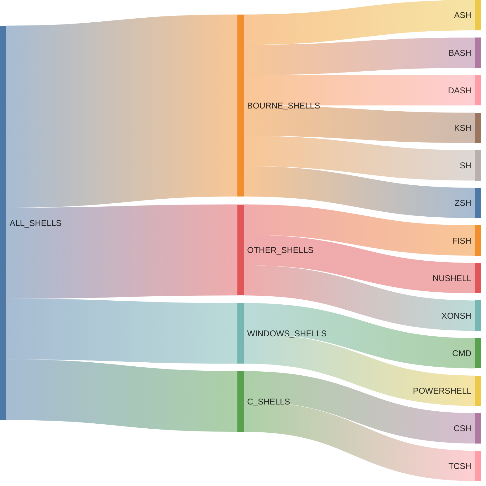
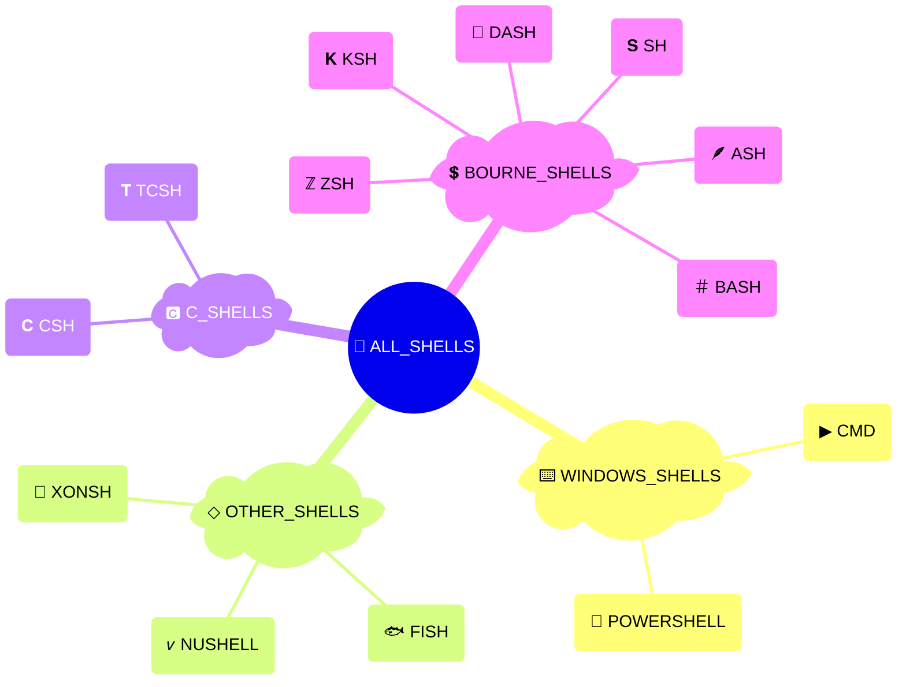

# {octicon}`command-palette` Shells

```{py:currentmodule} extra_platforms
```

Each shell represents a command-line interpreter, and is associated with:

- a unique shell ID
- a human-readable name
- an icon (emoji / unicode character)
- a [detection function](detection.md)
- various metadata in its `info()` method

## Shell usage

Each shell is materialized by a {class}`~Shell` object, from which you can access various metadata:

```pycon
>>> from extra_platforms import BASH
>>> BASH
Shell(id='bash', name='Bash')
>>> BASH.id
'bash'
>>> BASH.current
False
>>> BASH.info()
{'id': 'bash', 'name': 'Bash', 'icon': '＃', 'url': 'https://www.gnu.org/software/bash/', 'current': False, 'version': None, 'path': None}
```

To check if the current environment is running in a specific shell, use the corresponding [detection function](detection.md):

```pycon
>>> from extra_platforms import is_bash
>>> is_bash()
False
```

The current shell can be obtained via the `current_shell()` function:

```pycon
>>> from extra_platforms import current_shell
>>> current_shell()
Shell(id='unknown_shell', name='Unknown shell')
```

The path to the running shell's executable is available via {func}`~extra_platforms.current_shell_path`. It prefers the actual ancestor process binary (read from `/proc` on Linux, `ps` on macOS and the BSDs) over the `SHELL` environment variable, so it stays accurate when `SHELL` is unset or points to a different shell than the one executing.

## Symlink resolution: implementation over interface

Shell detection resolves symlinks in the `SHELL` environment variable before identifying the shell. This means detection always reports the **concrete shell implementation** rather than the POSIX interface name.

On most modern Unix systems, `/bin/sh` is a symlink to a concrete shell:

| Distribution   | `/bin/sh` target |
| :------------- | :--------------- |
| Debian, Ubuntu | `/bin/dash`      |
| Fedora, RHEL   | `/bin/bash`      |
| Alpine         | `/bin/busybox`   |
| macOS          | `/bin/bash`      |

When `/bin/sh` symlinks to `/bin/bash`:

- {func}`~is_bash` returns `True` (the actual binary running is bash).
- {func}`~is_sh` returns `False` (the resolved binary is not `sh`).
- {func}`~is_bourne_shells` returns `True` (bash is a Bourne-compatible shell).

This design gives developers the most precise information about what binary is executing their code. If you need to check whether the shell provides a Bourne-compatible *interface* (regardless of which binary implements it), test against the {data}`~BOURNE_SHELLS` group with {func}`~is_bourne_shells` instead of individual shell functions.

## Multiple shells can match at once

Shell detection functions are independent heuristics. Each one reads three channels in turn:

1. A version environment variable that only the shell itself sets on startup (like `FISH_VERSION`).
2. The `SHELL` environment variable: the configured login shell, resolved through symlinks as described above.
3. The parent process tree (read from `/proc` on Linux, `ps` on macOS and the BSDs, the Win32 API on Windows): the shells actually running as ancestors of the current process.

These channels describe different things, so several detection functions can legitimately return `True` at the same time:

- The login shell differs from the running shell: a fish user running a bash script is detected by both {func}`~is_fish` (from `SHELL`) and {func}`~is_bash` (from the process tree).
- Shells nest: a build chroot driven from a fish terminal keeps fish in the ancestor tree, above the bash chain running the build, and both are real ancestor processes.
- PowerShell modifies `PSModulePath` on startup and every child process inherits it, so {func}`~is_powershell` can stay `True` alongside the shell really executing your code. This is a permanent fixture of GitHub Ubuntu runners, where the variable leaks from the Azure infrastructure.

An `is_*()` function therefore answers "is this shell part of the current environment?", not "is this the shell executing me?". For the latter, use {func}`~current_shell`: it arbitrates all matches down to a single primary shell, preferring active version variables, then running ancestor processes, then the configured login shell. {func}`~current_traits` applies no such arbitration, so it may contain several shells.

For example, on a Mac where the terminal is configured to launch fish while `SHELL` still points at the stock zsh:

```pycon
>>> from extra_platforms import current_shell, is_fish, is_zsh
>>> is_zsh()  # The configured login shell, from SHELL.
True
>>> is_fish()  # The shell actually running, from the process tree.
True
>>> current_shell()
Shell(id='fish', name='Fish')
```

## Recognized shells

<!-- shell-table-start -->

| Icon | Symbol              | Name           | Detection function     |
| :--: | :------------------ | :------------- | :--------------------- |
|  🪶  | {data}`~ASH`        | Almquist Shell | {func}`~is_ash`        |
|  ＃  | {data}`~BASH`       | Bash           | {func}`~is_bash`       |
|  ▶   | {data}`~CMD`        | Command Prompt | {func}`~is_cmd`        |
|  𝐂   | {data}`~CSH`        | C shell        | {func}`~is_csh`        |
|  💨  | {data}`~DASH`       | Dash           | {func}`~is_dash`       |
|  🐟  | {data}`~FISH`       | Fish           | {func}`~is_fish`       |
|  𝐊   | {data}`~KSH`        | Korn shell     | {func}`~is_ksh`        |
|  𝜈   | {data}`~NUSHELL`    | Nushell        | {func}`~is_nushell`    |
|  🔷  | {data}`~POWERSHELL` | PowerShell     | {func}`~is_powershell` |
|  𝐒   | {data}`~SH`         | Bourne Shell   | {func}`~is_sh`         |
|  𝐓   | {data}`~TCSH`       | tcsh           | {func}`~is_tcsh`       |
|  🐍  | {data}`~XONSH`      | Xonsh          | {func}`~is_xonsh`      |
|  ℤ   | {data}`~ZSH`        | Zsh            | {func}`~is_zsh`        |

```{hint}
The {data}`~UNKNOWN_SHELL` trait represents an unrecognized
shell. It is not included in the {data}`~ALL_SHELLS` group,
and will be returned by {func}`~current_shell` if the current
shell is not recognized.
```

<!-- shell-table-end -->

## Groups of shells

<!-- shell-groups-table-start -->

| Icon | Symbol                  | Description              | [Detection](detection.md)  | {attr}`Canonical <Group.canonical>` |
| :--: | :---------------------- | :----------------------- | :------------------------- | :---------------------------------: |
|  🐚  | {data}`~ALL_SHELLS`     | All shells               | {func}`~is_any_shell`      |                                     |
|  💲  | {data}`~BOURNE_SHELLS`  | Bourne-compatible shells | {func}`~is_bourne_shells`  |                  ⬥                  |
|  🅲   | {data}`~C_SHELLS`       | C shells                 | {func}`~is_c_shells`       |                  ⬥                  |
|  ◇   | {data}`~OTHER_SHELLS`   | Other shells             | {func}`~is_other_shells`   |                  ⬥                  |
|  ⌨️  | {data}`~WINDOWS_SHELLS` | Windows shells           | {func}`~is_windows_shells` |                  ⬥                  |

```{hint}
Canonical groups are non-overlapping groups that together cover all
recognized traits. They are marked with a ⬥ icon in the table above.

Other groups are provided for convenience, but overlap with each other or
with canonical groups.
```

<!-- shell-groups-table-end -->

<!-- shell-sankey-start -->


```mermaid
---
config: {"sankey": {"showValues": false, "width": 800, "height": 800}}
---
sankey-beta

ALL_SHELLS,BOURNE_SHELLS,6
ALL_SHELLS,OTHER_SHELLS,3
ALL_SHELLS,WINDOWS_SHELLS,2
ALL_SHELLS,C_SHELLS,2
BOURNE_SHELLS,ASH,1
BOURNE_SHELLS,BASH,1
BOURNE_SHELLS,DASH,1
BOURNE_SHELLS,KSH,1
BOURNE_SHELLS,SH,1
BOURNE_SHELLS,ZSH,1
OTHER_SHELLS,FISH,1
OTHER_SHELLS,NUSHELL,1
OTHER_SHELLS,XONSH,1
WINDOWS_SHELLS,CMD,1
WINDOWS_SHELLS,POWERSHELL,1
C_SHELLS,CSH,1
C_SHELLS,TCSH,1
```

<!-- shell-sankey-end -->

<!-- shell-mindmap-start -->


```mermaid
---
config: {"mindmap": {"padding": 5}}
---
mindmap
    ((🐚 ALL_SHELLS))
        )⌨️ WINDOWS_SHELLS(
            (▶ CMD)
            (🔷 POWERSHELL)
        )◇ OTHER_SHELLS(
            (🐟 FISH)
            (𝜈 NUSHELL)
            (🐍 XONSH)
        )🅲 C_SHELLS(
            (𝐂 CSH)
            (𝐓 TCSH)
        )💲 BOURNE_SHELLS(
            (🪶 ASH)
            (＃ BASH)
            (💨 DASH)
            (𝐊 KSH)
            (𝐒 SH)
            (ℤ ZSH)
```

<!-- shell-mindmap-end -->

## Predefined shells

```{eval-rst}
.. autoclasstree:: extra_platforms.shell_data
   :strict:
```

```{eval-rst}
.. automodule:: extra_platforms.shell_data
   :no-index:
```

<!-- shell-data-autodata-start -->

```{eval-rst}
.. autodata:: extra_platforms.ASH
.. autodata:: extra_platforms.BASH
.. autodata:: extra_platforms.CMD
.. autodata:: extra_platforms.CSH
.. autodata:: extra_platforms.DASH
.. autodata:: extra_platforms.FISH
.. autodata:: extra_platforms.KSH
.. autodata:: extra_platforms.NUSHELL
.. autodata:: extra_platforms.POWERSHELL
.. autodata:: extra_platforms.SH
.. autodata:: extra_platforms.TCSH
.. autodata:: extra_platforms.UNKNOWN_SHELL
.. autodata:: extra_platforms.XONSH
.. autodata:: extra_platforms.ZSH
```

<!-- shell-data-autodata-end -->
