# {octicon}`terminal` Shells

```{py:currentmodule} extra_platforms
```

Each shell represents a command-line interpreter, and is associated with:

- a unique shell ID
- a human-readable name
- an icon (emoji / unicode character)
- a [detection function](detection.md)
- various metadata in its `info()` method

## Shell usage

Each shell is materialized by a {class}`~Shell` object, from which you can access various metadata:

```pycon
>>> from extra_platforms import BASH
>>> BASH
Shell(id='bash', name='Bash')
>>> BASH.id
'bash'
>>> BASH.current
False
>>> BASH.info()
{'id': 'bash', 'name': 'Bash', 'icon': '🐚', 'url': 'https://www.gnu.org/software/bash/', 'current': False, 'version': None, 'path': None}
```

To check if the current environment is running in a specific shell, use the corresponding [detection function](detection.md):

```pycon
>>> from extra_platforms import is_bash
>>> is_bash()
False
```

The current shell can be obtained via the `current_shell()` function:

```pycon
>>> from extra_platforms import current_shell
>>> current_shell()
Shell(id='unknown_shell', name='Unknown shell')
```

## Recognized shells

<!-- shell-table-start -->

| Icon | Symbol              | Name           | Detection function     |
| :--: | :------------------ | :------------- | :--------------------- |
|  🪶  | {data}`~ASH`        | Almquist Shell | {func}`~is_ash`        |
|  ＃  | {data}`~BASH`       | Bash           | {func}`~is_bash`       |
|  ▶   | {data}`~CMD`        | Command Prompt | {func}`~is_cmd`        |
|  𝐂   | {data}`~CSH`        | C shell        | {func}`~is_csh`        |
|  💨  | {data}`~DASH`       | Dash           | {func}`~is_dash`       |
|  🐟  | {data}`~FISH`       | Fish           | {func}`~is_fish`       |
|  𝐊   | {data}`~KSH`        | Korn shell     | {func}`~is_ksh`        |
|  𝜈   | {data}`~NUSHELL`    | Nushell        | {func}`~is_nushell`    |
|  🔷  | {data}`~POWERSHELL` | PowerShell     | {func}`~is_powershell` |
|  𝐓   | {data}`~TCSH`       | tcsh           | {func}`~is_tcsh`       |
|  🐍  | {data}`~XONSH`      | Xonsh          | {func}`~is_xonsh`      |
|  ℤ   | {data}`~ZSH`        | Zsh            | {func}`~is_zsh`        |

```{hint}
The {data}`~UNKNOWN_SHELL` trait represents an unrecognized
shell. It is not included in the {data}`~ALL_SHELLS` group,
and will be returned by {func}`~current_shell` if the current
shell is not recognized.
```

<!-- shell-table-end -->

## Groups of shells

<!-- shell-groups-table-start -->

| Icon | Symbol                  | Description              | [Detection](detection.md)  | [Canonical](groups.md#extra_platforms.Group.canonical) |
| :--: | :---------------------- | :----------------------- | :------------------------- | :----------------------------------------------------: |
|  🐚  | {data}`~ALL_SHELLS`     | All shells               | {func}`~is_any_shell`      |                                                        |
|  💲  | {data}`~BOURNE_SHELLS`  | Bourne-compatible shells | {func}`~is_bourne_shells`  |                           ⬥                            |
|  🅲   | {data}`~C_SHELLS`       | C shells                 | {func}`~is_c_shells`       |                           ⬥                            |
|  ◇   | {data}`~OTHER_SHELLS`   | Other shells             | {func}`~is_other_shells`   |                           ⬥                            |
|  ⌨️  | {data}`~WINDOWS_SHELLS` | Windows shells           | {func}`~is_windows_shells` |                           ⬥                            |

```{hint}
Canonical groups are non-overlapping groups that together cover all
recognized traits. They are marked with a ⬥ icon in the table above.

Other groups are provided for convenience, but overlap with each other or
with canonical groups.
```

<!-- shell-groups-table-end -->

<!-- shell-sankey-start -->


<!-- shell-sankey-end -->

<!-- shell-mindmap-start -->



<!-- shell-mindmap-end -->

```mermaid
---
config: {"mindmap": {"padding": 5}}
---
mindmap
    ((🐚 ALL_SHELLS))
        )⌨️ WINDOWS_SHELLS(
            (▶ CMD)
            (🔷 POWERSHELL)
        )◇ OTHER_SHELLS(
            (🐟 FISH)
            (𝜈 NUSHELL)
            (🐍 XONSH)
        )🅲 C_SHELLS(
            (𝐂 CSH)
            (𝐓 TCSH)
        )💲 BOURNE_SHELLS(
            (🪶 ASH)
            (＃ BASH)
            (💨 DASH)
            (𝐊 KSH)
            (ℤ ZSH)
```

## Predefined shells

```{eval-rst}
.. autoclasstree:: extra_platforms.shell_data
   :strict:
```

```{eval-rst}
.. automodule:: extra_platforms.shell_data
   :no-index:
```

<!-- shell-data-autodata-start -->

```{eval-rst}
.. autodata:: extra_platforms.ASH
.. autodata:: extra_platforms.BASH
.. autodata:: extra_platforms.CMD
.. autodata:: extra_platforms.CSH
.. autodata:: extra_platforms.DASH
.. autodata:: extra_platforms.FISH
.. autodata:: extra_platforms.KSH
.. autodata:: extra_platforms.NUSHELL
.. autodata:: extra_platforms.POWERSHELL
.. autodata:: extra_platforms.TCSH
.. autodata:: extra_platforms.UNKNOWN_SHELL
.. autodata:: extra_platforms.XONSH
.. autodata:: extra_platforms.ZSH
```

<!-- shell-data-autodata-end -->
