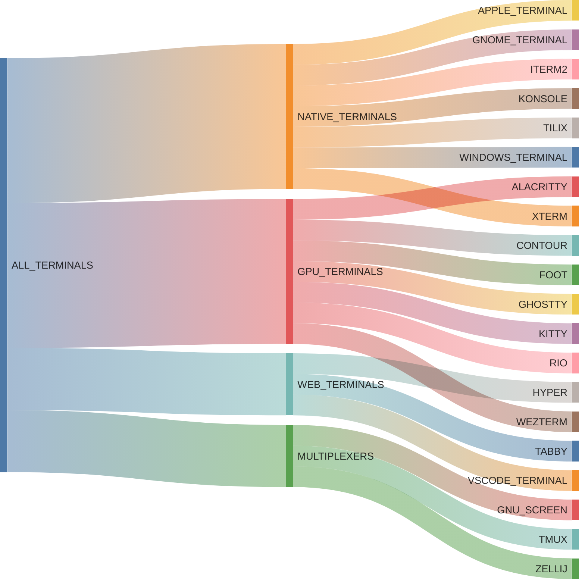
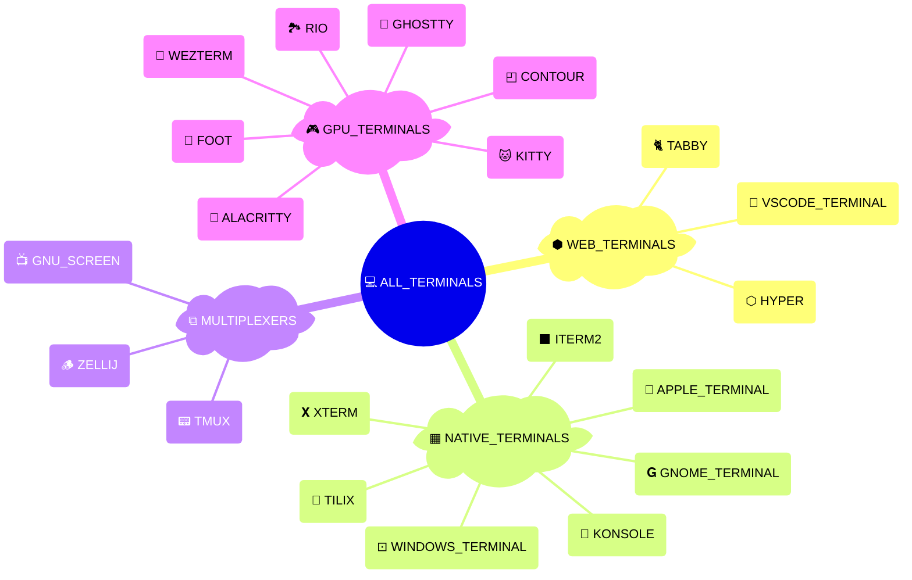

# {octicon}`terminal` Terminals

```{py:currentmodule} extra_platforms
```

Each terminal represents an application rendering the shell's output, and is associated with:

- a unique terminal ID
- a human-readable name
- an icon (emoji / unicode character)
- a [detection function](detection.md)
- various metadata in its `info()` method

## Terminal usage

Each terminal is materialized by a {class}`~Terminal` object, from which you can access various metadata:

```pycon
>>> from extra_platforms import KITTY
>>> KITTY
Terminal(id='kitty', name='Kitty')
>>> KITTY.id
'kitty'
>>> KITTY.current
False
>>> KITTY.info()
{'id': 'kitty', 'name': 'Kitty', 'icon': '🐱', 'url': 'https://sw.kovidgoyal.net/kitty/', 'current': False, 'version': None, 'color_support': None}
```

To check if the current environment is running in a specific terminal, use the corresponding [detection function](detection.md):

```pycon
>>> from extra_platforms import is_kitty
>>> is_kitty()
False
```

The current terminal can be obtained via the `current_terminal()` function:

```pycon
>>> from extra_platforms import current_terminal
>>> current_terminal()
Terminal(id='unknown_terminal', name='Unknown terminal')
```

## Terminals are optional and can stack

Terminal detection relies on the environment variables each emulator advertises to its children (like `TERM_PROGRAM` for Apple Terminal, `KITTY_WINDOW_ID` for Kitty, or `TMUX` for tmux).

A terminal is not always present: headless environments (CI runners, cron jobs, containers, non-interactive SSH commands) have no emulator attached. Every detection function then returns `False` and {func}`~current_terminal` returns {data}`~UNKNOWN_TERMINAL`. When the `TERM` variable is set but no terminal is recognized, the miss is logged as a `WARNING` (an emulator seems present, so a detection heuristic is probably missing and worth [reporting](https://github.com/kdeldycke/extra-platforms/issues)); without `TERM` it is only logged as `INFO`.

Terminal multiplexers stack on top of a regular emulator, and their variables inherit through the stack: running tmux inside Kitty leaves both {func}`~is_tmux` and {func}`~is_kitty` returning `True`. In that case {func}`~current_terminal` sets the multiplexer aside and reports the hosting emulator ({data}`~KITTY` here). Test against the {data}`~MULTIPLEXERS` group with {func}`~is_multiplexers` to target multiplexers explicitly.

## Recognized terminals

```{python:render}
:mirror:

from extra_platforms import ALL_TERMINALS
from extra_platforms._docs import generate_trait_table

print(generate_trait_table(ALL_TERMINALS))
```

<!-- mirror -->

| Icon | Symbol                    | Name             | Detection function           |
| :--: | :------------------------ | :--------------- | :--------------------------- |
|  🔳  | {data}`~ALACRITTY`        | Alacritty        | {func}`~is_alacritty`        |
|  🍏  | {data}`~APPLE_TERMINAL`   | Apple Terminal   | {func}`~is_apple_terminal`   |
|  ◰   | {data}`~CONTOUR`          | Contour          | {func}`~is_contour`          |
|  🦶  | {data}`~FOOT`             | foot             | {func}`~is_foot`             |
|  👻  | {data}`~GHOSTTY`          | Ghostty          | {func}`~is_ghostty`          |
|  𝐆   | {data}`~GNOME_TERMINAL`   | GNOME Terminal   | {func}`~is_gnome_terminal`   |
|  📺  | {data}`~GNU_SCREEN`       | GNU Screen       | {func}`~is_gnu_screen`       |
|  ⬡   | {data}`~HYPER`            | Hyper            | {func}`~is_hyper`            |
|  ⬛  | {data}`~ITERM2`           | iTerm2           | {func}`~is_iterm2`           |
|  🐱  | {data}`~KITTY`            | Kitty            | {func}`~is_kitty`            |
|  💎  | {data}`~KONSOLE`          | Konsole          | {func}`~is_konsole`          |
|  🏞️  | {data}`~RIO`              | Rio              | {func}`~is_rio`              |
|  🐈  | {data}`~TABBY`            | Tabby            | {func}`~is_tabby`            |
|  🔀  | {data}`~TILIX`            | Tilix            | {func}`~is_tilix`            |
|  📟  | {data}`~TMUX`             | tmux             | {func}`~is_tmux`             |
|  🔵  | {data}`~VSCODE_TERMINAL`  | VS Code Terminal | {func}`~is_vscode_terminal`  |
|  🔡  | {data}`~WEZTERM`          | WezTerm          | {func}`~is_wezterm`          |
|  ⊡   | {data}`~WINDOWS_TERMINAL` | Windows Terminal | {func}`~is_windows_terminal` |
|  𝐗   | {data}`~XTERM`            | xterm            | {func}`~is_xterm`            |
|  🪵  | {data}`~ZELLIJ`           | Zellij           | {func}`~is_zellij`           |

```{hint}
The {data}`~UNKNOWN_TERMINAL` trait represents an unrecognized
terminal. It is not included in the {data}`~ALL_TERMINALS` group,
and will be returned by {func}`~current_terminal` if the current
terminal is not recognized.
```

<!-- mirror-end -->

## Groups of terminals

```{python:render}
:mirror:

from extra_platforms import ALL_TERMINAL_GROUPS
from extra_platforms._docs import generate_group_table

print(generate_group_table(ALL_TERMINAL_GROUPS))
```

<!-- mirror -->

| Icon | Symbol                    | Description               | [Detection](detection.md)    | {attr}`Canonical <Group.canonical>` |
| :--: | :------------------------ | :------------------------ | :--------------------------- | :---------------------------------: |
|  💻  | {data}`~ALL_TERMINALS`    | All terminals             | {func}`~is_any_terminal`     |                                     |
|  🎮  | {data}`~GPU_TERMINALS`    | GPU-accelerated terminals | {func}`~is_gpu_terminals`    |                  ⬥                  |
|  ⧉   | {data}`~MULTIPLEXERS`     | Terminal multiplexers     | {func}`~is_multiplexers`     |                  ⬥                  |
|  ▦   | {data}`~NATIVE_TERMINALS` | Native terminal emulators | {func}`~is_native_terminals` |                  ⬥                  |
|  ⬢   | {data}`~WEB_TERMINALS`    | Web-based terminals       | {func}`~is_web_terminals`    |                  ⬥                  |

```{hint}
Canonical groups are non-overlapping groups that together cover all
recognized traits. They are marked with a ⬥ icon in the table above.

Other groups are provided for convenience, but overlap with each other or
with canonical groups.
```

<!-- mirror-end -->

```{python:render}
:mirror:

from extra_platforms import ALL_TERMINALS, ALL_TERMINAL_GROUPS, CANONICAL_GROUPS
from extra_platforms._docs import generate_sankey

print(generate_sankey(list(CANONICAL_GROUPS & ALL_TERMINAL_GROUPS) + [ALL_TERMINALS]))
```

<!-- mirror -->


```mermaid
---
config: {"sankey": {"showValues": false, "width": 800, "height": 800}}
---
sankey-beta

ALL_TERMINALS,NATIVE_TERMINALS,7
ALL_TERMINALS,GPU_TERMINALS,7
ALL_TERMINALS,WEB_TERMINALS,3
ALL_TERMINALS,MULTIPLEXERS,3
NATIVE_TERMINALS,APPLE_TERMINAL,1
NATIVE_TERMINALS,GNOME_TERMINAL,1
NATIVE_TERMINALS,ITERM2,1
NATIVE_TERMINALS,KONSOLE,1
NATIVE_TERMINALS,TILIX,1
NATIVE_TERMINALS,WINDOWS_TERMINAL,1
NATIVE_TERMINALS,XTERM,1
GPU_TERMINALS,ALACRITTY,1
GPU_TERMINALS,CONTOUR,1
GPU_TERMINALS,FOOT,1
GPU_TERMINALS,GHOSTTY,1
GPU_TERMINALS,KITTY,1
GPU_TERMINALS,RIO,1
GPU_TERMINALS,WEZTERM,1
WEB_TERMINALS,HYPER,1
WEB_TERMINALS,TABBY,1
WEB_TERMINALS,VSCODE_TERMINAL,1
MULTIPLEXERS,GNU_SCREEN,1
MULTIPLEXERS,TMUX,1
MULTIPLEXERS,ZELLIJ,1
```

<!-- mirror-end -->

```{python:render}
:mirror:

from extra_platforms import ALL_TERMINALS, ALL_TERMINAL_GROUPS, CANONICAL_GROUPS
from extra_platforms._docs import generate_traits_mindmap

print(generate_traits_mindmap(list(CANONICAL_GROUPS & ALL_TERMINAL_GROUPS) + [ALL_TERMINALS]))
```

<!-- mirror -->


```mermaid
---
config: {"mindmap": {"padding": 5}}
---
mindmap
    ((💻 ALL_TERMINALS))
        )⬢ WEB_TERMINALS(
            (⬡ HYPER)
            (🐈 TABBY)
            (🔵 VSCODE_TERMINAL)
        )▦ NATIVE_TERMINALS(
            (🍏 APPLE_TERMINAL)
            (𝐆 GNOME_TERMINAL)
            (⬛ ITERM2)
            (💎 KONSOLE)
            (🔀 TILIX)
            (⊡ WINDOWS_TERMINAL)
            (𝐗 XTERM)
        )⧉ MULTIPLEXERS(
            (📺 GNU_SCREEN)
            (📟 TMUX)
            (🪵 ZELLIJ)
        )🎮 GPU_TERMINALS(
            (🔳 ALACRITTY)
            (◰ CONTOUR)
            (🦶 FOOT)
            (👻 GHOSTTY)
            (🐱 KITTY)
            (🏞️ RIO)
            (🔡 WEZTERM)
```

<!-- mirror-end -->

## Predefined terminals

```{eval-rst}
.. autoclasstree:: extra_platforms.terminal_data
   :strict:
```

```{eval-rst}
.. automodule:: extra_platforms.terminal_data
   :no-index:
```

```{python:render}
from extra_platforms import ALL_TERMINALS, UNKNOWN_TERMINAL
from extra_platforms._docs import generate_sphinx_directives

print(
    generate_sphinx_directives(
        list(ALL_TERMINALS) + [UNKNOWN_TERMINAL], "autodata", "symbol_id"
    )
)
```
