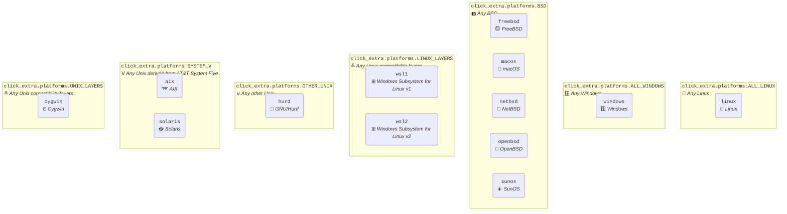
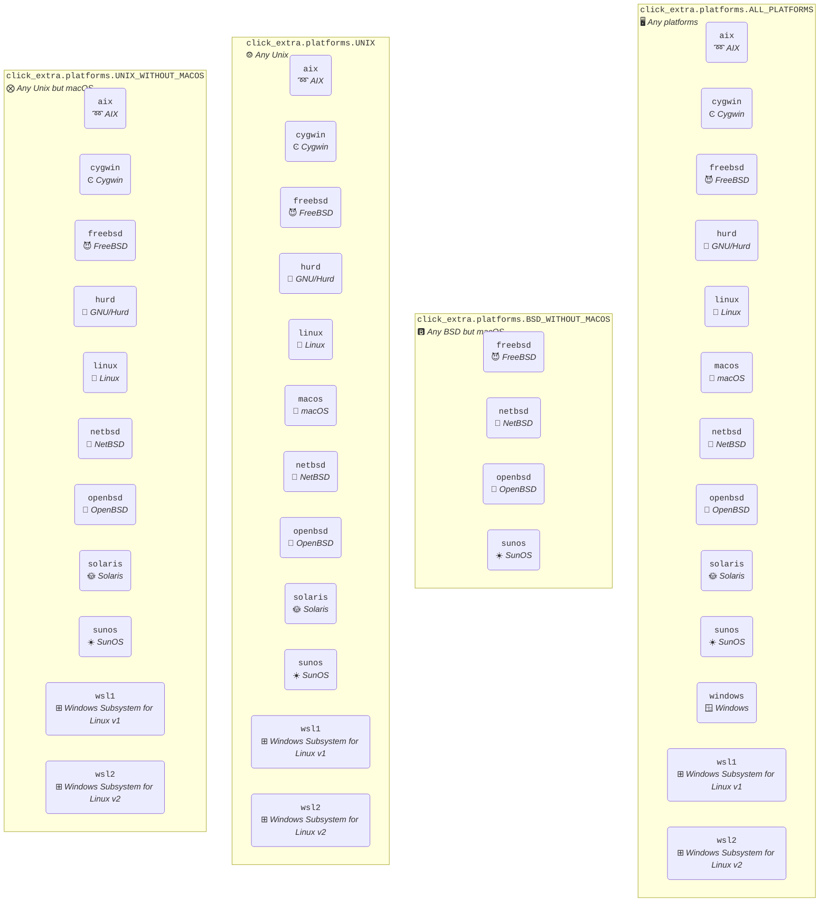

# Extra Platforms

[](https://pypi.python.org/pypi/extra-platforms)
[](https://pypi.python.org/pypi/extra-platforms)
[](https://pepy.tech/project/extra_platforms)
[](https://github.com/kdeldycke/extra-platforms/actions/workflows/tests.yaml?query=branch%3Amain)
[](https://app.codecov.io/gh/kdeldycke/extra-platforms)
[](https://github.com/kdeldycke/extra-platforms/actions/workflows/docs.yaml?query=branch%3Amain)
[](https://doi.org/10.5281/zenodo.13341712)

## What is Extra Platforms?

> [!WARNING]
> TODO

> [!TIP]
> I wanted to call this package `platforms`, but it's already taken on PyPI. So I went with `extra-platforms` instead, to mark its affiliation with [Click Extra](https://github.com/kdeldycke/click-extra).

## Example

> [!WARNING]
> TODO

## Group → platforms mapping

Relationships between groups and platforms:

<!-- platform-sankey-start -->

```mermaid
sankey-beta

"🖥️ all_platforms","➿ aix",1
"🖥️ all_platforms","Ͼ cygwin",1
"🖥️ all_platforms","😈 freebsd",1
"🖥️ all_platforms","🐃 hurd",1
"🖥️ all_platforms","🐧 linux",1
"🖥️ all_platforms","🍎 macos",1
"🖥️ all_platforms","🚩 netbsd",1
"🖥️ all_platforms","🐡 openbsd",1
"🖥️ all_platforms","🌞 solaris",1
"🖥️ all_platforms","☀️ sunos",1
"🖥️ all_platforms","🪟 windows",1
"🖥️ all_platforms","⊞ wsl1",1
"🖥️ all_platforms","⊞ wsl2",1
"⨷ unix","➿ aix",1
"⨷ unix","Ͼ cygwin",1
"⨷ unix","😈 freebsd",1
"⨷ unix","🐃 hurd",1
"⨷ unix","🐧 linux",1
"⨷ unix","🍎 macos",1
"⨷ unix","🚩 netbsd",1
"⨷ unix","🐡 openbsd",1
"⨷ unix","🌞 solaris",1
"⨷ unix","☀️ sunos",1
"⨷ unix","⊞ wsl1",1
"⨷ unix","⊞ wsl2",1
"⨂ unix_without_macos","➿ aix",1
"⨂ unix_without_macos","Ͼ cygwin",1
"⨂ unix_without_macos","😈 freebsd",1
"⨂ unix_without_macos","🐃 hurd",1
"⨂ unix_without_macos","🐧 linux",1
"⨂ unix_without_macos","🚩 netbsd",1
"⨂ unix_without_macos","🐡 openbsd",1
"⨂ unix_without_macos","🌞 solaris",1
"⨂ unix_without_macos","☀️ sunos",1
"⨂ unix_without_macos","⊞ wsl1",1
"⨂ unix_without_macos","⊞ wsl2",1
"🅱️ bsd","😈 freebsd",1
"🅱️ bsd","🍎 macos",1
"🅱️ bsd","🚩 netbsd",1
"🅱️ bsd","🐡 openbsd",1
"🅱️ bsd","☀️ sunos",1
"🅱️ bsd_without_macos","😈 freebsd",1
"🅱️ bsd_without_macos","🚩 netbsd",1
"🅱️ bsd_without_macos","🐡 openbsd",1
"🅱️ bsd_without_macos","☀️ sunos",1
"Ⅴ system_v","➿ aix",1
"Ⅴ system_v","🌞 solaris",1
"≚ linux_layers","⊞ wsl1",1
"≚ linux_layers","⊞ wsl2",1
"≛ unix_layers","Ͼ cygwin",1
"⊎ other_unix","🐃 hurd",1
"🪟 all_windows","🪟 windows",1
"🐧 all_linux","🐧 linux",1
```

<!-- platform-sankey-end -->

## OS families

Each platform is assigned to a group of non-overlpaping families:

<!-- NON_OVERLAPPING_GROUPS-graph-start -->

{caption="`click_extra.platforms.NON_OVERLAPPING_GROUPS` - Non-overlapping groups."}


<!-- NON_OVERLAPPING_GROUPS-graph-end -->

## Other groups

Other groups are available for convenience, but these overlaps:

<!-- EXTRA_GROUPS-graph-start -->

{caption="`click_extra.platforms.EXTRA_GROUPS` - Overlapping groups, defined for convenience."}


<!-- EXTRA_GROUPS-graph-end -->

> [!IMPORTANT]
> All the graphs above would be better off if merged. Unfortunately Graphviz is not capable of producing [Euler diagrams](https://xkcd.com/2721/). Only non-overlapping clusters can be rendered.
>
> There's still a chance to [have them supported by Mermaid](https://github.com/mermaid-js/mermaid/issues/2583) so we can switch to that if the feature materialize.

## Used in

Check these projects to get real-life examples of `extra-platforms` usage:

-  [Meta Package Manager](https://github.com/kdeldycke/meta-package-manager#readme) - A unifying CLI for multiple package managers.
-  [Click Extra](https://github.com/kdeldycke/click-extra#readme) - Drop-in replacement for Click to make user-friendly and colorful CLI.

Feel free to send a PR to add your project in this list if you are relying on Click Extra in any way.

## Development

[Development guidelines](https://github.com/kdeldycke/click-extra?tab=readme-ov-file#development) are the same as [parent project Click Extra](https://github.com/kdeldycke/click-extra), from which `extra-platforms` originated.
