# Extra Platforms

[](https://pypi.python.org/pypi/extra-platforms)
[](https://pypi.python.org/pypi/extra-platforms)
[](https://pepy.tech/project/extra_platforms)
[](https://github.com/kdeldycke/extra-platforms/actions/workflows/tests.yaml?query=branch%3Amain)
[](https://app.codecov.io/gh/kdeldycke/extra-platforms)
[](https://github.com/kdeldycke/extra-platforms/actions/workflows/docs.yaml?query=branch%3Amain)
[](https://doi.org/10.5281/zenodo.13341711)

## What is Extra Platforms?

Extra Platforms detects the runtime architecture, operating system (including Linux distribution), shell, terminal, CI environment & AI coding agents, and exposes rich, cacheable metadata (version, codename, icon, canonical URL). It also groups them into reusable families.

- Accurate detection of architecture, OS/distribution, shell, terminal, and CI systems using lightweight, cacheable heuristics.
- Rich metadata for platforms: version, codename, icon, canonical URL, and "like" relationships.
- Grouping and API primitives: predefined families, `is_*()` predicates, `current_*()` accessors, and `Group` membership helpers.
- Testing helpers: Pytest decorators and markers such as `@skip_<id>` and `@unless_<id>` for concise platform-aware tests.
- Extensible and CI-friendly: designed to be lightweight, easy to extend, and suitable for CI-aware workflows.
- Extend [`distro`](https://github.com/python-distro/distro) project with Windows and macOS detection.

## Quick start

Quickly inspect your current environment without installing anything, thanks to [`uvx`](https://docs.astral.sh/uv/guides/tools/#running-tools):

```shell-session
$ uvx extra-platforms
extra-platforms 9.0.1

── Architecture ── 📱 ARM64 (AArch64) ──[AARCH64]────────────
            id: aarch64
          (...)

── Platform ── 🍎 macOS ──[MACOS]────────────────────────────
            id: macos
          (...)

── Shell ── ℤ Zsh ──[ZSH]───────────────────────────────────
            id: zsh
          (...)

── Terminal ── 🍏 Apple Terminal ──[APPLE_TERMINAL]──────────
            id: apple_terminal
          (...)

── CI ── ❓ Unknown CI ──[UNKNOWN_CI]────────────────────────
          (...)
```

The same output is available via `python -m extra_platforms`.

Or if you want to explore usage of the library in a Python REPL:

```shell-session
$ uvx --with extra-platforms python
```

```pycon
>>> import extra_platforms
>>> extra_platforms.__version__
'9.0.1'
```

## Examples

Get the current platform, from which you can access lots of metadata:

```pycon
>>> from extra_platforms import current_platform
>>> my_os = current_platform()
>>> my_os
Platform(id='macos', name='macOS')
>>> my_os.id
'macos'
>>> my_os.name
'macOS'
>>> my_os.icon
'🍎'
>>> my_os.info()
{
    'id': 'macos',
    'name': 'macOS',
    'icon': '🍎',
    'url': 'https://apple.com/macos/',
    'current': True,
    'distro_id': 'darwin',
    'version': '26.2',
    'version_parts': {'major': '26', 'minor': '2', 'build_number': None},
    'like': None,
    'codename': 'Tahoe',
}
```

Check if a platform is a specific system:

```pycon
>>> from extra_platforms import is_gentoo
>>> is_gentoo()
False
```

Use groups to check if the current platform is part of a specific family:

```pycon
>>> from extra_platforms import current_platform, BSD, UNIX, LINUX
>>> current_platform()
Platform(id='macos', name='macOS')
>>> current_platform() in BSD
True
>>> current_platform() in UNIX
True
>>> current_platform() in LINUX
False
```

Or directly use the detection functions returning a boolean that is associated with each group:

```pycon
>>> from extra_platforms import is_bsd, is_unix, is_linux
>>> is_bsd()
True
>>> is_unix()
True
>>> is_linux()
False
```

List all platforms of a family:

```pycon
>>> from extra_platforms import LINUX
>>> LINUX.members
mappingproxy({
    'altlinux': Platform(id='altlinux', name='ALT Linux'),
    'amzn': Platform(id='amzn', name='Amazon Linux'),
    'android': Platform(id='android', name='Android'),
    'arch': Platform(id='arch', name='Arch Linux'),
    'buildroot': Platform(id='buildroot', name='Buildroot'),
    'cachyos': Platform(id='cachyos', name='CachyOS'),
    'centos': Platform(id='centos', name='CentOS'),
    'cloudlinux': Platform(id='cloudlinux', name='CloudLinux OS'),
    'debian': Platform(id='debian', name='Debian'),
    'exherbo': Platform(id='exherbo', name='Exherbo Linux'),
    'fedora': Platform(id='fedora', name='Fedora'),
    'gentoo': Platform(id='gentoo', name='Gentoo Linux'),
    'guix': Platform(id='guix', name='Guix System'),
    'ibm_powerkvm': Platform(id='ibm_powerkvm', name='IBM PowerKVM'),
    'kvmibm': Platform(id='kvmibm', name='KVM for IBM z Systems'),
    'linuxmint': Platform(id='linuxmint', name='Linux Mint'),
    'mageia': Platform(id='mageia', name='Mageia'),
    'mandriva': Platform(id='mandriva', name='Mandriva Linux'),
    'nobara': Platform(id='nobara', name='Nobara'),
    'opensuse': Platform(id='opensuse', name='openSUSE'),
    'oracle': Platform(id='oracle', name='Oracle Linux'),
    'parallels': Platform(id='parallels', name='Parallels'),
    'pidora': Platform(id='pidora', name='Pidora'),
    'raspbian': Platform(id='raspbian', name='Raspbian'),
    'rhel': Platform(id='rhel', name='RedHat Enterprise Linux'),
    'rocky': Platform(id='rocky', name='Rocky Linux'),
    'scientific': Platform(id='scientific', name='Scientific Linux'),
    'slackware': Platform(id='slackware', name='Slackware'),
    'sles': Platform(id='sles', name='SUSE Linux Enterprise Server'),
    'tumbleweed': Platform(id='tumbleweed', name='openSUSE Tumbleweed'),
    'tuxedo': Platform(id='tuxedo', name='Tuxedo OS'),
    'ubuntu': Platform(id='ubuntu', name='Ubuntu'),
    'ultramarine': Platform(id='ultramarine', name='Ultramarine'),
    'generic_linux': Platform(id='generic_linux', name='Generic Linux'),
    'xenserver': Platform(id='xenserver', name='XenServer'),
})
>>> LINUX.member_ids
frozenset({'centos', 'mageia', 'generic_linux', 'ultramarine', 'tuxedo', 'arch', 'buildroot', 'android', 'exherbo', 'mandriva', 'fedora', 'slackware', 'parallels', 'xenserver', 'kvmibm', 'nobara', 'amzn', 'guix', 'debian', 'oracle', 'cachyos', 'altlinux', 'rhel', 'ibm_powerkvm', 'rocky', 'scientific', 'sles', 'linuxmint', 'tumbleweed', 'ubuntu', 'pidora', 'cloudlinux', 'gentoo', 'raspbian', 'opensuse'})
>>> print("\n".join([p.name for p in LINUX]))
ALT Linux
Amazon Linux
Android
Arch Linux
Buildroot
CachyOS
CentOS
CloudLinux OS
Debian
Exherbo Linux
Fedora
Gentoo Linux
Guix System
IBM PowerKVM
KVM for IBM z Systems
Linux Mint
Mageia
Mandriva Linux
Nobara
openSUSE
Oracle Linux
Parallels
Pidora
Raspbian
RedHat Enterprise Linux
Rocky Linux
Scientific Linux
Slackware
SUSE Linux Enterprise Server
openSUSE Tumbleweed
Tuxedo OS
Ubuntu
Ultramarine
Generic Linux
XenServer
```

Reduce a disparate collection of groups and platforms into a minimal descriptive set, by grouping all platforms into families:

```pycon
>>> from extra_platforms import AIX, MACOS, SOLARIS, reduce
>>> reduce([AIX, MACOS])
frozenset({
    Platform(id='macos', name='macOS'),
    Platform(id='aix', name='IBM AIX'),
})
>>> reduce([AIX, MACOS, SOLARIS])
frozenset({
    Group(id='system_v', name='AT&T System Five'),
    Platform(id='macos', name='macOS'),
})
```

## Architectures

All recognized architectures and how they're grouped:

```mermaid
---
config: {"mindmap": {"padding": 5}}
---
mindmap
    ((🏛️ ALL_ARCHITECTURES))
        )𝘅 X86(
            (𝗶 I386)
            (𝗶 I586)
            (𝗶 I686)
            (🖥️ X86_64)
        )🌐 WEBASSEMBLY(
            (🌐 WASM32)
            (🌐 WASM64)
        )Ⅴ RISCV(
            (Ⅴ RISCV32)
            (Ⅴ RISCV64)
        )⚡ POWERPC(
            (⚡ PPC)
            (⚡ PPC64)
            (⚡ PPC64LE)
        )🐉 LOONGARCH(
            (🐉 LOONGARCH64)
        )🏢 IBM_MAINFRAME(
            (🏢 S390X)
        )☀️ ALL_SPARC(
            (☀️ SPARC)
            (☀️ SPARC64)
        )🔲 ALL_MIPS(
            (🔲 MIPS)
            (🔲 MIPS64)
            (🔲 MIPS64EL)
            (🔲 MIPSEL)
        )📱 ALL_ARM(
            (📱 AARCH64)
            (📱 ARM)
            (📱 ARMV5TEL)
            (📱 ARMV6L)
            (📱 ARMV7L)
            (📱 ARMV8L)
```

<!-- architecture-mindmap-start -->



<!-- architecture-mindmap-end -->

## Platforms

All recognized platforms and how they're grouped:

```mermaid
---
config: {"mindmap": {"padding": 5}}
---
mindmap
    ((⚙️ ALL_PLATFORMS))
        )≛ UNIX_LAYERS(
            (Ͼ CYGWIN)
        )𝐕 SYSTEM_V(
            (➿ AIX)
            (🔥 ILLUMOS)
            (🌞 SOLARIS)
        )🅟 OTHER_POSIX(
            (🍂 HAIKU)
            (🦬 HURD)
        )≚ LINUX_LAYERS(
            (⊞ WSL1)
            (⊞ WSL2)
        )🐧 LINUX(
            (🏔️ ALPINE)
            (Δ ALTLINUX)
            (⤻ AMZN)
            (🤖 ANDROID)
            (🎗️ ARCH)
            (⛑️ BUILDROOT)
            (⌬ CACHYOS)
            (💠 CENTOS)
            (꩜ CLOUDLINUX)
            (🌀 DEBIAN)
            (🐽 EXHERBO)
            (🎩 FEDORA)
            (🥚 GENERIC_LINUX)
            (🗜️ GENTOO)
            (🐃 GUIX)
            (🤹 IBM_POWERKVM)
            (🔱 KALI)
            (🤹 KVMIBM)
            (🌿 LINUXMINT)
            (⍥ MAGEIA)
            (💫 MANDRIVA)
            (▲ MANJARO)
            ( NOBARA)
            (🦎 OPENSUSE)
            (📶 OPENWRT)
            (🦴 ORACLE)
            (∥ PARALLELS)
            (🍓 PIDORA)
            (🍓 RASPBIAN)
            (🎩 RHEL)
            (⛰️ ROCKY)
            (⚛️ SCIENTIFIC)
            (🚬 SLACKWARE)
            (🦎 SLES)
            (↻ TUMBLEWEED)
            (🤵 TUXEDO)
            (🎯 UBUNTU)
            (🌊 ULTRAMARINE)
            (Ⓧ XENSERVER)
        )Ⓑ BSD(
            (🪰 DRAGONFLY_BSD)
            (😈 FREEBSD)
            (🍎 MACOS)
            (🌘 MIDNIGHTBSD)
            (🚩 NETBSD)
            (🐡 OPENBSD)
            (🌅 SUNOS)
        )🪟 ALL_WINDOWS(
            (🪟 WINDOWS)
```

<!-- platform-mindmap-start -->



<!-- platform-mindmap-end -->

> [!TIP]
> More groups exist beyond those shown in the diagram, and more utilities are available for each platform. See the [platform documentation](https://kdeldycke.github.io/extra-platforms/platforms.html#groups-of-platforms) for details.

## Shells

All recognized shells:

```mermaid
---
config: {"mindmap": {"padding": 5}}
---
mindmap
    ((🐚 ALL_SHELLS))
        )⌨️ WINDOWS_SHELLS(
            (▶ CMD)
            (🔷 POWERSHELL)
        )◇ OTHER_SHELLS(
            (🐟 FISH)
            (𝜈 NUSHELL)
            (🐍 XONSH)
        )🅲 C_SHELLS(
            (𝐂 CSH)
            (𝐓 TCSH)
        )💲 BOURNE_SHELLS(
            (🪶 ASH)
            (＃ BASH)
            (💨 DASH)
            (𝐊 KSH)
            (ℤ ZSH)
```

<!-- shell-mindmap-start -->



<!-- shell-mindmap-end -->

## Terminals

All recognized terminals:

```mermaid
---
config: {"mindmap": {"padding": 5}}
---
mindmap
    ((💻 ALL_TERMINALS))
        )⬢ WEB_TERMINALS(
            (⬡ HYPER)
            (🐈 TABBY)
            (🔵 VSCODE_TERMINAL)
        )▦ NATIVE_TERMINALS(
            (🍏 APPLE_TERMINAL)
            (𝐆 GNOME_TERMINAL)
            (⬛ ITERM2)
            (💎 KONSOLE)
            (🔀 TILIX)
            (⊡ WINDOWS_TERMINAL)
            (𝐗 XTERM)
        )⧉ MULTIPLEXERS(
            (📺 GNU_SCREEN)
            (📟 TMUX)
            (🪵 ZELLIJ)
        )🎮 GPU_TERMINALS(
            (🔳 ALACRITTY)
            (◰ CONTOUR)
            (🦶 FOOT)
            (👻 GHOSTTY)
            (🐱 KITTY)
            (🏞️ RIO)
            (🔡 WEZTERM)
```

<!-- terminal-mindmap-start -->



<!-- terminal-mindmap-end -->

## CI systems

All recognized CI systems:

```mermaid
---
config: {"mindmap": {"padding": 5}}
---
mindmap
    ((♺ ALL_CI))
        (â• AZURE_PIPELINES)
        (⟲ BAMBOO)
        (🪠BUILDKITE)
        (⪾ CIRCLE_CI)
        (≋ CIRRUS_CI)
        (áš™ CODEBUILD)
        (🙠GITHUB_CI)
        (🦊 GITLAB_CI)
        (⥠HEROKU_CI)
        (ğŸ™ï¸ TEAMCITY)
        (👷 TRAVIS_CI)
```

<!-- ci-mindmap-start -->



<!-- ci-mindmap-end -->

## Agents

All recognized AI coding agents:

```mermaid
---
config: {"mindmap": {"padding": 5}}
---
mindmap
    ((🧠 ALL_AGENTS))
        (✴️ CLAUDE_CODE)
        (👾 CLINE)
        (➤ CURSOR)
```

<!-- agent-mindmap-start -->



<!-- agent-mindmap-end -->

## Used in

Check these projects to get real-life examples of `extra-platforms` usage:

-  [Meta Package Manager](https://github.com/kdeldycke/meta-package-manager) - A unifying CLI for multiple package managers.
-  [Mail Deduplicate](https://github.com/kdeldycke/mail-deduplicate) - Deduplicate emails in mail files and folders.
-  [Click Extra](https://github.com/kdeldycke/click-extra) - Drop-in replacement for Click to make user-friendly and colorful CLI.

Feel free to send a PR to add your project in this list if you are relying on Extra Platforms in any way.

## Development

[Development guidelines](https://github.com/kdeldycke/click-extra#development) are the same as [parent project Click Extra](https://github.com/kdeldycke/click-extra), from which `extra-platforms` originated.
