# Extra Platforms

[](https://pypi.python.org/pypi/extra-platforms)
[](https://pypi.python.org/pypi/extra-platforms)
[](https://pepy.tech/project/extra_platforms)
[](https://github.com/kdeldycke/extra-platforms/actions/workflows/tests.yaml?query=branch%3Amain)
[](https://app.codecov.io/gh/kdeldycke/extra-platforms)
[](https://github.com/kdeldycke/extra-platforms/actions/workflows/docs.yaml?query=branch%3Amain)
[](https://doi.org/10.5281/zenodo.13341712)

## What is Extra Platforms?

- Provides a list of all known platforms
- Detect the current platform, at the distribution level
- Gather current platform metadata (version, codename, etc.)
- Group platforms into families
- Manage collection of platforms and groups
- Associate each platform and group to an emoji symbol
- New conditional markers for `pytest`:
  - `@skip_linux`, `@skip_macos` and `@skip_windows`
  - `@unless_linux`, `@unless_macos` and `@unless_windows`
- Address [`distro#177` issue (support for Windows and Mac OS)](https://github.com/python-distro/distro/issues/177)

## Examples

Get the current platform, from which you can access lots of metadata:

```pycon
>>> from extra_platforms import current_os

>>> my_os = current_os()
>>> my_os
Platform(id='macos', name='macOS', current=True)

>>> my_os.id
'macos'
>>> my_os.name
'macOS'
>>> my_os.icon
'🍎'

>>> my_os.info()
{
    "id": "macos",
    "name": "macOS",
    "icon": "🍎",
    "current": True,
    "distro_id": "darwin",
    "version": "23.6.0",
    "version_parts": {"major": "23", "minor": "6", "build_number": "0"},
    "like": None,
    "codename": None,
}
```

Check if a platform is a specific system:

```pycon
>>> from extra_platforms import is_gentoo

>>> is_gentoo()
False
```

Use groups to check if the current platform is part of a specific family:

```pycon
>>> from extra_platforms import UNIX, current_os

>>> current_os() in UNIX
False
```

Or directly use the boolean variables available for each family:

```pycon
>>> from extra_platforms import is_unix

>>> is_unix()
False
```

List all platforms of a family:

```pycon
>>> from extra_platforms import LINUX

>>> LINUX
Group(id='linux', name='Any Linux', platform_ids=frozenset({'ibm_powerkvm', 'rocky', 'debian', 'tuxedo', 'ubuntu', 'mageia', 'xenserver', 'opensuse', 'nobara', 'buildroot', 'rhel', 'parallels', 'pidora', 'sles', 'amzn', 'scientific', 'linuxmint', 'centos', 'android', 'gentoo', 'raspbian', 'unknown_linux', 'mandriva', 'exherbo', 'cloudlinux', 'fedora', 'guix', 'arch', 'altlinux', 'slackware', 'oracle', 'kvmibm'}))

>>> print("\n".join([p.name for p in LINUX]))
ALT Linux
Amazon Linux
Android
Arch Linux
Buildroot
CentOS
CloudLinux OS
Debian
Exherbo Linux
Fedora
Gentoo Linux
Guix System
IBM PowerKVM
KVM for IBM z Systems
Linux Mint
Mageia
Mandriva Linux
Nobara
openSUSE
Oracle Linux
Parallels
Pidora
Raspbian
RedHat Enterprise Linux
Rocky Linux
Scientific Linux
Slackware
SUSE Linux Enterprise Server
Tuxedo OS
Ubuntu
Unknown Linux
XenServer
```

Reduce a disparate collection of groups and platforms into a minimal descriptive set, by grouping all platforms into families:

```pycon
>>> from extra_platforms import AIX, MACOS, SOLARIS, reduce

>>> reduce([AIX, MACOS])
{
    Platform(id='aix', name='IBM AIX', current=False),
    Platform(id='macos', name='macOS', current=True),
}

>>> reduce([AIX, MACOS, SOLARIS])
{
    Group(id='system_v', name='Any Unix derived from AT&T System Five', platform_ids=frozenset({'aix', 'solaris'})),
    Platform(id='macos', name='macOS', current=True),
}
```

## Groups → Platforms mapping

Relationships between groups and platforms:

<!-- platform-sankey-start -->


<!-- platform-sankey-end -->

## OS families

Each platform is assigned to a group of non-overlpaping families:

```mermaid
---
config: {"mindmap": {"padding": 5}}
---
mindmap
    ((Extra Platforms))
        )≛ UNIX_LAYERS(
            (Ͼ cygwin)
        )Ⅴ SYSTEM_V(
            (➿ aix)
            (🌞 solaris)
        )⊎ OTHER_UNIX(
            (🐃 hurd)
        )≚ LINUX_LAYERS(
            (⊞ wsl1)
            (⊞ wsl2)
        )🐧 LINUX(
            (🐧 altlinux)
            (🙂 amzn)
            (🤖 android)
            (🎗️ arch)
            (⛑️ buildroot)
            (💠 centos)
            (꩜ cloudlinux)
            (🌀 debian)
            (🐽 exherbo)
            (🎩 fedora)
            (🗜️ gentoo)
            (🐃 guix)
            (🤹 ibm_powerkvm)
            (🤹 kvmibm)
            (🌿 linuxmint)
            (⍥ mageia)
            (💫 mandriva)
            ( nobara)
            (🦎 opensuse)
            (🦴 oracle)
            (∥ parallels)
            (🍓 pidora)
            (🍓 raspbian)
            (🎩 rhel)
            (⛰️ rocky)
            (⚛️ scientific)
            (🚬 slackware)
            (🦎 sles)
            (↻ tumbleweed)
            (🤵 tuxedo)
            (🎯 ubuntu)
            (🐧 unknown_linux)
            (Ⓧ xenserver)
        )🅱️+ BSD(
            (😈 freebsd)
            (🍎 macos)
            (🌘 midnightbsd)
            (🚩 netbsd)
            (🐡 openbsd)
            (☀️ sunos)
        )🪟 ANY_WINDOWS(
            (🪟 windows)
```

<!-- platform-hierarchy-start -->



<!-- platform-hierarchy-end -->

<!-- NON_OVERLAPPING_GROUPS-graph-start -->



<!-- NON_OVERLAPPING_GROUPS-graph-end -->

```mermaid
---
title: <code>extra_platforms.NON_OVERLAPPING_GROUPS</code> - Non-overlapping groups.
---
flowchart

    subgraph "<code>extra_platforms.ANY_WINDOWS</code><br/>🪟 <em>Any Windows</em>"
        any_windows_windows(<code>windows</code><br/>🪟 <em>Windows</em>)
    end
    subgraph "<code>extra_platforms.BSD</code><br/>🅱️+ <em>Any BSD</em>"
        bsd_freebsd(<code>freebsd</code><br/>😈 <em>FreeBSD</em>)
        bsd_macos(<code>macos</code><br/>🍎 <em>macOS</em>)
        bsd_midnightbsd(<code>midnightbsd</code><br/>🌘 <em>MidnightBSD</em>)
        bsd_netbsd(<code>netbsd</code><br/>🚩 <em>NetBSD</em>)
        bsd_openbsd(<code>openbsd</code><br/>🐡 <em>OpenBSD</em>)
        bsd_sunos(<code>sunos</code><br/>☀️ <em>SunOS</em>)
    end
    subgraph "<code>extra_platforms.LINUX</code><br/>🐧 <em>Any Linux distribution</em>"
        linux_altlinux(<code>altlinux</code><br/>🐧 <em>ALT Linux</em>)
        linux_amzn(<code>amzn</code><br/>🙂 <em>Amazon Linux</em>)
        linux_android(<code>android</code><br/>🤖 <em>Android</em>)
        linux_arch(<code>arch</code><br/>🎗️ <em>Arch Linux</em>)
        linux_buildroot(<code>buildroot</code><br/>⛑️ <em>Buildroot</em>)
        linux_centos(<code>centos</code><br/>💠 <em>CentOS</em>)
        linux_cloudlinux(<code>cloudlinux</code><br/>꩜ <em>CloudLinux OS</em>)
        linux_debian(<code>debian</code><br/>🌀 <em>Debian</em>)
        linux_exherbo(<code>exherbo</code><br/>🐽 <em>Exherbo Linux</em>)
        linux_fedora(<code>fedora</code><br/>🎩 <em>Fedora</em>)
        linux_gentoo(<code>gentoo</code><br/>🗜️ <em>Gentoo Linux</em>)
        linux_guix(<code>guix</code><br/>🐃 <em>Guix System</em>)
        linux_ibm_powerkvm(<code>ibm_powerkvm</code><br/>🤹 <em>IBM PowerKVM</em>)
        linux_kvmibm(<code>kvmibm</code><br/>🤹 <em>KVM for IBM z Systems</em>)
        linux_linuxmint(<code>linuxmint</code><br/>🌿 <em>Linux Mint</em>)
        linux_mageia(<code>mageia</code><br/>⍥ <em>Mageia</em>)
        linux_mandriva(<code>mandriva</code><br/>💫 <em>Mandriva Linux</em>)
        linux_nobara(<code>nobara</code><br/> <em>Nobara</em>)
        linux_opensuse(<code>opensuse</code><br/>🦎 <em>openSUSE</em>)
        linux_oracle(<code>oracle</code><br/>🦴 <em>Oracle Linux</em>)
        linux_parallels(<code>parallels</code><br/>∥ <em>Parallels</em>)
        linux_pidora(<code>pidora</code><br/>🍓 <em>Pidora</em>)
        linux_raspbian(<code>raspbian</code><br/>🍓 <em>Raspbian</em>)
        linux_rhel(<code>rhel</code><br/>🎩 <em>RedHat Enterprise Linux</em>)
        linux_rocky(<code>rocky</code><br/>⛰️ <em>Rocky Linux</em>)
        linux_scientific(<code>scientific</code><br/>⚛️ <em>Scientific Linux</em>)
        linux_slackware(<code>slackware</code><br/>🚬 <em>Slackware</em>)
        linux_sles(<code>sles</code><br/>🦎 <em>SUSE Linux Enterprise Server</em>)
        linux_tumbleweed(<code>tumbleweed</code><br/>↻ <em>openSUSE Tumbleweed</em>)
        linux_tuxedo(<code>tuxedo</code><br/>🤵 <em>Tuxedo OS</em>)
        linux_ubuntu(<code>ubuntu</code><br/>🎯 <em>Ubuntu</em>)
        linux_unknown_linux(<code>unknown_linux</code><br/>🐧 <em>Unknown Linux</em>)
        linux_xenserver(<code>xenserver</code><br/>Ⓧ <em>XenServer</em>)
    end
    subgraph "<code>extra_platforms.LINUX_LAYERS</code><br/>≚ <em>Any Linux compatibility layers</em>"
        linux_layers_wsl1(<code>wsl1</code><br/>⊞ <em>Windows Subsystem for Linux v1</em>)
        linux_layers_wsl2(<code>wsl2</code><br/>⊞ <em>Windows Subsystem for Linux v2</em>)
    end
    subgraph "<code>extra_platforms.OTHER_UNIX</code><br/>⊎ <em>Any other Unix</em>"
        other_unix_hurd(<code>hurd</code><br/>🐃 <em>GNU/Hurd</em>)
    end
    subgraph "<code>extra_platforms.SYSTEM_V</code><br/>Ⅴ <em>Any Unix derived from AT&amp;T System Five</em>"
        system_v_aix(<code>aix</code><br/>➿ <em>IBM AIX</em>)
        system_v_solaris(<code>solaris</code><br/>🌞 <em>Solaris</em>)
    end
    subgraph "<code>extra_platforms.UNIX_LAYERS</code><br/>≛ <em>Any Unix compatibility layers</em>"
        unix_layers_cygwin(<code>cygwin</code><br/>Ͼ <em>Cygwin</em>)
    end
```

## Other groups

Other groups are available for convenience, but these overlaps:

```mermaid
---
title: <code>extra_platforms.EXTRA_GROUPS</code> - Overlapping groups, defined for convenience.
---
flowchart

    subgraph "<code>extra_platforms.ALL_PLATFORMS</code><br/>🖥️ <em>All platforms</em>"
        all_platforms_aix(<code>aix</code><br/>➿ <em>IBM AIX</em>)
        all_platforms_altlinux(<code>altlinux</code><br/>🐧 <em>ALT Linux</em>)
        all_platforms_amzn(<code>amzn</code><br/>🙂 <em>Amazon Linux</em>)
        all_platforms_android(<code>android</code><br/>🤖 <em>Android</em>)
        all_platforms_arch(<code>arch</code><br/>🎗️ <em>Arch Linux</em>)
        all_platforms_buildroot(<code>buildroot</code><br/>⛑️ <em>Buildroot</em>)
        all_platforms_centos(<code>centos</code><br/>💠 <em>CentOS</em>)
        all_platforms_cloudlinux(<code>cloudlinux</code><br/>꩜ <em>CloudLinux OS</em>)
        all_platforms_cygwin(<code>cygwin</code><br/>Ͼ <em>Cygwin</em>)
        all_platforms_debian(<code>debian</code><br/>🌀 <em>Debian</em>)
        all_platforms_exherbo(<code>exherbo</code><br/>🐽 <em>Exherbo Linux</em>)
        all_platforms_fedora(<code>fedora</code><br/>🎩 <em>Fedora</em>)
        all_platforms_freebsd(<code>freebsd</code><br/>😈 <em>FreeBSD</em>)
        all_platforms_gentoo(<code>gentoo</code><br/>🗜️ <em>Gentoo Linux</em>)
        all_platforms_guix(<code>guix</code><br/>🐃 <em>Guix System</em>)
        all_platforms_hurd(<code>hurd</code><br/>🐃 <em>GNU/Hurd</em>)
        all_platforms_ibm_powerkvm(<code>ibm_powerkvm</code><br/>🤹 <em>IBM PowerKVM</em>)
        all_platforms_kvmibm(<code>kvmibm</code><br/>🤹 <em>KVM for IBM z Systems</em>)
        all_platforms_linuxmint(<code>linuxmint</code><br/>🌿 <em>Linux Mint</em>)
        all_platforms_macos(<code>macos</code><br/>🍎 <em>macOS</em>)
        all_platforms_mageia(<code>mageia</code><br/>⍥ <em>Mageia</em>)
        all_platforms_mandriva(<code>mandriva</code><br/>💫 <em>Mandriva Linux</em>)
        all_platforms_midnightbsd(<code>midnightbsd</code><br/>🌘 <em>MidnightBSD</em>)
        all_platforms_netbsd(<code>netbsd</code><br/>🚩 <em>NetBSD</em>)
        all_platforms_nobara(<code>nobara</code><br/> <em>Nobara</em>)
        all_platforms_openbsd(<code>openbsd</code><br/>🐡 <em>OpenBSD</em>)
        all_platforms_opensuse(<code>opensuse</code><br/>🦎 <em>openSUSE</em>)
        all_platforms_oracle(<code>oracle</code><br/>🦴 <em>Oracle Linux</em>)
        all_platforms_parallels(<code>parallels</code><br/>∥ <em>Parallels</em>)
        all_platforms_pidora(<code>pidora</code><br/>🍓 <em>Pidora</em>)
        all_platforms_raspbian(<code>raspbian</code><br/>🍓 <em>Raspbian</em>)
        all_platforms_rhel(<code>rhel</code><br/>🎩 <em>RedHat Enterprise Linux</em>)
        all_platforms_rocky(<code>rocky</code><br/>⛰️ <em>Rocky Linux</em>)
        all_platforms_scientific(<code>scientific</code><br/>⚛️ <em>Scientific Linux</em>)
        all_platforms_slackware(<code>slackware</code><br/>🚬 <em>Slackware</em>)
        all_platforms_sles(<code>sles</code><br/>🦎 <em>SUSE Linux Enterprise Server</em>)
        all_platforms_solaris(<code>solaris</code><br/>🌞 <em>Solaris</em>)
        all_platforms_sunos(<code>sunos</code><br/>☀️ <em>SunOS</em>)
        all_platforms_tumbleweed(<code>tumbleweed</code><br/>↻ <em>openSUSE Tumbleweed</em>)
        all_platforms_tuxedo(<code>tuxedo</code><br/>🤵 <em>Tuxedo OS</em>)
        all_platforms_ubuntu(<code>ubuntu</code><br/>🎯 <em>Ubuntu</em>)
        all_platforms_unknown_linux(<code>unknown_linux</code><br/>🐧 <em>Unknown Linux</em>)
        all_platforms_windows(<code>windows</code><br/>🪟 <em>Windows</em>)
        all_platforms_wsl1(<code>wsl1</code><br/>⊞ <em>Windows Subsystem for Linux v1</em>)
        all_platforms_wsl2(<code>wsl2</code><br/>⊞ <em>Windows Subsystem for Linux v2</em>)
        all_platforms_xenserver(<code>xenserver</code><br/>Ⓧ <em>XenServer</em>)
    end
    subgraph "<code>extra_platforms.BSD_WITHOUT_MACOS</code><br/>🅱️ <em>Any BSD excluding macOS</em>"
        bsd_without_macos_freebsd(<code>freebsd</code><br/>😈 <em>FreeBSD</em>)
        bsd_without_macos_midnightbsd(<code>midnightbsd</code><br/>🌘 <em>MidnightBSD</em>)
        bsd_without_macos_netbsd(<code>netbsd</code><br/>🚩 <em>NetBSD</em>)
        bsd_without_macos_openbsd(<code>openbsd</code><br/>🐡 <em>OpenBSD</em>)
        bsd_without_macos_sunos(<code>sunos</code><br/>☀️ <em>SunOS</em>)
    end
    subgraph "<code>extra_platforms.LINUX_LIKE</code><br/>🐧+ <em>Any Linux and compatibility layers</em>"
        linux_like_altlinux(<code>altlinux</code><br/>🐧 <em>ALT Linux</em>)
        linux_like_amzn(<code>amzn</code><br/>🙂 <em>Amazon Linux</em>)
        linux_like_android(<code>android</code><br/>🤖 <em>Android</em>)
        linux_like_arch(<code>arch</code><br/>🎗️ <em>Arch Linux</em>)
        linux_like_buildroot(<code>buildroot</code><br/>⛑️ <em>Buildroot</em>)
        linux_like_centos(<code>centos</code><br/>💠 <em>CentOS</em>)
        linux_like_cloudlinux(<code>cloudlinux</code><br/>꩜ <em>CloudLinux OS</em>)
        linux_like_debian(<code>debian</code><br/>🌀 <em>Debian</em>)
        linux_like_exherbo(<code>exherbo</code><br/>🐽 <em>Exherbo Linux</em>)
        linux_like_fedora(<code>fedora</code><br/>🎩 <em>Fedora</em>)
        linux_like_gentoo(<code>gentoo</code><br/>🗜️ <em>Gentoo Linux</em>)
        linux_like_guix(<code>guix</code><br/>🐃 <em>Guix System</em>)
        linux_like_ibm_powerkvm(<code>ibm_powerkvm</code><br/>🤹 <em>IBM PowerKVM</em>)
        linux_like_kvmibm(<code>kvmibm</code><br/>🤹 <em>KVM for IBM z Systems</em>)
        linux_like_linuxmint(<code>linuxmint</code><br/>🌿 <em>Linux Mint</em>)
        linux_like_mageia(<code>mageia</code><br/>⍥ <em>Mageia</em>)
        linux_like_mandriva(<code>mandriva</code><br/>💫 <em>Mandriva Linux</em>)
        linux_like_nobara(<code>nobara</code><br/> <em>Nobara</em>)
        linux_like_opensuse(<code>opensuse</code><br/>🦎 <em>openSUSE</em>)
        linux_like_oracle(<code>oracle</code><br/>🦴 <em>Oracle Linux</em>)
        linux_like_parallels(<code>parallels</code><br/>∥ <em>Parallels</em>)
        linux_like_pidora(<code>pidora</code><br/>🍓 <em>Pidora</em>)
        linux_like_raspbian(<code>raspbian</code><br/>🍓 <em>Raspbian</em>)
        linux_like_rhel(<code>rhel</code><br/>🎩 <em>RedHat Enterprise Linux</em>)
        linux_like_rocky(<code>rocky</code><br/>⛰️ <em>Rocky Linux</em>)
        linux_like_scientific(<code>scientific</code><br/>⚛️ <em>Scientific Linux</em>)
        linux_like_slackware(<code>slackware</code><br/>🚬 <em>Slackware</em>)
        linux_like_sles(<code>sles</code><br/>🦎 <em>SUSE Linux Enterprise Server</em>)
        linux_like_tumbleweed(<code>tumbleweed</code><br/>↻ <em>openSUSE Tumbleweed</em>)
        linux_like_tuxedo(<code>tuxedo</code><br/>🤵 <em>Tuxedo OS</em>)
        linux_like_ubuntu(<code>ubuntu</code><br/>🎯 <em>Ubuntu</em>)
        linux_like_unknown_linux(<code>unknown_linux</code><br/>🐧 <em>Unknown Linux</em>)
        linux_like_wsl1(<code>wsl1</code><br/>⊞ <em>Windows Subsystem for Linux v1</em>)
        linux_like_wsl2(<code>wsl2</code><br/>⊞ <em>Windows Subsystem for Linux v2</em>)
        linux_like_xenserver(<code>xenserver</code><br/>Ⓧ <em>XenServer</em>)
    end
    subgraph "<code>extra_platforms.UNIX</code><br/>⨷ <em>Any Unix</em>"
        unix_aix(<code>aix</code><br/>➿ <em>IBM AIX</em>)
        unix_altlinux(<code>altlinux</code><br/>🐧 <em>ALT Linux</em>)
        unix_amzn(<code>amzn</code><br/>🙂 <em>Amazon Linux</em>)
        unix_android(<code>android</code><br/>🤖 <em>Android</em>)
        unix_arch(<code>arch</code><br/>🎗️ <em>Arch Linux</em>)
        unix_buildroot(<code>buildroot</code><br/>⛑️ <em>Buildroot</em>)
        unix_centos(<code>centos</code><br/>💠 <em>CentOS</em>)
        unix_cloudlinux(<code>cloudlinux</code><br/>꩜ <em>CloudLinux OS</em>)
        unix_cygwin(<code>cygwin</code><br/>Ͼ <em>Cygwin</em>)
        unix_debian(<code>debian</code><br/>🌀 <em>Debian</em>)
        unix_exherbo(<code>exherbo</code><br/>🐽 <em>Exherbo Linux</em>)
        unix_fedora(<code>fedora</code><br/>🎩 <em>Fedora</em>)
        unix_freebsd(<code>freebsd</code><br/>😈 <em>FreeBSD</em>)
        unix_gentoo(<code>gentoo</code><br/>🗜️ <em>Gentoo Linux</em>)
        unix_guix(<code>guix</code><br/>🐃 <em>Guix System</em>)
        unix_hurd(<code>hurd</code><br/>🐃 <em>GNU/Hurd</em>)
        unix_ibm_powerkvm(<code>ibm_powerkvm</code><br/>🤹 <em>IBM PowerKVM</em>)
        unix_kvmibm(<code>kvmibm</code><br/>🤹 <em>KVM for IBM z Systems</em>)
        unix_linuxmint(<code>linuxmint</code><br/>🌿 <em>Linux Mint</em>)
        unix_macos(<code>macos</code><br/>🍎 <em>macOS</em>)
        unix_mageia(<code>mageia</code><br/>⍥ <em>Mageia</em>)
        unix_mandriva(<code>mandriva</code><br/>💫 <em>Mandriva Linux</em>)
        unix_midnightbsd(<code>midnightbsd</code><br/>🌘 <em>MidnightBSD</em>)
        unix_netbsd(<code>netbsd</code><br/>🚩 <em>NetBSD</em>)
        unix_nobara(<code>nobara</code><br/> <em>Nobara</em>)
        unix_openbsd(<code>openbsd</code><br/>🐡 <em>OpenBSD</em>)
        unix_opensuse(<code>opensuse</code><br/>🦎 <em>openSUSE</em>)
        unix_oracle(<code>oracle</code><br/>🦴 <em>Oracle Linux</em>)
        unix_parallels(<code>parallels</code><br/>∥ <em>Parallels</em>)
        unix_pidora(<code>pidora</code><br/>🍓 <em>Pidora</em>)
        unix_raspbian(<code>raspbian</code><br/>🍓 <em>Raspbian</em>)
        unix_rhel(<code>rhel</code><br/>🎩 <em>RedHat Enterprise Linux</em>)
        unix_rocky(<code>rocky</code><br/>⛰️ <em>Rocky Linux</em>)
        unix_scientific(<code>scientific</code><br/>⚛️ <em>Scientific Linux</em>)
        unix_slackware(<code>slackware</code><br/>🚬 <em>Slackware</em>)
        unix_sles(<code>sles</code><br/>🦎 <em>SUSE Linux Enterprise Server</em>)
        unix_solaris(<code>solaris</code><br/>🌞 <em>Solaris</em>)
        unix_sunos(<code>sunos</code><br/>☀️ <em>SunOS</em>)
        unix_tumbleweed(<code>tumbleweed</code><br/>↻ <em>openSUSE Tumbleweed</em>)
        unix_tuxedo(<code>tuxedo</code><br/>🤵 <em>Tuxedo OS</em>)
        unix_ubuntu(<code>ubuntu</code><br/>🎯 <em>Ubuntu</em>)
        unix_unknown_linux(<code>unknown_linux</code><br/>🐧 <em>Unknown Linux</em>)
        unix_wsl1(<code>wsl1</code><br/>⊞ <em>Windows Subsystem for Linux v1</em>)
        unix_wsl2(<code>wsl2</code><br/>⊞ <em>Windows Subsystem for Linux v2</em>)
        unix_xenserver(<code>xenserver</code><br/>Ⓧ <em>XenServer</em>)
    end
    subgraph "<code>extra_platforms.UNIX_WITHOUT_MACOS</code><br/>⨂ <em>Any Unix excluding macOS</em>"
        unix_without_macos_aix(<code>aix</code><br/>➿ <em>IBM AIX</em>)
        unix_without_macos_altlinux(<code>altlinux</code><br/>🐧 <em>ALT Linux</em>)
        unix_without_macos_amzn(<code>amzn</code><br/>🙂 <em>Amazon Linux</em>)
        unix_without_macos_android(<code>android</code><br/>🤖 <em>Android</em>)
        unix_without_macos_arch(<code>arch</code><br/>🎗️ <em>Arch Linux</em>)
        unix_without_macos_buildroot(<code>buildroot</code><br/>⛑️ <em>Buildroot</em>)
        unix_without_macos_centos(<code>centos</code><br/>💠 <em>CentOS</em>)
        unix_without_macos_cloudlinux(<code>cloudlinux</code><br/>꩜ <em>CloudLinux OS</em>)
        unix_without_macos_cygwin(<code>cygwin</code><br/>Ͼ <em>Cygwin</em>)
        unix_without_macos_debian(<code>debian</code><br/>🌀 <em>Debian</em>)
        unix_without_macos_exherbo(<code>exherbo</code><br/>🐽 <em>Exherbo Linux</em>)
        unix_without_macos_fedora(<code>fedora</code><br/>🎩 <em>Fedora</em>)
        unix_without_macos_freebsd(<code>freebsd</code><br/>😈 <em>FreeBSD</em>)
        unix_without_macos_gentoo(<code>gentoo</code><br/>🗜️ <em>Gentoo Linux</em>)
        unix_without_macos_guix(<code>guix</code><br/>🐃 <em>Guix System</em>)
        unix_without_macos_hurd(<code>hurd</code><br/>🐃 <em>GNU/Hurd</em>)
        unix_without_macos_ibm_powerkvm(<code>ibm_powerkvm</code><br/>🤹 <em>IBM PowerKVM</em>)
        unix_without_macos_kvmibm(<code>kvmibm</code><br/>🤹 <em>KVM for IBM z Systems</em>)
        unix_without_macos_linuxmint(<code>linuxmint</code><br/>🌿 <em>Linux Mint</em>)
        unix_without_macos_mageia(<code>mageia</code><br/>⍥ <em>Mageia</em>)
        unix_without_macos_mandriva(<code>mandriva</code><br/>💫 <em>Mandriva Linux</em>)
        unix_without_macos_midnightbsd(<code>midnightbsd</code><br/>🌘 <em>MidnightBSD</em>)
        unix_without_macos_netbsd(<code>netbsd</code><br/>🚩 <em>NetBSD</em>)
        unix_without_macos_nobara(<code>nobara</code><br/> <em>Nobara</em>)
        unix_without_macos_openbsd(<code>openbsd</code><br/>🐡 <em>OpenBSD</em>)
        unix_without_macos_opensuse(<code>opensuse</code><br/>🦎 <em>openSUSE</em>)
        unix_without_macos_oracle(<code>oracle</code><br/>🦴 <em>Oracle Linux</em>)
        unix_without_macos_parallels(<code>parallels</code><br/>∥ <em>Parallels</em>)
        unix_without_macos_pidora(<code>pidora</code><br/>🍓 <em>Pidora</em>)
        unix_without_macos_raspbian(<code>raspbian</code><br/>🍓 <em>Raspbian</em>)
        unix_without_macos_rhel(<code>rhel</code><br/>🎩 <em>RedHat Enterprise Linux</em>)
        unix_without_macos_rocky(<code>rocky</code><br/>⛰️ <em>Rocky Linux</em>)
        unix_without_macos_scientific(<code>scientific</code><br/>⚛️ <em>Scientific Linux</em>)
        unix_without_macos_slackware(<code>slackware</code><br/>🚬 <em>Slackware</em>)
        unix_without_macos_sles(<code>sles</code><br/>🦎 <em>SUSE Linux Enterprise Server</em>)
        unix_without_macos_solaris(<code>solaris</code><br/>🌞 <em>Solaris</em>)
        unix_without_macos_sunos(<code>sunos</code><br/>☀️ <em>SunOS</em>)
        unix_without_macos_tumbleweed(<code>tumbleweed</code><br/>↻ <em>openSUSE Tumbleweed</em>)
        unix_without_macos_tuxedo(<code>tuxedo</code><br/>🤵 <em>Tuxedo OS</em>)
        unix_without_macos_ubuntu(<code>ubuntu</code><br/>🎯 <em>Ubuntu</em>)
        unix_without_macos_unknown_linux(<code>unknown_linux</code><br/>🐧 <em>Unknown Linux</em>)
        unix_without_macos_wsl1(<code>wsl1</code><br/>⊞ <em>Windows Subsystem for Linux v1</em>)
        unix_without_macos_wsl2(<code>wsl2</code><br/>⊞ <em>Windows Subsystem for Linux v2</em>)
        unix_without_macos_xenserver(<code>xenserver</code><br/>Ⓧ <em>XenServer</em>)
    end
```

<!-- EXTRA_GROUPS-graph-start -->



<!-- EXTRA_GROUPS-graph-end -->

> [!IMPORTANT]
> All the graphs above would be better off if merged. Unfortunately Graphviz is not capable of producing [Euler diagrams](https://xkcd.com/2721/). Only non-overlapping clusters can be rendered.
>
> There's still a chance to [have them supported by Mermaid](https://github.com/mermaid-js/mermaid/issues/2583) so we can switch to that if the feature materialize.

## Used in

Check these projects to get real-life examples of `extra-platforms` usage:

-  [Meta Package Manager](https://github.com/kdeldycke/meta-package-manager#readme) - A unifying CLI for multiple package managers.
-  [Click Extra](https://github.com/kdeldycke/click-extra#readme) - Drop-in replacement for Click to make user-friendly and colorful CLI.

Feel free to send a PR to add your project in this list if you are relying on Click Extra in any way.

## Development

[Development guidelines](https://github.com/kdeldycke/click-extra?tab=readme-ov-file#development) are the same as [parent project Click Extra](https://github.com/kdeldycke/click-extra), from which `extra-platforms` originated.
